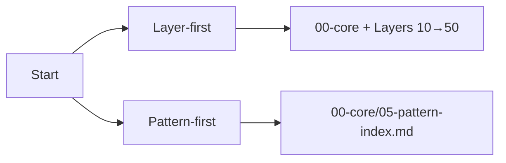

# How to Use This Repository

This document defines the **intended usage** of `context-engineering-core`.

It exists to prevent two common misuse patterns:

- treating the repository as material to skim
- treating examples as shortcuts

---

## Navigation Model

This repository supports two entry modes:

1. **Layer-first (design-time learning)**
   Use when designing or reviewing systems.

2. **Pattern-first (triage and diagnosis)**
   Use when debugging or investigating failures.

The layer-first path is normative.
The pattern-first path is operational.


---

## Layer-first Path (Normative)

Read in strict dependency order:

1. `10-primitives/`
2. `20-failure-mechanics/`
3. `30-control-mechanisms/`
4. `40-system-manifestations/`
5. `50-human-governance/`

Skipping layers breaks the reasoning chain and leads to incorrect control selection.

---

## Pattern-first Path (Operational)

If diagnosing a live issue:

1. Start at `00-core/05-pattern-index.md`
2. Identify the likely failure pattern
3. Follow links back to:

   - relevant primitive specs
   - failure signals
   - applicable controls
   - trade-offs
   - checks

This path is for triage.
It is not a substitute for understanding primitives.

---

## Layer Index Files

Each layer contains an `index.md`.

Layer indexes are intentionally thin:

- a single-sentence orientation
- links to each concept `00-spec.md`
- optional status tags

Layer indexes do not contain definitions, examples, or advice.

---

## Concept Structure (Canonical)

Every concept uses the same internal mini-structure:

```text
concept-name/
├── 00-spec.md
├── 01-failure-signals.md
├── 02-trade-offs.md
├── 03-examples.md
└── 04-checks.md
```

File responsibilities are fixed and must not be mixed.

---

## How to Read a Concept

Read in order:

1. **00-spec.md**
   Establish what must be true.

2. **01-failure-signals.md**
   Learn how violation presents in practice.

3. **02-trade-offs.md**
   Understand structural costs of the concept/control.

4. **03-examples.md**
   Validate execution against constraints and costs.

5. **04-checks.md**
   Operationalize through verification and decision gates.

Examples are not entry points.

---

## Example Rules (Enforced)

Examples in this repository are proofs of constrained execution.

Every example must explicitly reference:

- at least one failure signal
- at least one trade-off

Examples that demonstrate only success are incomplete by definition.

---

## Actionability Guarantee

Every concept must terminate in checks.

Checks may be:

- verification questions
- pass/fail assertions
- decision tables
- bounded procedures
- measurable indicators

If you cannot perform a check after reading a concept, the concept is incomplete.

---

## Use With Agent Systems

This repository is compatible with agent workflows, but its priority is design-time clarity.

When using the repository with agents:

- load specifications before skills
- require trade-offs before execution
- gate actions through checks
- preserve human governance boundaries

Agent skill libraries should be treated as derived artifacts informed by these specifications.

---

## Common Misuse Patterns

The following indicate incorrect use:

- copying controls without stating trade-offs
- applying controls without identifying failures
- jumping to examples for implementation guidance
- claiming alignment without performing checks

These errors originate in design, not in tooling.

---

## Status

This document is **stable**.

Changes must preserve the navigation model, reading order, canonical structure, and example rules defined here.

```
::contentReference[oaicite:0]{index=0}
```
