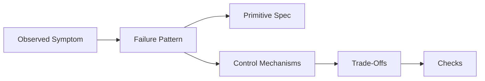
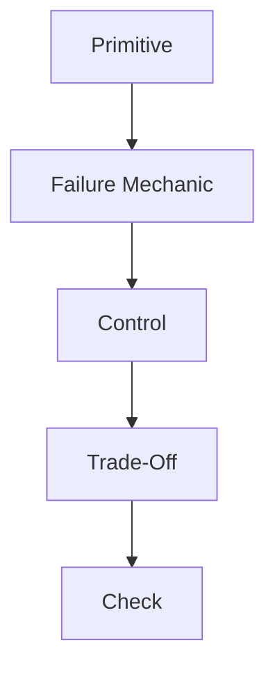

# Pattern Index

This document provides a **pattern-first entry point** into the repository.

It exists for situations where a reader is diagnosing a problem or reviewing a system under time pressure and needs to reason from **observed failure** back to **structural causes and controls**.

This index does not replace the layered reading order.
It is an operational aid.

---

## How to Use This Index

Use this index when you can observe **symptoms**, but the underlying cause is unclear.

Process:

1. Identify the dominant **failure signal**
2. Locate the corresponding **failure pattern**
3. Follow links back to:
   - the constraining primitives
   - the defined failure mechanics
   - the available control mechanisms
   - the documented trade-offs
   - the executable checks

---

## Failure-Centered Patterns

Patterns are grouped by **failure mechanics**, not by solution.

### Degradation Patterns

Failure mechanic: **Degradation**
Symptom profile:

- declining output quality over time
- inconsistent reasoning depth
- loss of instruction adherence in long contexts

Patterns:

- **Context Accumulation Without Selection**

  - Primitives: attention, signal-vs-noise, lifetimes
  - Controls: selection, compression
  - Trade-offs: loss of peripheral information, reduced recall

- **Instruction Dilution**

  - Primitives: attention, ordering
  - Controls: ordering, masking
  - Trade-offs: reduced flexibility, higher coupling

---

### Poisoning Patterns

Failure mechanic: **Poisoning**
Symptom profile:

- confident but incorrect outputs
- persistent hallucinations
- reasoning anchored to false premises

Patterns:

- **Unvalidated Retrieval Injection**

  - Primitives: boundaries, scope
  - Controls: selection, boundary enforcement
  - Trade-offs: reduced recall, higher rejection rates

- **Stale Memory Reinforcement**

  - Primitives: lifetimes, signal-vs-noise
  - Controls: lifetime management, masking
  - Trade-offs: loss of historical context

---

### Interference Patterns

Failure mechanic: **Interference**
Symptom profile:

- conflicting behaviors
- unstable tool usage
- inconsistent prioritization

Patterns:

- **Competing Instruction Sets**

  - Primitives: scope, boundaries
  - Controls: ordering, masking
  - Trade-offs: reduced parallelism

- **Tool–Instruction Collision**

  - Primitives: attention, boundaries
  - Controls: selection, explicit tool contracts
  - Trade-offs: increased integration complexity

---

### Drift Patterns

Failure mechanic: **Drift**
Symptom profile:

- gradual deviation from original intent
- shifting output style or objectives
- emergent behaviors not explicitly designed

Patterns:

- **Implicit Scope Expansion**

  - Primitives: scope, boundaries
  - Controls: scope enforcement, checks
  - Trade-offs: reduced adaptability

- **Unchecked Memory Persistence**

  - Primitives: lifetimes, signal-vs-noise
  - Controls: lifetime expiration, review gates
  - Trade-offs: reduced continuity

---

## Pattern-to-Layer Traceability

Every pattern in this index must map to:

- at least one **primitive**
- exactly one **dominant failure mechanic**
- one or more **control mechanisms**
- at least one **trade-off**
- at least one **check**

Patterns that cannot satisfy this mapping are invalid.

---

## Pattern Stability

Patterns are considered **stable** only when:

- their failure signals are observable
- their controls are defined
- their trade-offs are explicit
- their checks are executable

Patterns without checks remain provisional.

---

## Extending the Pattern Index

New patterns may be added only when:

- they represent a distinct failure manifestation
- they cannot be expressed as a variant of an existing pattern
- they link to existing or proposed specs

Patterns must not be framed as solutions.

---

## Status

This document is **stable**.

Revisions must preserve the failure-centered organization and traceability requirements defined here.
