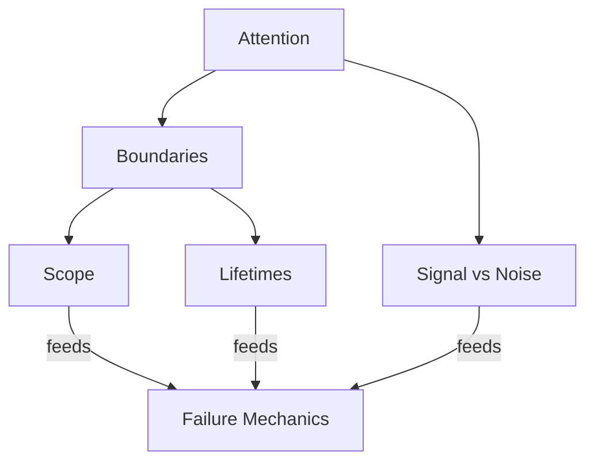

# Primitive Index

This document defines the **canonical set of primitives** used throughout this repository.

Primitives are **non-negotiable structural concepts**.  
They describe constraints that exist regardless of model choice, framework, or tooling.

Primitives are not techniques.  
They are **facts of system behavior**.

---

## What a Primitive Is

A **primitive** is a property of context-engineered systems that:

- cannot be removed through better prompting
- cannot be optimized away
- constrains all higher-level mechanisms
- manifests consistently across architectures

If a concept disappears when tooling changes, it is not a primitive.

---

## Why This Index Exists

This index exists to:

- lock vocabulary
- prevent conceptual drift
- avoid redefinition across layers
- force consistency in later controls and examples

Every higher-layer document must map back to one or more primitives here.

---

## Canonical Primitives

The repository currently defines the following primitives.

These are ordered deliberately.

---

### 1. Attention

**What it constrains**  
How much of the context can meaningfully influence behavior.

**Core insight**  
Context size ≠ usable signal.

**Failure pressure introduced**
- degradation
- interference amplification

**Defined in**
- `10-primitives/attention/`

Attention is the hard ceiling on reasoning influence.

---

### 2. Boundaries

**What they constrain**  
Where influence is allowed to flow.

**Core insight**  
Influence without boundaries becomes ambient and accidental.

**Failure pressure introduced**
- interference
- poisoning
- drift acceleration

**Defined in**
- `10-primitives/boundaries/`

Boundaries govern authority, scope, time, persistence, and channels.

---

## Near-Term Primitives (Declared but Not Yet Expanded)

These primitives are **logically downstream** of Attention and Boundaries.  
They are referenced but not yet fully specified.

They are listed here to lock intent and prevent accidental redefinition.

---

### 3. Scope (Planned)

**What it will constrain**  
Where instructions, roles, and behaviors apply.

**Reason for separation**  
Scope is a *specialization of boundaries*, not a synonym.

**Primary failures**
- interference
- role collapse

---

### 4. Lifetimes (Planned)

**What it will constrain**  
How long context remains valid or influential.

**Reason for separation**  
Temporal decay and persistence require distinct handling.

**Primary failures**
- drift
- poisoning

---

### 5. Signal vs Noise (Planned)

**What it will constrain**  
What deserves attention at all.

**Reason for separation**  
Selection and compression depend on this distinction.

**Primary failures**
- degradation
- interference

---

## Primitive–Failure Mapping

This table is normative.

| Primitive | Primary Failures Governed |
|--------|---------------------------|
| Attention | Degradation, Interference |
| Boundaries | Interference, Poisoning, Drift |
| Scope | Interference |
| Lifetimes | Drift, Poisoning |
| Signal vs Noise | Degradation |

Any failure explanation that bypasses this mapping is incomplete.

---

## Primitive–Control Relationship

Primitives **precede controls**.

- Primitives define constraints.
- Controls operate *within* those constraints.

If a control attempts to override a primitive, the design is invalid.

---

## What This Index Forbids

This index forbids:

- introducing new primitives casually
- redefining primitives per layer
- collapsing primitives into techniques
- skipping primitives when designing controls

If a concept cannot be grounded here, it does not belong in the repo.

---

## How to Use This Index

When writing or reviewing any document:

1. Identify which primitives it depends on.
2. Verify definitions match this index.
3. Reject any implicit redefinition.
4. Escalate if a new primitive is required.

This is a **governance document**, not a summary.

---

## Status

This index is **stable**.

It may only change if:
- a genuinely new structural constraint is discovered
- existing primitives are proven insufficient

Such changes require explicit justification and review.
