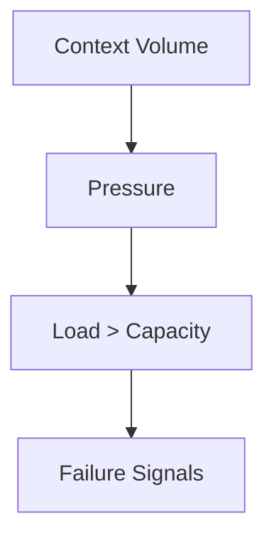

# Attention — Failure Signals

This document enumerates **observable signals** indicating attention overload, misallocation, or collapse.

Attention failures occur when **usable focus** is exhausted or diverted, even if tokens remain.

---

## Signal Model

When pressure exceeds capacity, signals compete; weak constraints are displaced; behavior collapses.

---

## Overload Signals

- **Progressive quality decay as context grows**  
  Output coherence drops with each additional artifact.

- **Late-position dominance**  
  Recent or verbose content overrides earlier constraints.

- **Hallucination under long histories**  
  Fabrication increases as attention fragments.

---

## Misallocation Signals

- **Ignored critical constraints**  
  Short, high-signal instructions are skipped in favor of longer background.

- **Excessive focus on verbose text**  
  Length correlates with influence, not authority or scope.

- **Tool log fixation**  
  Long tool outputs dominate reasoning; errors buried.

---

## Instability Signals

- **Non-deterministic outputs across runs with same inputs**  
  Small ordering changes swing outcomes.

- **Oscillation between frames**  
  Response shifts mid-answer as different context fragments win attention.

---

## Silent Signals

- **Budget reporting absent or ignored**  
  No measurement of attention use.

- **Unbounded retrieval**  
  Recall volume grows without gate; quality drifts.

---

## Distinguishing Attention Failure

| Observation                      | Attention Failure? |
| -------------------------------- | ------------------ |
| Wrong answer once                | Not necessarily    |
| Quality drops as context grows   | Yes                |
| Short constraints ignored        | Yes                |
| Authority conflicts              | Possibly (ordering/masking) |

---

## Detection Guidance

- Reduce context by half; if quality improves, attention was overloaded.
- Reorder content; if outcomes change, attention is positional.
- Measure token contribution per artifact; identify top consumers.
- Limit retrieval volume; observe stability.

---

## When to Escalate

Escalate when:
- budget utilization is unknown
- weak but critical constraints are repeatedly ignored
- adding context reliably degrades outputs
- positional effects dominate behavior

Attention failures compound; treat them as structural, not model quirks.
