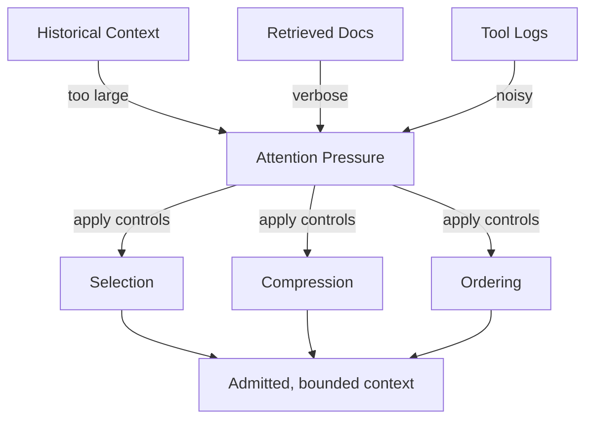

# Attention — Examples

These examples show how attention pressure manifests and how explicit controls change outcomes.  
They focus on **influence capacity**, not correctness.



---

## Example 1: Long History Overload

**Context**  
A support chatbot keeps full conversation history (~200 turns).

**Failure**  
- Early system constraints are ignored.  
- Answers degrade mid-session.  
- Small wording changes flip outcomes.

**Change (Selection + Compression)**  
- Keep last N turns verbatim; compress older turns into deltas.  
- Elevate system constraints to the top of the assembled context.

**Outcome**  
- Constraints stay visible.  
- Behavior stabilizes across long sessions.  
- Attention utilization drops below budget.

---

## Example 2: Verbose Retrieval Dominance

**Context**  
RAG pipeline retrieves 15 long documents for a narrow task.

**Failure**  
- Short task constraints ignored.  
- Responses mirror retrieved prose.  
- Budget exceeded by retrieval alone.

**Change (Selection + Filtering)**  
- Filter to top-3 relevant sections.  
- Deduplicate overlapping passages.  
- Bound retrieval token budget explicitly.

**Outcome**  
- Constraints applied.  
- Retrieval remains useful without overload.  
- Attention stays within budget.

---

## Example 3: Tool Log Saturation

**Context**  
Tool outputs include full debug logs.

**Failure**  
- Logs dominate context.  
- Error signals buried; model “fixates” on logs.

**Change (Compression + Masking)**  
- Keep only result, status, and error fields.  
- Mask raw logs from reasoning context.

**Outcome**  
- Decisions focus on relevant tool results.  
- Logs remain available for audit, not for attention.

---

## Example 4: Weak Constraint Displacement

**Context**  
Short safety constraints appear alongside long background.

**Failure**  
- Safety constraint ignored intermittently.  
- Background verbosity wins attention.

**Change (Ordering + Highlighting)**  
- Place constraints first; mark as non-compressible.  
- Down-rank background to advisory.

**Outcome**  
- Constraint honored consistently.  
    - Background still accessible but non-dominant.

---

## Example 5: Explicit Attention Budgeting (Pseudo-code)

**Context**
A multi-turn agent conversation where each turn adds to the context, and critical system instructions must always be prioritized.

**Failure**
- System instructions are occasionally truncated or pushed out of the active context window by lengthy user interactions or tool outputs.
- Performance degrades due to models processing excessively long contexts, or worse, making decisions based on incomplete instructions.

**Change (Conceptual Pseudo-code)**
```python
def assemble_context(
    system_instructions: list[str],
    conversation_history: list[str],
    tool_outputs: list[str],
    max_attention_budget: int = 4000 # in tokens, conceptual
) -> str:
    assembled_context = []
    current_budget_used = 0

    # 1. Prioritize and reserve budget for system instructions (non-negotiable)
    for instruction in system_instructions:
        tokens = estimate_tokens(instruction) # hypothetical token estimation
        if current_budget_used + tokens <= max_attention_budget:
            assembled_context.append(instruction)
            current_budget_used += tokens
        else:
            # Critical failure: system instructions exceed budget
            raise ValueError("System instructions exceed maximum attention budget.")

    # 2. Add recent conversation history, trimming if necessary (high priority)
    # Process in reverse chronological order
    for turn in reversed(conversation_history):
        tokens = estimate_tokens(turn)
        if current_budget_used + tokens <= max_attention_budget:
            assembled_context.insert(len(system_instructions), turn) # Insert after system instructions
            current_budget_used += tokens
        else:
            print(f"Warning: Truncating conversation history to fit budget. Dropped: {turn[:50]}...")
            # Optionally, compress older turns here instead of dropping
            break # Stop adding older turns if budget is hit

    # 3. Add recent tool outputs, trimming if necessary (medium priority)
    # Process in reverse chronological order
    for output in reversed(tool_outputs):
        tokens = estimate_tokens(output)
        if current_budget_used + tokens <= max_attention_budget:
            assembled_context.insert(len(system_instructions), output) # Insert after system instructions and history
            current_budget_used += tokens
        else:
            print(f"Warning: Truncating tool outputs to fit budget. Dropped: {output[:50]}...")
            break

    # Reorder if necessary to maintain chronological flow within sections
    # (e.g., system instructions always first, then history oldest to newest, then tools)
    # This pseudo-code simplifies insertion; actual implementation would manage ordering.

    return "\n".join(assembled_context)

# Outcome
- Ensures critical system instructions are always present.
- Manages context growth to prevent exceeding the attention budget.
- Provides explicit points where context is managed, allowing for clear trade-offs (e.g., how much history to keep vs. how many tool outputs).
- Makes the "constrained system resource" explicit in the code.

---

## Example Invariants
- Reducing context often improves outcomes when attention is failing.  
- Position and verbosity biases must be countered explicitly.  
- If budget is unknown, failures are expected.  
- Attention controls must precede downstream reasoning or tool use.
