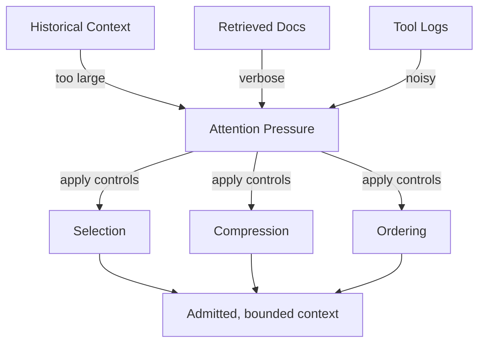

# Attention — Examples

These examples show how attention pressure manifests and how explicit controls change outcomes.  
They focus on **influence capacity**, not correctness.

---

## Example 1: Long History Overload

**Context**  
A support chatbot keeps full conversation history (~200 turns).

**Failure**  
- Early system constraints are ignored.  
- Answers degrade mid-session.  
- Small wording changes flip outcomes.

**Change (Selection + Compression)**  
- Keep last N turns verbatim; compress older turns into deltas.  
- Elevate system constraints to the top of the assembled context.

**Outcome**  
- Constraints stay visible.  
- Behavior stabilizes across long sessions.  
- Attention utilization drops below budget.

---

## Example 2: Verbose Retrieval Dominance

**Context**  
RAG pipeline retrieves 15 long documents for a narrow task.

**Failure**  
- Short task constraints ignored.  
- Responses mirror retrieved prose.  
- Budget exceeded by retrieval alone.

**Change (Selection + Filtering)**  
- Filter to top-3 relevant sections.  
- Deduplicate overlapping passages.  
- Bound retrieval token budget explicitly.

**Outcome**  
- Constraints applied.  
- Retrieval remains useful without overload.  
- Attention stays within budget.

---

## Example 3: Tool Log Saturation

**Context**  
Tool outputs include full debug logs.

**Failure**  
- Logs dominate context.  
- Error signals buried; model “fixates” on logs.

**Change (Compression + Masking)**  
- Keep only result, status, and error fields.  
- Mask raw logs from reasoning context.

**Outcome**  
- Decisions focus on relevant tool results.  
- Logs remain available for audit, not for attention.

---

## Example 4: Weak Constraint Displacement

**Context**  
Short safety constraints appear alongside long background.

**Failure**  
- Safety constraint ignored intermittently.  
- Background verbosity wins attention.

**Change (Ordering + Highlighting)**  
- Place constraints first; mark as non-compressible.  
- Down-rank background to advisory.

**Outcome**  
- Constraint honored consistently.  
- Background still accessible but non-dominant.

---

## Example Invariants

- Reducing context often improves outcomes when attention is failing.  
- Position and verbosity biases must be countered explicitly.  
- If budget is unknown, failures are expected.  
- Attention controls must precede downstream reasoning or tool use.
