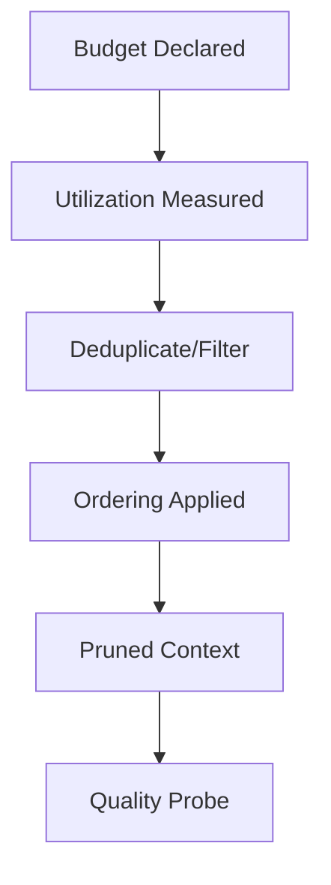

# Attention — Checks

These checks verify that attention is explicitly budgeted, measured, and protected.

If any check fails, attention risk is unmanaged.

---

## Check 1: Budget Declaration

**Question**  
Is there an explicit attention/token budget for this task?

**Pass**  
Budget is numeric, enforced, and visible to the pipeline.

**Fail**  
“As much as fits”; no explicit limit.

---

## Check 2: Utilization Measurement

**Question**  
Is attention utilization measured per artifact/class?

**Pass**  
Token contribution per artifact is computed and reported.

**Fail**  
No breakdown; cannot explain where attention went.

---

## Check 3: Weak Signal Elevation

**Question**  
Are short, critical constraints elevated above verbose background?

**Pass**  
Constraints are ordered first or marked non-compressible.

**Fail**  
Short constraints disappear or are intermittently ignored.

---

## Check 4: Redundancy Control

**Question**  
Is duplicate or near-duplicate content removed before admission?

**Pass**  
Deduplication/delta logic exists; repeated content not re-admitted.

**Fail**  
Summaries of summaries; repeated facts inflate load.

---

## Check 5: Retrieval Boundaries

**Question**  
Is retrieval volume bounded and filtered by relevance?

**Pass**  
Top-K/score thresholds; retrieval token cap enforced.

**Fail**  
Unbounded retrieval; relevance unchecked.

---

## Check 6: Tool Output Pruning

**Question**  
Are tool logs/results pruned to relevant fields?

**Pass**  
Only result/status/errors admitted; logs masked or filtered.

**Fail**  
Full logs in context; reasoning fixates on noise.

---

## Check 7: Positional Bias Mitigation

**Question**  
Is ordering used to prevent late/verbose dominance?

**Pass**  
Constraints and high-authority items precede advisory/background.

**Fail**  
Reordering changes outcomes materially.

---

## Check 8: Overload Probe

**Question**  
Does reducing context improve quality?

**Pass**  
Quality stable or drops when context is reduced.

**Fail**  
Quality improves when context is reduced → attention was failing.

---

## Minimal Attention Audit

- [ ] Budget declared and enforced  
- [ ] Utilization measured per artifact/class  
- [ ] Weak signals elevated  
- [ ] Redundancy controlled  
- [ ] Retrieval bounded  
- [ ] Tool outputs pruned  
- [ ] Ordering mitigates positional bias  
- [ ] Overload probe run

Failure of any item indicates unmanaged attention risk.
