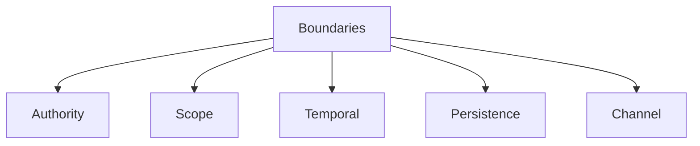

# Boundaries

This specification defines **boundaries** as a foundational primitive in context-engineered systems.

Boundaries determine **where influence is allowed to flow** within a system.  
They do not optimize behavior. They **constrain it**.

Without explicit boundaries, context becomes ambient, authority becomes accidental, and failures become systemic.

---

## Definition

A **boundary** is a structural rule that limits **which context elements may influence which decisions, at what time, and with what authority**.

Boundaries apply to:
- instructions
- data
- tools
- memory
- agents
- feedback

Boundaries do not describe *what* to do.  
They define *where influence stops*.

---

## Boundary vs Constraint

Boundaries are often confused with constraints.

They are not the same.

- **Constraints** restrict outputs or actions.
- **Boundaries** restrict *influence paths*.

A system may satisfy constraints while violating boundaries.

---

## Why Boundaries Are Primitive

Boundaries are primitive because:

- attention is finite
- authority is not implicit
- context elements are heterogeneous
- influence must be governed before it is optimized

All higher-level mechanisms assume boundaries already exist.

---

## Core Boundary Dimensions

Boundaries manifest along five dimensions.

Each dimension constrains a different failure axis.

---

## Authority Boundaries

Authority boundaries define **who can override whom**.

They answer:

- Which inputs are advisory vs binding?
- Which sources can negate others?
- Where final decision authority lies?

Without authority boundaries:

- interference emerges
- poisoning escalates
- safety constraints erode silently

Authority must be explicit or it will be inferred incorrectly.

---

## Scope Boundaries

Scope boundaries define **where an instruction or signal applies**.

They answer:

- Which tasks does this apply to?
- Which agents or roles are affected?
- Which phases of execution are in scope?

Without scope boundaries:

- instructions bleed across tasks
- roles collapse
- context becomes global by accident

Scope limits influence spatially and functionally.

---

## Temporal Boundaries

Temporal boundaries define **how long influence persists**.

They answer:

- Is this instruction momentary or durable?
- Does this assumption expire?
- When must intent be revalidated?

Without temporal boundaries:

- stale context persists
- drift accumulates
- corrections fail to stick

Time is a boundary whether acknowledged or not.

---

## Persistence Boundaries

Persistence boundaries define **what may be remembered or reinforced**.

They answer:

- Which inputs may enter long-term memory?
- What requires validation before persistence?
- What can be rolled back?

Without persistence boundaries:

- poisoning becomes permanent
- falsehoods recur
- learning loops amplify error

Memory is an attack surface.

---

## Channel Boundaries

Channel boundaries separate **instruction, data, policy, feedback, and tools**.

They answer:

- Can data issue instructions?
- Can feedback redefine intent?
- Can tools alter policy?

Without channel boundaries:

- instruction is smuggled as data
- authority is hijacked
- integrity collapses

Channels exist to prevent category errors.

---

## Boundary Failures (Preview)

When boundaries fail:

- **Interference** occurs when authority and scope boundaries are weak.
- **Poisoning** occurs when channel and persistence boundaries are violated.
- **Drift** occurs when temporal boundaries are absent.
- **Degradation** is worsened when boundaries allow accumulation.

Boundaries are the first line of defense.

---

## Design Implications

From a system design perspective:

- every context element must have a boundary
- boundaries must be explicit, not emergent
- influence paths must be enumerable
- boundary violations must be detectable

Systems without boundaries rely on luck.

---

## Non-Claims

This specification does not claim:

- that boundaries eliminate failures
- that boundaries imply correctness
- that boundaries can be fully automated
- that boundaries are static

It defines structure, not behavior.

---

## Status

This specification is **stable**.

It provides sufficient grounding to define boundary failure signals, trade-offs, and subsequent control mechanisms.
