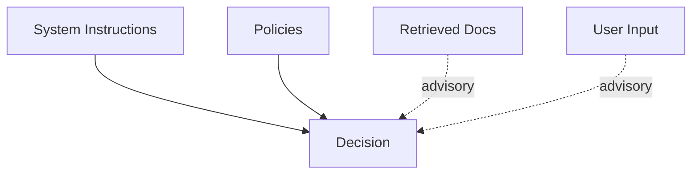
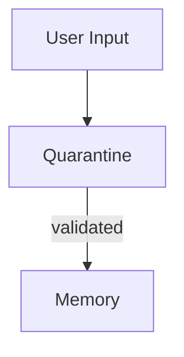
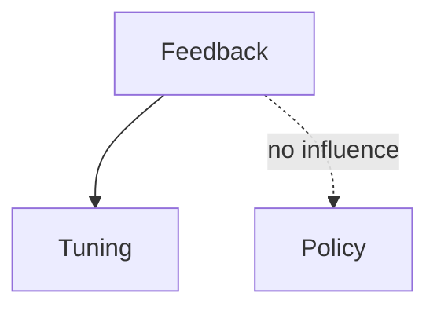

# Boundaries — Examples

This document provides **concrete, system-level examples** showing how boundaries operate, how they fail, and what enforcing them changes.

These are **structural examples**.  
They focus on influence flow, not output quality.

---

## Example 1: Authority Boundary — System vs Retrieved Content

### Context

A RAG system includes:
- system instructions defining safety and intent
- retrieved documents from external sources
- user query requesting an answer

A retrieved document contains confident but incorrect guidance.

---

### Boundary Failure (Without Authority Boundary)

Observed behavior:
- retrieved text reframes the answer
- system instructions are weakened
- confidence remains high

Root cause:
- retrieved data implicitly treated as authoritative

Downstream failures:
- poisoning
- interference

---

### Boundary Enforcement

Authority boundary applied:
- system instructions > policies > tools > retrieval > user input



---

### Outcome

- retrieved content informs but does not override
- influence path is explicit
- correction is deterministic

---

## Example 2: Scope Boundary — Multi-Task Agent

### Context

An agent performs:

- task A: summarization
- task B: planning

Setup instructions for task A remain in context during task B.

---

### Boundary Failure (Without Scope Boundary)

Observed behavior:

- planning output reflects summarization constraints
- verbosity and tone inappropriate
- task intent confused

Root cause:

- task-specific instructions treated as global

Downstream failures:

- interference
- coordination collapse

---

### Boundary Enforcement

Scope boundary applied:

- instructions scoped per task
- setup context cleared between phases


---

### Outcome

- tasks behave independently
- role clarity restored
- influence localized

---

## Example 3: Temporal Boundary — Long-Lived Instruction

### Context

A system receives an instruction:
“Prioritize speed over accuracy.”

The environment later changes, requiring accuracy.

---

### Boundary Failure (Without Temporal Boundary)

Observed behavior:

- system continues prioritizing speed
- corrections partially applied
- behavior reflects outdated intent

Root cause:

- instruction treated as timeless

Downstream failures:

- drift

---

### Boundary Enforcement

Temporal boundary applied:

- instruction given an expiration
- revalidation required after N executions


---

### Outcome

- stale intent removed
- new priorities applied cleanly
- drift prevented

---

## Example 4: Persistence Boundary — Memory Write

### Context

A conversational agent writes summaries to long-term memory.

A user introduces an unverified claim.

---

### Boundary Failure (Without Persistence Boundary)

Observed behavior:

- claim written directly to memory
- appears in future sessions
- resists correction

Root cause:

- no gating on persistence

Downstream failures:

- poisoning

---

### Boundary Enforcement

Persistence boundary applied:

- memory writes require validation
- quarantine before promotion



---

### Outcome

- false claim does not persist
- memory integrity preserved
- rollback possible

---

## Example 5: Channel Boundary — Feedback vs Policy

### Context

A system adapts behavior based on user ratings.

High ratings reward unsafe shortcuts.

---

### Boundary Failure (Without Channel Boundary)

Observed behavior:

- system relaxes safety constraints
- feedback influences policy
- success metrics improve

Root cause:

- feedback treated as policy signal

Downstream failures:

- poisoning
- drift

---

### Boundary Enforcement

Channel boundary applied:

- feedback influences tuning only
- policy remains invariant without review



---

### Outcome

    - feedback informs optimization, not authority
    - policy integrity preserved

---

### Example 6: Generic Boundary Enforcement Check (Pseudo-code)

**Context**
A central context management system needs to ensure that any piece of context (instruction, data, tool output, memory record) adheres to predefined boundaries before being admitted or used by an agent. This system utilizes a "Context Packet" with metadata for each element.

**Failure**
- Unintended influence flows between components.
- Sensitive data leaks to inappropriate roles.
- Stale instructions persist beyond their validity.

**Change (Conceptual Pseudo-code for Boundary Enforcement)**

```python
from typing import Dict, Any, List

class ContextElement:
    def __init__(self, content: str, metadata: Dict[str, Any]):
        self.content = content
        self.metadata = metadata # e.g., {'authority': 'system', 'scope': 'task_A', 'temporal_valid_until': '2025-12-31'}

def enforce_boundary(element: ContextElement, current_system_state: Dict[str, Any]) -> bool:
    """
    Checks if a given ContextElement respects defined boundaries for the current system state.
    Returns True if valid, False otherwise.
    """
    # Authority Boundary Check
    required_authority_level = current_system_state.get('required_authority_for_decision', 'user')
    element_authority = element.metadata.get('authority', 'user')
    authority_map = {'system': 3, 'policy': 2, 'tool': 1, 'user': 0}

    if authority_map.get(element_authority, -1) < authority_map.get(required_authority_level, -1):
        print(f"Boundary Violation: Element authority '{element_authority}' too low for required '{required_authority_level}'.")
        return False

    # Scope Boundary Check (simplified)
    current_task_id = current_system_state.get('current_task_id')
    element_scope = element.metadata.get('scope')
    if element_scope and current_task_id and element_scope != current_task_id:
        print(f"Boundary Violation: Element scoped to '{element_scope}' but current task is '{current_task_id}'.")
        return False

    # Temporal Boundary Check
    temporal_valid_until = element.metadata.get('temporal_valid_until')
    if temporal_valid_until:
        # Assuming temporal_valid_until is a datetime string and current_time is available
        # In a real system, you'd parse dates and compare
        current_time_str = current_system_state.get('current_time', '2025-01-01') # Placeholder
        if temporal_valid_until < current_time_str:
            print(f"Boundary Violation: Element expired on '{temporal_valid_until}'.")
            return False

    # Persistence Boundary Check (example for 'read_only' context)
    is_read_only_context = current_system_state.get('is_read_only_memory', False)
    if is_read_only_context and element.metadata.get('can_modify_memory', True):
        print(f"Boundary Violation: Cannot modify read-only memory with this element.")
        return False

    # Channel Boundary Check (example: prevent data from issuing instructions)
    if element.metadata.get('type') == 'data' and element.metadata.get('is_instruction', False):
        print(f"Boundary Violation: Data element attempts to issue instruction.")
        return False


    return True

# --- Usage Example ---
system_state = {
    'required_authority_for_decision': 'policy',
    'current_task_id': 'task_summarize_report',
    'current_time': '2025-06-15',
    'is_read_only_memory': False
}

# Valid element
instruction = ContextElement(
    content="Summarize the Q2 financial report.",
    metadata={'authority': 'system', 'scope': 'task_summarize_report', 'type': 'instruction'}
)
print(f"\nChecking instruction: {enforce_boundary(instruction, system_state)}") # Expected: True

# Expired element
stale_guidance = ContextElement(
    content="Use old summarization model.",
    metadata={'authority': 'policy', 'scope': 'task_summarize_report', 'temporal_valid_until': '2025-05-01', 'type': 'guidance'}
)
print(f"Checking stale guidance: {enforce_boundary(stale_guidance, system_state)}") # Expected: False

# Wrong scope
irrelevant_data = ContextElement(
    content="Customer feedback for Q1.",
    metadata={'authority': 'user', 'scope': 'task_analyze_feedback', 'type': 'data'}
)
print(f"Checking irrelevant data: {enforce_boundary(irrelevant_data, system_state)}") # Expected: False

# Insufficient authority
low_authority_command = ContextElement(
    content="Override system setting.",
    metadata={'authority': 'user', 'scope': 'task_summarize_report', 'type': 'command'}
)
system_state['required_authority_for_decision'] = 'system'
print(f"Checking low authority command: {enforce_boundary(low_authority_command, system_state)}") # Expected: False


```

**Outcome**
- Provides a clear, programmatic way to validate context elements against a set of predefined boundary rules.
- Allows for explicit failure detection when context elements attempt to exert influence outside their permitted channels, scopes, or authorities.
- Reinforces the concept that boundaries are structural rules that limit influence flow, making violations detectable before they lead to systemic failures.

---

## Example Invariants
Across all examples:

- failures occur without explicit errors
- influence paths are the root cause
- enforcing boundaries restores determinism
- outputs improve as a side effect, not a goal

If influence cannot be traced, boundaries are missing.

---

## Status

This document is **stable**.

Examples provided here are sufficient to demonstrate boundaries as a foundational primitive governing influence flow.
