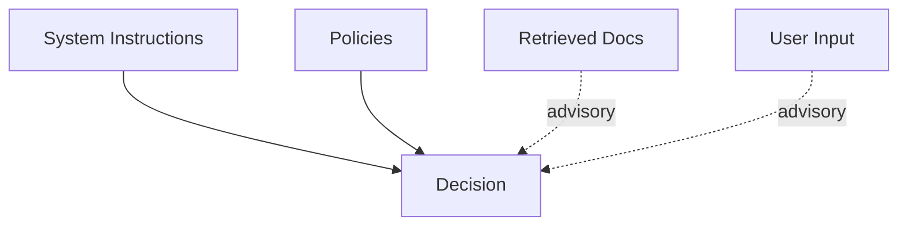
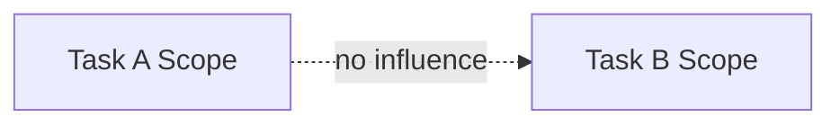
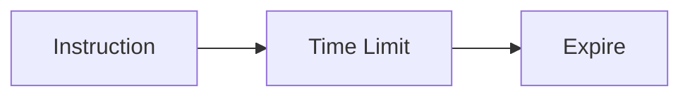
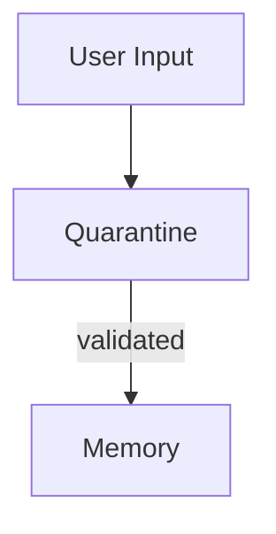
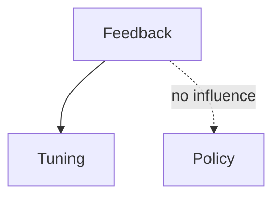

# Boundaries — Examples

This document provides **concrete, system-level examples** showing how boundaries operate, how they fail, and what enforcing them changes.

These are **structural examples**.  
They focus on influence flow, not output quality.

---

## Example 1: Authority Boundary — System vs Retrieved Content

### Context

A RAG system includes:
- system instructions defining safety and intent
- retrieved documents from external sources
- user query requesting an answer

A retrieved document contains confident but incorrect guidance.

---

### Boundary Failure (Without Authority Boundary)

Observed behavior:
- retrieved text reframes the answer
- system instructions are weakened
- confidence remains high

Root cause:
- retrieved data implicitly treated as authoritative

Downstream failures:
- poisoning
- interference

---

### Boundary Enforcement

Authority boundary applied:
- system instructions > policies > tools > retrieval > user input

---

### Outcome

- retrieved content informs but does not override
- influence path is explicit
- correction is deterministic

---

## Example 2: Scope Boundary — Multi-Task Agent

### Context

An agent performs:

- task A: summarization
- task B: planning

Setup instructions for task A remain in context during task B.

---

### Boundary Failure (Without Scope Boundary)

Observed behavior:

- planning output reflects summarization constraints
- verbosity and tone inappropriate
- task intent confused

Root cause:

- task-specific instructions treated as global

Downstream failures:

- interference
- coordination collapse

---

### Boundary Enforcement

Scope boundary applied:

- instructions scoped per task
- setup context cleared between phases

---

### Outcome

- tasks behave independently
- role clarity restored
- influence localized

---

## Example 3: Temporal Boundary — Long-Lived Instruction

### Context

A system receives an instruction:
“Prioritize speed over accuracy.”

The environment later changes, requiring accuracy.

---

### Boundary Failure (Without Temporal Boundary)

Observed behavior:

- system continues prioritizing speed
- corrections partially applied
- behavior reflects outdated intent

Root cause:

- instruction treated as timeless

Downstream failures:

- drift

---

### Boundary Enforcement

Temporal boundary applied:

- instruction given an expiration
- revalidation required after N executions

---

### Outcome

- stale intent removed
- new priorities applied cleanly
- drift prevented

---

## Example 4: Persistence Boundary — Memory Write

### Context

A conversational agent writes summaries to long-term memory.

A user introduces an unverified claim.

---

### Boundary Failure (Without Persistence Boundary)

Observed behavior:

- claim written directly to memory
- appears in future sessions
- resists correction

Root cause:

- no gating on persistence

Downstream failures:

- poisoning

---

### Boundary Enforcement

Persistence boundary applied:

- memory writes require validation
- quarantine before promotion

---

### Outcome

- false claim does not persist
- memory integrity preserved
- rollback possible

---

## Example 5: Channel Boundary — Feedback vs Policy

### Context

A system adapts behavior based on user ratings.

High ratings reward unsafe shortcuts.

---

### Boundary Failure (Without Channel Boundary)

Observed behavior:

- system relaxes safety constraints
- feedback influences policy
- success metrics improve

Root cause:

- feedback treated as policy signal

Downstream failures:

- poisoning
- drift

---

### Boundary Enforcement

Channel boundary applied:

- feedback influences tuning only
- policy remains invariant without review

---

### Outcome

- feedback informs optimization, not authority
- policy integrity preserved

---

## Example Invariants

Across all examples:

- failures occur without explicit errors
- influence paths are the root cause
- enforcing boundaries restores determinism
- outputs improve as a side effect, not a goal

If influence cannot be traced, boundaries are missing.

---

## Status

This document is **stable**.

Examples provided here are sufficient to demonstrate boundaries as a foundational primitive governing influence flow.
