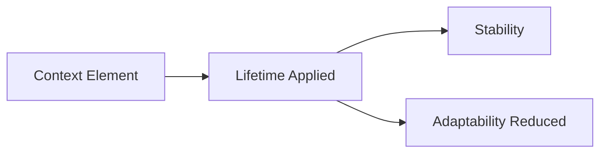
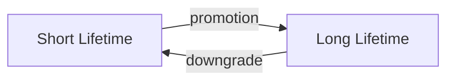

# Lifetimes — Trade-Offs

This document enumerates the **structural trade-offs introduced by enforcing lifetimes** in context-engineered systems.

Lifetimes do not improve intelligence.  
They **constrain temporal influence**.

Every lifetime decision trades adaptability for integrity.

---

## Trade-Off Model

Lifetimes regulate **how long influence persists**.

Longer lifetimes increase stability and risk simultaneously.

---

## Ephemeral Lifetime Trade-Offs

**What ephemeral lifetimes improve**

- rapid correction
- minimal blast radius
- low poisoning risk

**What they constrain**

- continuity
- learning
- cumulative reasoning

**Structural cost**

- repeated context injection
- higher orchestration overhead

**Failure if ignored**

- accidental persistence
- silent promotion

Ephemeral lifetimes prioritize safety over efficiency.

---

## Session-Bound Lifetime Trade-Offs

**What session-bound lifetimes improve**

- coherent interaction
- short-term personalization
- predictable resets

**What they constrain**

- cross-session learning
- long-term preference modeling

**Structural cost**

- frequent reinitialization
- limited personalization

**Failure if ignored**

- session bleed
- unintended carryover

Session lifetimes balance continuity with resetability.

---

## Durable Lifetime Trade-Offs

**What durable lifetimes improve**

- gradual adaptation
- calibrated behavior
- reduced rework

**What they constrain**

- speed of correction
- reversibility

**Structural cost**

- governance overhead
- review and validation

**Failure if ignored**

- silent accretion
- slow drift

Durable lifetimes trade agility for consistency.

---

## Persistent Lifetime Trade-Offs

**What persistent lifetimes improve**

- strong guarantees
- stable policy enforcement
- invariant behavior

**What they constrain**

- flexibility
- evolution
- experimentation

**Structural cost**

- high rollback cost
- governance burden

**Failure if ignored**

- permanent poisoning
- irreversible misalignment

Persistent lifetimes must be rare and justified.

---

## Lifetime Transition Trade-Offs

**Promotion trade-offs**

- improves reuse
- increases risk surface
- requires validation

**Downgrade trade-offs**

- restores safety
- breaks continuity
- requires rollback mechanisms

Asymmetry is intentional: promotion is easier than safe reversal.

---

## Cross-Lifetime Trade-Offs

Lifetimes interact with:

- boundaries (who controls expiration)
- scope (where expired context applied)
- signal vs noise (what is worth persisting)

Poor lifetime choices amplify other failures.

---

## Lifetime Invariants

The following always hold:

- Longer lifetimes increase blast radius.
- Shorter lifetimes increase orchestration cost.
- Promotion without validation causes poisoning.
- Expiration without cleanup causes drift.

Any design denying these is incomplete.

---

## Trade-Off Visibility Requirement

Lifetime trade-offs must be explicit.

Acceptable mechanisms:

- lifetime annotations
- expiration policies
- promotion criteria
- downgrade procedures

Hidden temporal assumptions become latent failures.

---

## Relationship to Governance

Lifetimes concentrate responsibility.

- As lifetimes lengthen:
  - human oversight increases
  - rollback authority becomes critical
  - mistakes become expensive

Time is a governance surface.

---

## Status

This document is **stable**.

Trade-offs listed here are sufficient to reason about lifetime decisions at the primitive level.
