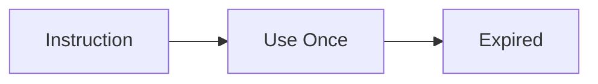
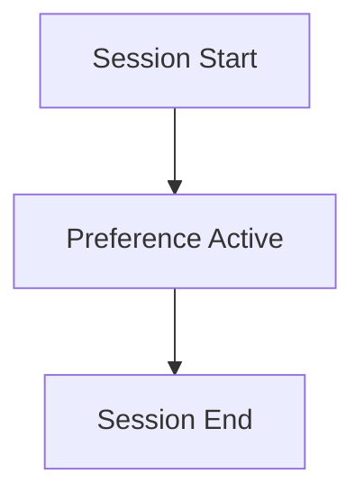
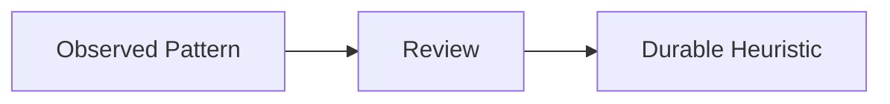
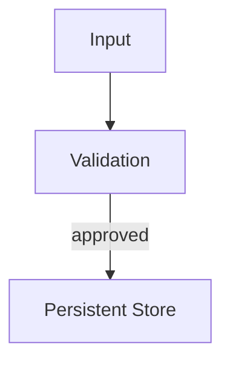
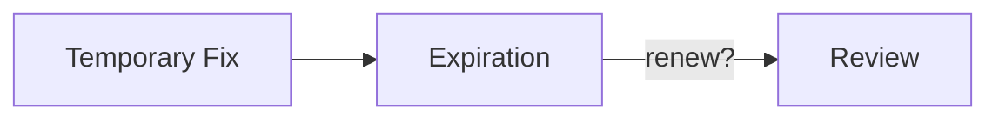

# Lifetimes — Examples

This document provides **execution-grounded examples** demonstrating how lifetimes operate, how they fail, and how enforcing them changes system behavior.

These examples focus on **temporal influence**, not output quality.

---

## Example 1: Ephemeral Instruction Used Once

### Context

A user provides a one-time instruction:

> “For this response, be extremely concise.”

This instruction is intended to affect only the immediate output.

---

### Lifetime Failure (Without Ephemeral Enforcement)

Observed behavior:
- future responses remain terse
- verbosity does not return to baseline
- corrections partially work

Root cause:
- ephemeral instruction treated as session-bound or durable

Downstream failures:
- drift
- unintended personalization

---

### Lifetime Enforcement

Ephemeral lifetime applied:
- instruction consumed once
- removed immediately after execution

---

### Outcome

- immediate instruction respected
- subsequent behavior unaffected
- blast radius minimized

---

## Example 2: Session-Bound Preferences

### Context

During a session, a user states:

> “Assume I am a beginner.”

This preference should apply only to the current interaction.

---

### Lifetime Failure (Without Session Boundary)

Observed behavior:

- system assumes beginner status in future sessions
- explanations remain overly simplified
- user experience degrades

Root cause:

- session-bound preference treated as durable

Downstream failures:

- drift

---

### Lifetime Enforcement

Session lifetime applied:

- preference stored in session context
- cleared on session termination

---

### Outcome

- appropriate guidance during session
- no carryover across sessions
- predictable resets

---

## Example 3: Durable Heuristic with Governance

### Context

A system observes repeated successful behavior:

- summarizing documents before answering improves quality

Designers choose to retain this pattern.

---

### Lifetime Failure (Without Governance)

Observed behavior:

- heuristic becomes mandatory
- applied to inappropriate tasks
- corrections partially work

Root cause:

- durable behavior promoted without review
- no downgrade path

Downstream failures:

- drift

---

### Lifetime Enforcement

Durable lifetime applied:

- heuristic promoted with justification
- review cadence defined
- downgrade path available

---

### Outcome

- behavior improves where appropriate
- adaptability preserved
- drift contained

---

## Example 4: Persistent Memory Entry

### Context

A system stores long-term knowledge:

- user’s professional domain
- core system constraints

This information must persist across sessions.

---

### Lifetime Failure (Without Validation)

Observed behavior:

- incorrect domain stored
- future responses misaligned
- corrections ineffective

Root cause:

- persistent promotion without validation
- no rollback

Downstream failures:

- poisoning

---

### Lifetime Enforcement

Persistent lifetime applied:

- validation required before promotion
- rollback mechanism defined

---

### Outcome

- persistent state remains accurate
- corrections are enforceable
- poisoning prevented

---

## Example 5: Lifetime Transition Failure

### Context

A temporary workaround is introduced to handle an edge case.

It is never revisited.

---

### Lifetime Failure

Observed behavior:

- workaround becomes permanent
- undocumented behavior accumulates
- system behavior diverges over time

Root cause:

- implicit promotion from ephemeral to persistent
- no expiration or review

Downstream failures:

- drift
- governance failure

---

### Lifetime Enforcement

Transition rules applied:

- explicit expiration set
- review required for promotion

---

### Outcome

- workaround expires or is reviewed
- system remains intentional
- drift prevented

---

## Example Invariants

Across all examples:

- failures emerge silently over time
- temporal mis-specification precedes behavioral drift
- promotion without governance is the dominant risk
- expiration is a control surface

If context outlives its intent, lifetime has failed.

---

## Status

This document is **stable**.

Examples provided here are sufficient to demonstrate lifetimes as a primitive governing temporal influence.
