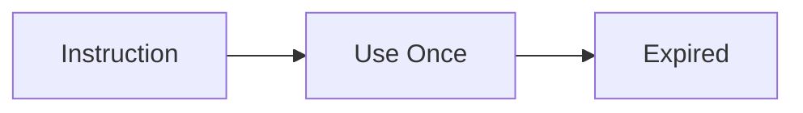
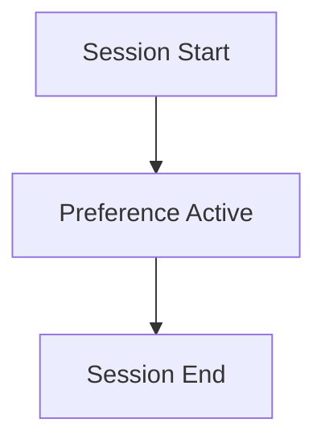
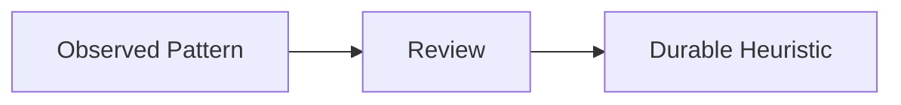
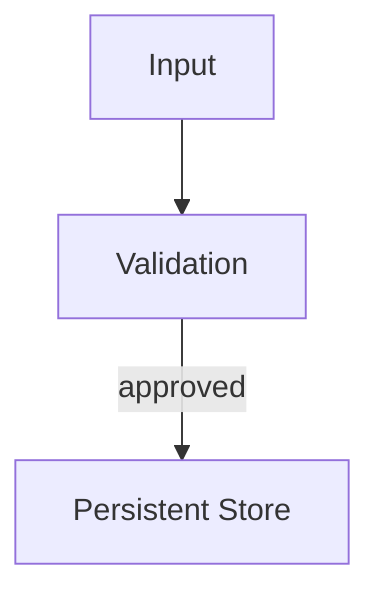
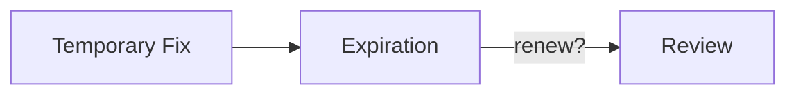

# Lifetimes — Examples

This document provides **execution-grounded examples** demonstrating how lifetimes operate, how they fail, and how enforcing them changes system behavior.

These examples focus on **temporal influence**, not output quality.

---

## Example 1: Ephemeral Instruction Used Once

### Context

A user provides a one-time instruction:

> “For this response, be extremely concise.”

This instruction is intended to affect only the immediate output.

---

### Lifetime Failure (Without Ephemeral Enforcement)

Observed behavior:
- future responses remain terse
- verbosity does not return to baseline
- corrections partially work

Root cause:
- ephemeral instruction treated as session-bound or durable

Downstream failures:
- drift
- unintended personalization

---

### Lifetime Enforcement

Ephemeral lifetime applied:
- instruction consumed once
- removed immediately after execution



---

### Outcome

- immediate instruction respected
- subsequent behavior unaffected
- blast radius minimized

---

## Example 2: Session-Bound Preferences

### Context

During a session, a user states:

> “Assume I am a beginner.”

This preference should apply only to the current interaction.

---

### Lifetime Failure (Without Session Boundary)

Observed behavior:

- system assumes beginner status in future sessions
- explanations remain overly simplified
- user experience degrades

Root cause:

- session-bound preference treated as durable

Downstream failures:

- drift

---

### Lifetime Enforcement

Session lifetime applied:

- preference stored in session context
- cleared on session termination



---

### Outcome

- appropriate guidance during session
- no carryover across sessions
- predictable resets

---

## Example 3: Durable Heuristic with Governance

### Context

A system observes repeated successful behavior:

- summarizing documents before answering improves quality

Designers choose to retain this pattern.

---

### Lifetime Failure (Without Governance)

Observed behavior:

- heuristic becomes mandatory
- applied to inappropriate tasks
- corrections partially work

Root cause:

- durable behavior promoted without review
- no downgrade path

Downstream failures:

- drift

---

### Lifetime Enforcement

Durable lifetime applied:

- heuristic promoted with justification
- review cadence defined
- downgrade path available



---

### Outcome

- behavior improves where appropriate
- adaptability preserved
- drift contained

---

## Example 4: Persistent Memory Entry

### Context

A system stores long-term knowledge:

- user’s professional domain
- core system constraints

This information must persist across sessions.

---

### Lifetime Failure (Without Validation)

Observed behavior:

- incorrect domain stored
- future responses misaligned
- corrections ineffective

Root cause:

- persistent promotion without validation
- no rollback

Downstream failures:

- poisoning

---

### Lifetime Enforcement

Persistent lifetime applied:

- validation required before promotion
- rollback mechanism defined



---

### Outcome

- persistent state remains accurate
- corrections are enforceable
- poisoning prevented

---

## Example 5: Lifetime Transition Failure

### Context

A temporary workaround is introduced to handle an edge case.

It is never revisited.

---

### Lifetime Failure

Observed behavior:

- workaround becomes permanent
- undocumented behavior accumulates
- system behavior diverges over time

Root cause:

- implicit promotion from ephemeral to persistent
- no expiration or review

Downstream failures:

- drift
- governance failure

---

### Lifetime Enforcement

Transition rules applied:

- explicit expiration set
- review required for promotion



---

### Outcome

    - workaround expires or is reviewed
    - system remains intentional
    - drift prevented

---

### Example 6: Context Element Lifetime Management (Pseudo-code)

**Context**
An agent maintains various pieces of context: short-lived user preferences, session-bound instructions, and durable system configurations. Each context element needs to be managed according to its defined lifetime to prevent stale information from influencing decisions.

**Failure**
- Ephemeral user instructions persist across turns, leading to unexpected agent behavior.
- Session-bound data leaks into new sessions.
- Durable configurations are assumed to be current without re-validation.

**Change (Conceptual Pseudo-code for Lifetime Management)**

```python
from datetime import datetime, timedelta
from typing import Dict, Any, Optional

class ContextElement:
    def __init__(self, content: str, metadata: Dict[str, Any]):
        self.content = content
        self.metadata = metadata
        # metadata example: {'lifetime_type': 'ephemeral', 'expires_at': None, 'session_id': None}
        # lifetime_type: 'ephemeral', 'session_bound', 'durable', 'persistent'

    def is_valid(self, current_session_id: Optional[str] = None) -> bool:
        lifetime_type = self.metadata.get('lifetime_type', 'durable')

        if lifetime_type == 'ephemeral':
            # Ephemeral items are consumed once and are no longer valid
            # For this example, assume consumption happens externally.
            # Here, we'll mark it invalid immediately if not explicitly marked consumed.
            return self.metadata.get('consumed', False) is False # If not consumed yet, it's valid for one use

        elif lifetime_type == 'session_bound':
            return self.metadata.get('session_id') == current_session_id

        elif lifetime_type == 'durable':
            expires_at_str = self.metadata.get('expires_at')
            if expires_at_str:
                expires_at = datetime.fromisoformat(expires_at_str)
                return datetime.now() < expires_at
            return True # Durable with no explicit expiry is always valid until revoked

        elif lifetime_type == 'persistent':
            return True # Persistent items are always valid until explicitly removed/modified

        return False # Unknown lifetime type

    def consume(self):
        """Marks an ephemeral context element as consumed."""
        if self.metadata.get('lifetime_type') == 'ephemeral':
            self.metadata['consumed'] = True

def manage_context_lifetimes(
    active_context_elements: List[ContextElement],
    current_session_id: str
) -> List[ContextElement]:
    """
    Filters and updates context elements based on their defined lifetimes.
    """
    updated_context: List[ContextElement] = []
    
    for element in active_context_elements:
        if element.is_valid(current_session_id):
            updated_context.append(element)
            # Mark ephemeral elements as consumed after their single use in this cycle
            if element.metadata.get('lifetime_type') == 'ephemeral':
                element.consume()
        else:
            print(f"DEBUG: Removed expired/invalid context element: {element.content[:50]}...")
            # For durable/persistent, might trigger re-validation or governance review

    return updated_context

# --- Usage Example ---
session_1_id = "sess_abc123"
session_2_id = "sess_xyz789"

# Ephemeral instruction (valid for one turn)
ephemeral_instruction = ContextElement(
    "Be playful for just this one response.",
    {'lifetime_type': 'ephemeral', 'consumed': False}
)

# Session-bound preference
session_pref = ContextElement(
    "My favorite color is blue.",
    {'lifetime_type': 'session_bound', 'session_id': session_1_id}
)

# Durable configuration (expires next year)
durable_config = ContextElement(
    "Use enhanced search algorithm.",
    {'lifetime_type': 'durable', 'expires_at': (datetime.now() + timedelta(days=365)).isoformat()}
)

# Persistent knowledge
persistent_knowledge = ContextElement(
    "User's name is Alice.",
    {'lifetime_type': 'persistent'}
)

# Simulate turn 1 in session_1
active_elements_turn_1 = [ephemeral_instruction, session_pref, durable_config, persistent_knowledge]
print(f"\n--- Session 1, Turn 1 (Before Management) ---")
for elem in active_elements_turn_1:
    print(f"Content: {elem.content[:30]}..., Valid: {elem.is_valid(session_1_id)}")

managed_context_turn_1 = manage_context_lifetimes(active_elements_turn_1, session_1_id)
print(f"\n--- Session 1, Turn 1 (After Management) ---")
for elem in managed_context_turn_1:
    print(f"Content: {elem.content[:30]}..., Valid: {elem.is_valid(session_1_id)}") # ephemeral is now consumed

# Simulate turn 2 in session_1 (ephemeral should be gone)
active_elements_turn_2 = [session_pref, durable_config, persistent_knowledge] # Ephemeral is logically removed
print(f"\n--- Session 1, Turn 2 (Before Management) ---")
for elem in active_elements_turn_2:
    print(f"Content: {elem.content[:30]}..., Valid: {elem.is_valid(session_1_id)}")

managed_context_turn_2 = manage_context_lifetimes(active_elements_turn_2, session_1_id)
print(f"\n--- Session 1, Turn 2 (After Management) ---")
for elem in managed_context_turn_2:
    print(f"Content: {elem.content[:30]}..., Valid: {elem.is_valid(session_1_id)}")

# Simulate new session (session-bound should be gone)
active_elements_new_session = [durable_config, persistent_knowledge] # Session-bound is logically removed
print(f"\n--- New Session (Before Management) ---")
for elem in active_elements_new_session:
    print(f"Content: {elem.content[:30]}..., Valid: {elem.is_valid(session_2_id)}")

managed_context_new_session = manage_context_lifetimes(active_elements_new_session, session_2_id)
print(f"\n--- New Session (After Management) ---")
for elem in managed_context_new_session:
    print(f"Content: {elem.content[:30]}..., Valid: {elem.is_valid(session_2_id)}")
```

**Outcome**
- Provides a structured, programmatic approach to managing the temporal validity of context elements.
- Ensures that context elements are automatically removed or flagged when their defined lifetime expires, preventing stale information from influencing decisions.
- Clearly differentiates between ephemeral, session-bound, durable, and persistent context types, allowing for precise control over influence.
- Mitigates failures like drift and unintended persistence by making context expiration an explicit, enforceable control.

---

## Example Invariants
Across all examples:

- failures emerge silently over time
- temporal mis-specification precedes behavioral drift
- promotion without governance is the dominant risk
- expiration is a control surface

If context outlives its intent, lifetime has failed.

---

## Status

This document is **stable**.

Examples provided here are sufficient to demonstrate lifetimes as a primitive governing temporal influence.
