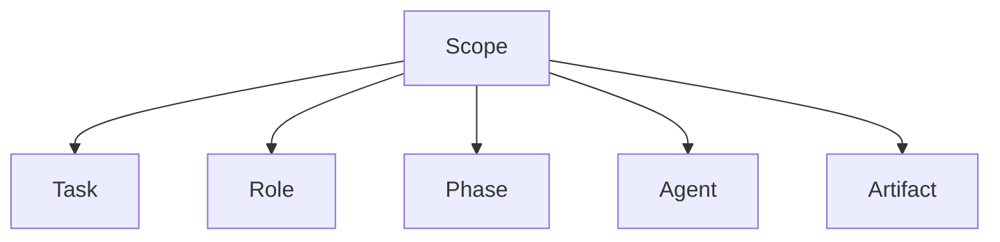
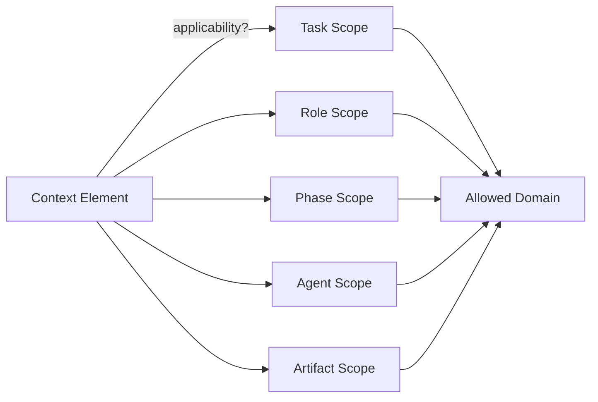

# Scope

This specification defines **scope** as a foundational primitive in context-engineered systems.

Scope determines **where an instruction, assumption, or signal applies**.  
It limits *reach*, not authority.

Without explicit scope, all context becomes global by default.  
Global context is a structural hazard.

---

## Definition

**Scope** is the rule that bounds **the applicability of a context element** across tasks, roles, phases, agents, or artifacts.

Scope answers:
- *What does this apply to?*
- *Where does it stop applying?*

Scope does **not** decide priority or correctness.  
It decides **applicability**.

---

## Scope vs Boundaries

Scope is a specialization of boundaries.

- **Boundaries** limit *influence paths*.
- **Scope** limits *applicability domains*.

A boundary may exist without scope.  
Scope cannot exist without boundaries.

---

## Why Scope Is Primitive

Scope is primitive because:

- tasks coexist within the same context window
- agents share execution environments
- attention does not respect intent automatically
- global applicability is the default failure mode

Every system has scope.  
Most systems fail because it is implicit.

---

## Scope Dimensions

Scope applies across multiple structural axes.

Each axis constrains a different class of failure.

---

## Task Scope

Task scope defines **which task an instruction applies to**.

Without task scope:

- setup instructions bleed into execution
- outputs reflect the wrong objective
- multi-step workflows collapse

Task scope is mandatory for multi-task systems.

---

## Role Scope

Role scope defines **which role is being enacted**.

Without role scope:

- policy, reasoning, and execution collapse into one voice
- assistants oscillate between personas
- authority becomes ambiguous

Role scope enforces responsibility separation.

---

## Phase Scope

Phase scope defines **when an instruction is active**.

Typical phases:

- planning
- reasoning
- execution
- evaluation

Without phase scope:

- evaluation criteria influence generation
- planning constraints leak into execution
- correction becomes inconsistent

Phase scope localizes intent in time.

---

## Agent Scope

Agent scope defines **which agent a context element applies to**.

Without agent scope:

- shared memory contaminates behavior
- agent roles blur
- coordination logic collapses

Agent scope is non-negotiable in multi-agent systems.

---

## Artifact Scope

Artifact scope defines **which artifacts are influenced**.

Artifacts include:

- memory entries
- summaries
- plans
- code
- evaluations

Without artifact scope:

- instructions modify unintended outputs
- summaries encode constraints
- memory absorbs transient context

Artifact scope protects downstream state.

---

## Scope Failure Patterns

Scope failures are **silent and structural**.

Common patterns:

- global instructions by default
- reused prompts without scoping
- shared context across unrelated tasks
- missing phase separation

Scope failures most often manifest as **interference**.

---

## Scope vs Temporal Boundaries

Scope defines *where*.  
Temporal boundaries define *when*.

An instruction may be:

- correctly scoped
- but temporally stale

These primitives are complementary, not interchangeable.

---

## Design Implications

From a system design perspective:

- every context element must declare scope
- default scope must be narrow
- scope expansion must be explicit
- scope violations must be detectable

Systems that rely on “it should only apply here” are mis-specified.

---

## Non-Claims

This specification does not claim:

- that scope guarantees correctness
- that scope eliminates interference
- that scope can be inferred reliably
- that scope is static

It defines applicability, not behavior.

---

## Status

This specification is **stable**.

It provides sufficient grounding to define scope failure signals, trade-offs, examples, and enforcement checks.
