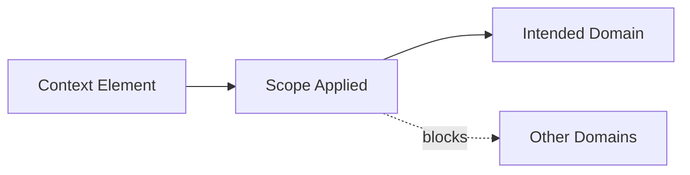
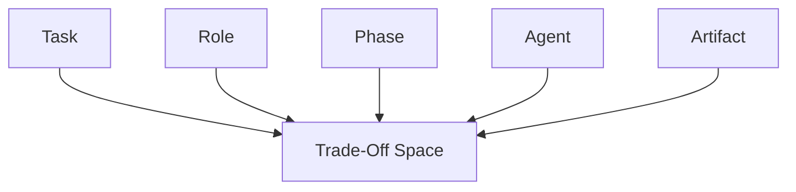

# Scope — Trade-Offs

This document enumerates the **structural trade-offs introduced by enforcing scope** in context-engineered systems.

Scope does not improve correctness.  
It **reduces unintended applicability**.

Every scope boundary trades flexibility for determinism.

---

## Trade-Off Model

Scope constrains **where influence applies**.

Blocking unintended domains always removes some potential reuse.

---

## Task Scope Trade-Offs

**What task scope improves**

- separation of objectives
- predictable transitions between tasks
- reduced interference

**What it constrains**

- reuse of setup context
- cross-task optimization
- global reasoning shortcuts

**Structural cost**

- repeated setup
- additional orchestration

**Failure if ignored**

- instruction bleed
- mixed objectives

Task scope stabilizes workflows by sacrificing convenience.

---

## Role Scope Trade-Offs

**What role scope improves**

- responsibility clarity
- authority separation
- consistent behavior per role

**What it constrains**

- expressive blending
- conversational fluidity
- emergent personas

**Structural cost**

- stricter prompting
- role handoff overhead

**Failure if ignored**

- role collapse
- authority ambiguity

Role scope prevents confusion by limiting expressiveness.

---

## Phase Scope Trade-Offs

**What phase scope improves**

- isolation between planning, execution, and evaluation
- clean reasoning stages
- deterministic corrections

**What it constrains**

- opportunistic optimization across phases
- dynamic backtracking

**Structural cost**

- additional phase transitions
- context resets

**Failure if ignored**

- evaluation biasing generation
- planning constraints leaking into execution

Phase scope enforces order by restricting simultaneity.

---

## Agent Scope Trade-Offs

**What agent scope improves**

- containment of influence
- predictable coordination
- reduced cross-agent interference

**What it constrains**

- parallel reasoning
- shared situational awareness

**Structural cost**

- synchronization overhead
- orchestration complexity

**Failure if ignored**

- cross-agent contamination
- unstable coordination

Agent scope trades throughput for isolation.

---

## Artifact Scope Trade-Offs

**What artifact scope improves**

- integrity of downstream state
- rollback capability
- prevention of constraint propagation

**What it constrains**

- artifact reuse
- implicit carryover of assumptions

**Structural cost**

- explicit artifact schemas
- validation overhead

**Failure if ignored**

- poisoned summaries
- persistent drift

Artifact scope protects the future by limiting inheritance.

---

## Cross-Scope Trade-Offs

Scopes compound.

Common compound costs:

- increased orchestration
- reduced autonomy
- slower iteration
- higher governance burden

These costs are structural, not accidental.

---

## Scope Invariants

The following always hold:

- Narrower scope reduces unintended influence.
- Broader scope increases interference risk.
- Scope defaults to global unless constrained.
- Scope errors surface as coordination failures.

Any design denying these is incomplete.

---

## Trade-Off Visibility Requirement

Scope trade-offs must be explicit.

Acceptable mechanisms:

- scope declarations
- phase diagrams
- role maps
- task transition rules

Hidden scope assumptions become hidden failures.

---

## Relationship to Governance

Scope enforcement increases governance load.

As scope tightens:

- automation becomes less implicit
- handoffs become explicit
- responsibility is clearer

Scope does not remove accountability.  
It localizes it.

---

## Status

This document is **stable**.

Trade-offs listed here are sufficient to reason about scope enforcement decisions at the primitive level.
