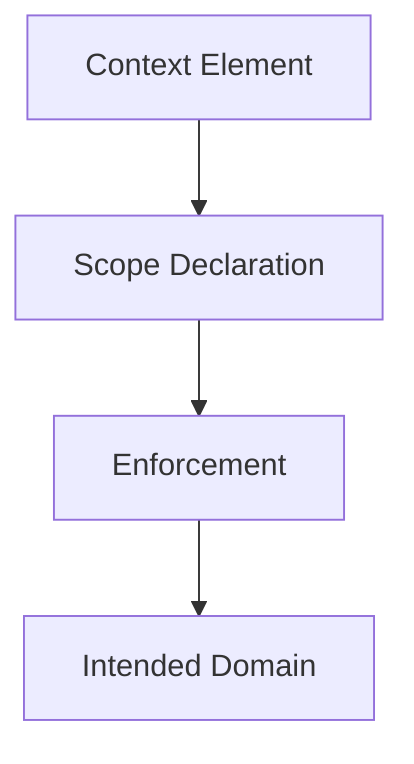

# Scope — Checks

This document defines **executable checks** to verify that scope is explicitly defined, enforced, and preventing unintended applicability.

Scope checks validate **where context is allowed to apply**, not whether outputs are correct.

A system can pass all quality checks and still fail every scope check.

---

## Check Model

Scope checks verify that **applicability domains are explicit and exclusive**.

If a context element reaches a domain without passing through a scope declaration, scope has failed.

---

## Check 1: Task Scope Declaration

**Question**  
Is every context element explicitly tied to a specific task?

**How to run**

- Enumerate all active tasks.
- List all instructions and assumptions.
- Map each element to a task.

**Pass criteria**

- Every element maps to exactly one task or is explicitly global.
- Task transitions reset or re-scope context.

**Fail indicators**

- “Applies to everything by default”
- Instructions persisting across tasks
- Mixed-task outputs

**Associated failures**

- Interference

---

## Check 2: Role Scope Enforcement

**Question**  
Are roles isolated with non-overlapping scopes?

**How to run**

- Identify roles (policy, reasoning, execution, evaluation).
- Inspect whether role instructions are active simultaneously.

**Pass criteria**

- Role scopes are exclusive.
- Role handoffs are explicit.

**Fail indicators**

- Role collapse
- Mixed voices or responsibilities
- Policy language in execution output

**Associated failures**

- Interference
- Authority ambiguity

---

## Check 3: Phase Scope Boundaries

**Question**  
Are phases (planning, execution, evaluation) explicitly bounded?

**How to run**

- Inspect whether phase transitions discard or mask context.
- Reorder phases experimentally.

**Pass criteria**

- Phase-specific context does not persist beyond its phase.
- Reordering phases does not change behavior unexpectedly.

**Fail indicators**

- Planning assumptions affecting execution
- Evaluation criteria biasing generation

**Associated failures**

- Interference

---

## Check 4: Agent Scope Isolation

**Question**  
Is agent-specific context isolated?

**How to run**

- Inspect shared memory and shared prompts.
- Verify agent-specific visibility rules.

**Pass criteria**

- Agents cannot see each other’s private context.
- Shared state is intentional and governed.

**Fail indicators**

- Cross-agent contamination
- Unexpected shared assumptions

**Associated failures**

- Interference

---

## Check 5: Artifact Scope Control

**Question**  
Are artifacts prevented from influencing unintended downstream artifacts?

**How to run**

- Trace how summaries, plans, and memories are created.
- Verify artifact-specific scope rules.

**Pass criteria**

- Artifacts declare intended consumers.
- Temporary artifacts cannot persist implicitly.

**Fail indicators**

- Summaries entering memory
- Plans altering policy
- Evaluations shaping future execution

**Associated failures**

- Drift
- Poisoning

---

## Check 6: Scope Reset and Cleanup

**Question**  
Does the system explicitly reset scope when context changes?

**How to run**

- Observe context before and after task or phase transitions.
- Verify stale context removal.

**Pass criteria**

- Scope cleanup is deterministic.
- No residual assumptions remain.

**Fail indicators**

- Context accumulation
- Partial resets
- Reliance on “the model should ignore this”

**Associated failures**

- Interference
- Drift

---

## Minimal Scope Audit (Checklist)

A system minimally conforms if all are true:

- [ ] Task scope is explicit
- [ ] Role scopes are isolated
- [ ] Phase boundaries are enforced
- [ ] Agent contexts are separated
- [ ] Artifact influence is bounded
- [ ] Scope resets are deterministic

Failure of any item indicates scope failure.

---

## When to Re-run These Checks

Re-run scope checks when:

- new tasks or roles are added
- workflows become multi-phase
- agents are introduced
- artifacts are persisted
- unexplained coordination issues appear

Scope failures compound silently.

---

## Status

This document is **stable**.

Checks listed here are sufficient to verify scope enforcement as a foundational primitive.
