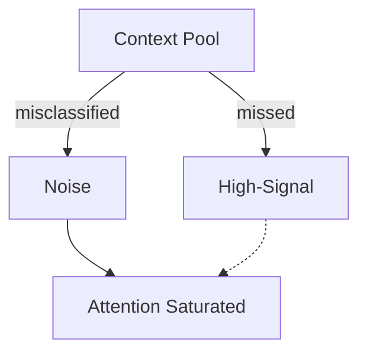

# Signal vs Noise — Failure Signals

This document enumerates **observable signals** that indicate failure to correctly distinguish signal from noise.

Signal vs noise failures occur when **irrelevant or low-value context consumes attention**, obscures intent, or interferes with valid influence.

These failures are structural.  
They often appear even when all inputs are “correct.”

---

## Signal Model

Signal failures manifest when **attention is allocated to the wrong material**.

If noise receives attention while signal does not, a signal failure exists.

---

## Over-Inclusion Signals

### Verbosity Dominance

Observed behaviors:

- long explanations override concise instructions
- verbosity correlates with influence
- short but critical signals are ignored

Interpretation:

- signal inferred from length
- no signal weighting applied

Primary downstream failures:

- degradation
- interference

---

### Redundant Context Accumulation

Observed behaviors:

- repeated facts appear across prompts
- summaries restate prior summaries
- context window fills without new information

Interpretation:

- no deduplication
- previously-consumed signal treated as fresh

Primary downstream failures:

- degradation

---

## Under-Inclusion Signals

### Critical Signal Omission

Observed behaviors:

- system misses key constraints
- outputs violate explicit requirements
- corrections appear ignored

Interpretation:

- signal drowned by noise
- attention budget exhausted prematurely

Primary downstream failures:

- degradation
- interference

---

### Weak Signal Suppression

Observed behaviors:

- subtle but important qualifiers ignored
- edge-case instructions missed
- caveats disappear in execution

Interpretation:

- no weighting for weak but critical signals
- attention biased toward obvious context

---

## Phase-Shift Misclassification

### Expired Signal Treated as Active

Observed behaviors:

- planning assumptions affect execution
- evaluation criteria bias generation
- stale goals remain influential

Interpretation:

- phase shift not reflected in signal classification
- lifetime decay ignored

Primary downstream failures:

- interference
- drift

---

### Active Signal Treated as Noise

Observed behaviors:

- phase-critical instructions ignored
- evaluation criteria not applied during evaluation
- safety constraints skipped at execution

Interpretation:

- phase context missing
- role or phase scope violated

---

## Cross-Role Noise Signals

### Role-Irrelevant Context Consumed

Observed behaviors:

- policy language affects execution tone
- evaluation metrics shape reasoning prematurely
- explanations contaminate decisions

Interpretation:

- role-dependent signal classification absent

Primary downstream failures:

- interference

---

## Signal Inversion

### Optimization Target Becomes Noise

Observed behaviors:

- original objective fades
- system optimizes proxies
- metrics replace intent

Interpretation:

- signal inversion via feedback loops
- misclassified reinforcement

Primary downstream failures:

- drift
- poisoning

---

## Noise Persistence Signals

### Previously-Useful Context Becomes Dominant

Observed behaviors:

- legacy assumptions dominate decisions
- outdated constraints reappear
- context relevance decays unnoticed

Interpretation:

- signal decay unmanaged
- lifetime misaligned

Primary downstream failures:

- drift

---

## Distinguishing Signal Failure from Other Failures

| Observation          | Signal vs Noise Failure? |
| -------------------- | ------------------------ |
| Wrong answer         | Possibly                 |
| Attention saturated  | Yes                      |
| Context window full  | Not necessarily          |
| Correct info ignored | Yes                      |
| Authority conflict   | No (Boundary)            |

Signal failures concern **attention allocation**, not authority or applicability.

---

## Detection Guidance

Signal failures are detected by:

- aggressively reducing context and observing improvement
- removing verbose sections experimentally
- reordering context by assumed importance
- isolating phase-specific context

If removing context improves performance, noise was present.

---

## When to Escalate

Escalation is required when:

- adding context degrades outputs
- key constraints are repeatedly ignored
- behavior improves after context removal

Signal failures are often misdiagnosed as “model weakness.”

---

## Status

This document is **stable**.

Signals listed here are sufficient to detect failures in signal vs noise discrimination before systemic degradation occurs.
