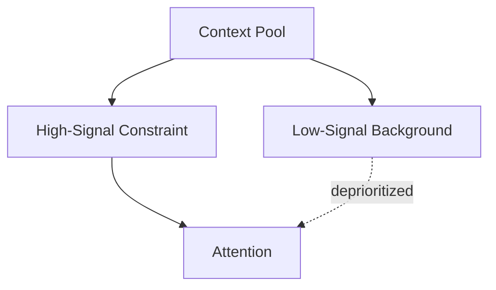
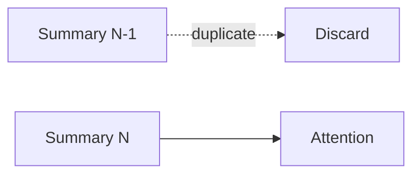
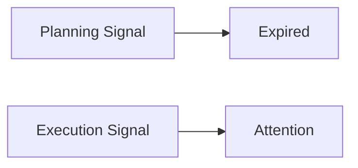
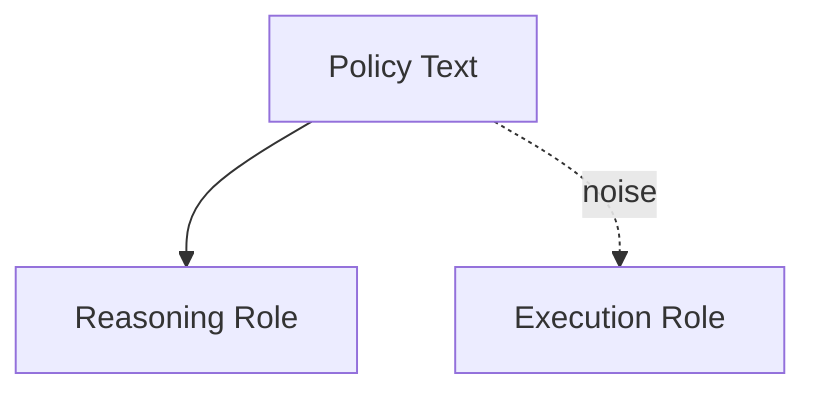
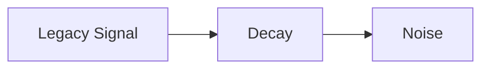

# Signal vs Noise — Examples

This document provides **execution-grounded examples** showing how signal and noise are distinguished, how misclassification occurs, and what changes when signal selection is enforced.

These examples focus on **attention allocation and relevance**, not correctness alone.

---

## Example 1: Verbose Context Masking a Critical Constraint

### Context

A system receives:
- a long background document
- a short instruction:  
  “Do not include personal data in the output.”

The background text is correct, detailed, and relevant historically.

---

### Signal Failure (Without Signal Selection)

Observed behavior:
- output includes personal data
- short instruction appears ignored
- model follows dominant narrative from background

Root cause:
- verbosity treated as salience
- critical but weak signal drowned by noise

Downstream failures:
- degradation
- policy violation

---

### Signal Enforcement

Signal selection applied:
- constraints elevated as high-signal
- background demoted to reference-only

---

### Outcome

- constraint respected
- background still informative
- attention used intentionally

---

## Example 2: Redundant Context Accumulation in Long Sessions

### Context

A conversational system summarizes each turn and re-injects summaries.

---

### Signal Failure (Without Deduplication)

Observed behavior:

- summaries repeat prior summaries
- context window fills rapidly
- performance degrades over time

Root cause:

- previously-consumed signal treated as fresh
- no noise pruning

Downstream failures:

- degradation

---

### Signal Enforcement

Noise removal applied:

- redundant summaries removed
- only delta information retained

---

### Outcome

- stable performance across long sessions
- attention pressure reduced
- summaries remain useful

---

## Example 3: Phase-Shifted Signal Misclassification

### Context

A system operates in two phases:

1. Planning
2. Execution

Planning includes hypothetical constraints and alternatives.

---

### Signal Failure (Without Phase Awareness)

Observed behavior:

- execution hesitates
- alternatives appear in final output
- system appears indecisive

Root cause:

- planning signal treated as execution signal
- phase shift ignored

Downstream failures:

- interference

---

### Signal Enforcement

Phase-aware signal selection applied:

- planning context expires
- execution signal refreshed

---

### Outcome

- decisive execution
- clean phase separation
- reduced interference

---

## Example 4: Role-Dependent Signal Misuse

### Context

Policy text is included to guide reasoning.  
Execution should be practical and user-facing.

---

### Signal Failure (Without Role Awareness)

Observed behavior:

- execution output mirrors policy language
- tone is rigid and legalistic
- usability drops

Root cause:

- policy treated as execution signal
- role scope ignored

Downstream failures:

- interference

---

### Signal Enforcement

Role-aware signal classification applied:

- policy high-signal for reasoning
- policy noise for execution

---

### Outcome

- reasoning remains compliant
- execution becomes usable
- responsibilities remain clear

---

## Example 5: Legacy Signal Decay

### Context

A system once required a workaround for a deprecated API.  
The workaround remains in context.

---

### Signal Failure (Without Decay)

Observed behavior:

- obsolete constraints persist
- newer capabilities underused
- behavior lags reality

Root cause:

- signal decay unmanaged
- obsolete signal treated as current

Downstream failures:

- drift

---

### Signal Enforcement

Decay rules applied:

- legacy signal demoted
- revalidation required for inclusion

---

### Outcome

- obsolete constraints removed
- behavior realigns with current state
- drift arrested

---

## Example Invariants

Across all examples:

- failures occur without incorrect inputs
- verbosity correlates with dominance unless controlled
- signal relevance changes by phase and role
- removing context often improves behavior

If adding context makes behavior worse, noise was added.

---

## Status

This document is **stable**.

Examples provided here are sufficient to demonstrate signal vs noise as a primitive governing attention relevance.
