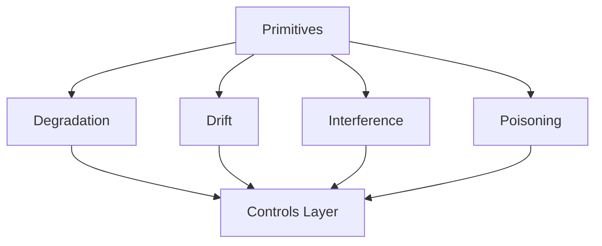

# Failure Mechanics Index

This index summarizes the failure mechanics defined in this repository and how they connect to primitives and controls.

Failure mechanics describe **how systems fail structurally**. They are not root causes or mitigations; they are the predictable ways systems break when primitives are violated.

---

## Catalog

- **Degradation** — capacity loss and quality decay under attention pressure. (`20-failure-mechanics/degradation/`)
- **Drift** — stable behavior that diverges from intent. (`20-failure-mechanics/drift/`)
- **Interference** — competing signals causing conflict or oscillation. (`20-failure-mechanics/interference/`)
- **Poisoning** — integrity breaches from untrusted or adversarial inputs. (`20-failure-mechanics/poisoning/`)

---

## How to Use

1. Identify the dominant failure mechanic by signal domain (capacity, alignment, coordination, integrity).
2. Trace dependencies to primitives (attention, boundaries, scope, lifetimes, signal vs noise).
3. Select controls only after the failure mechanic is correctly classified.
4. Run the associated checks before claiming mitigation.

---

## Status

This index is **stable**. Additions require explicit justification and must map to existing primitives and controls.
