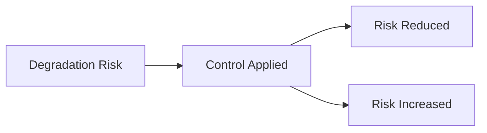
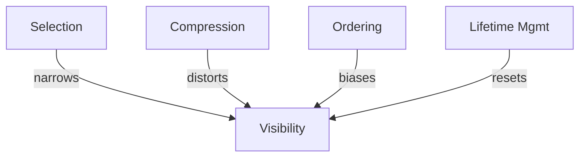

# Degradation — Trade-Offs

This document enumerates the **structural trade-offs** introduced when applying controls to mitigate degradation.

Trade-offs are **non-negotiable**.
They cannot be optimized away, only selected, bounded, and governed.

---

## Trade-Off Model

Every degradation control reduces the _rate_ or _visibility_ of decay by increasing exposure elsewhere.

Failure to state trade-offs explicitly converts mitigation into hidden liability.

---

## Trade-Offs by Control

### Selection

**What it reduces**

- accumulation pressure
- attention dilution
- progressive quality decay

**What it increases**

- omission risk
- brittleness to edge cases
- dependence on selection accuracy

**Irreversibility**

- excluded information cannot influence outcomes within the turn
- recovery requires re-selection or re-execution

**When this becomes dangerous**

- slowly relevant context matters later
- task boundaries evolve mid-session

---

### Compression

**What it reduces**

- context length
- attention saturation
- immediate degradation symptoms

**What it increases**

- information loss
- summary bias
- distortion across iterations

**Irreversibility**

- compressed content cannot be reconstructed
- bias compounds when compression is repeated

**When this becomes dangerous**

- summaries become authoritative
- compressed outputs persist without refresh

---

### Ordering

**What it reduces**

- early-stage instruction erosion
- loss of salience for constraints

**What it increases**

- positional bias
- coupling between layout and behavior
- fragility under continued growth

**Irreversibility**

- later elements are structurally disadvantaged
- reordering effects decay over time

**When this becomes dangerous**

- ordering substitutes for selection
- critical elements migrate deeper in context

---

### Lifetime Management

**What it reduces**

- silent accumulation
- relevance decay
- persistence-driven degradation

**What it increases**

- discontinuity
- re-ingestion and recomputation cost
- loss of long-horizon coherence

**Irreversibility**

- expired context is no longer available
- continuity must be re-established manually or procedurally

**When this becomes dangerous**

- long-term reasoning is required
- historical nuance is critical

---

## Cross-Control Trade-Offs

Stacking controls amplifies cost.

Common compound risks:

- **Selection + Compression** → silent omission with bias
- **Compression + Persistence** → accelerated drift
- **Ordering without Selection** → delayed but inevitable degradation
- **Aggressive Lifetimes** → loss of continuity

Coordination is mandatory.

---

## Trade-Off Invariants

The following always hold:

- Slowing degradation reduces coverage.
- Reducing accumulation increases brittleness.
- Preserving salience increases bias.
- Removing history reduces continuity.

Any design that violates these statements is mis-specified.

---

## Trade-Off Visibility Requirement

All degradation controls must surface trade-offs at design and review time.

Acceptable mechanisms:

- explicit documentation
- review checklists
- acceptance criteria
- escalation thresholds

Hidden trade-offs are treated as design defects.

---

## Relationship to Governance

As degradation mitigation becomes more aggressive:

- transparency decreases
- irreversibility increases
- human oversight must strengthen

Governance intensity must scale with trade-off severity.

---

## References

The trade-offs described here align with empirical findings and production experience reported in:

- Liu et al., **Lost in the Middle: How Language Models Use Long Contexts**, 2023
- Chen et al., **Evaluating Large Language Models on Long-Context Tasks**, 2023
- Wu et al., **Scaling Laws for Forgetting in Language Models**, 2023
- Anthropic, **On the Risks of Persistent Context and Long-Horizon Agents**, 2023

These works demonstrate that mitigation strategies trade decay for bias, omission, or loss of continuity.

---

## Status

This document is **stable**.

Trade-offs listed here are considered exhaustive for degradation mitigation at the failure-mechanics level.
