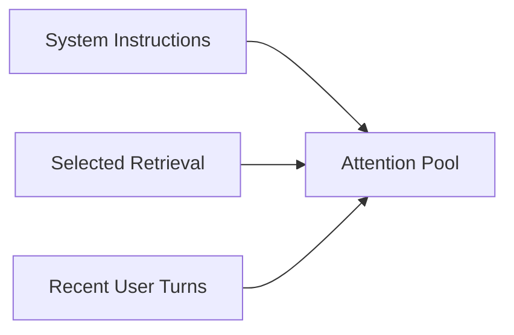
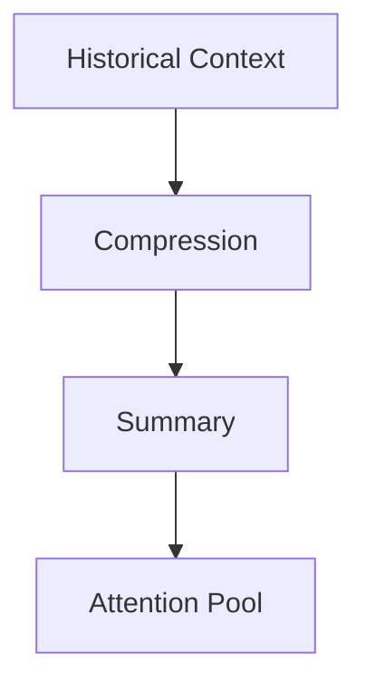
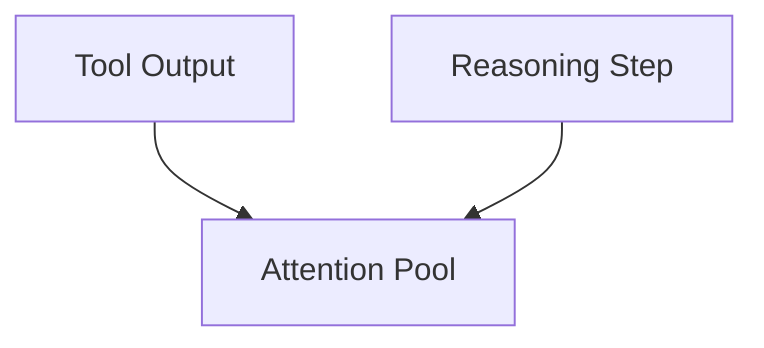
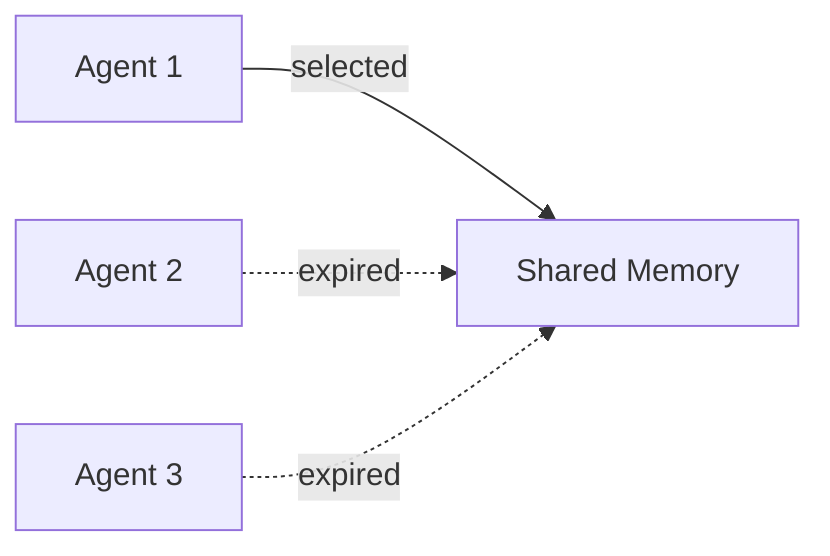

# Degradation — Examples

This document provides **bounded, execution-focused examples** demonstrating how degradation manifests in real systems and how controls are applied **with explicit trade-offs and governance points**.

Examples exist to **prove the failure mechanic is actionable**, not to suggest default implementations.

---

## Example 1: Long-Running Conversational Agent

### Context

A conversational agent supports multi-hour interactions with:

- persistent message history
- retrieval-augmented responses
- periodic summarization of prior turns

Early interactions are high quality. Later responses become shallow and inconsistent.

---

### Observed Failure Signals

From `01-failure-signals.md`:

- **Gradual Constraint Erosion**
- **Shallowing of Reasoning Depth**
- **Progressive Quality Decline**

Signals appear without explicit errors.

---

### Control Application

Controls applied:

- **Selection**: limit retrieval to top-k documents per turn
- **Lifetime Management**: expire conversation turns older than a fixed horizon
- **Ordering**: elevate system constraints above retrieved content

---

### Trade-Offs Introduced

From `02-trade-offs.md`:

- Omission of earlier conversational nuance
- Increased brittleness for long-horizon reasoning
- Dependence on selection quality

---

### Outcome

- Instruction adherence stabilizes
- Reasoning depth improves for recent topics
- Long-term continuity degrades

---

### Human Governance Point

- Periodic review of expired context
- Manual re-ingestion when continuity is required

---

## Example 2: Iterative Summarization Pipeline

### Context

A system repeatedly compresses accumulated context into summaries to manage context length.

Summaries are used as authoritative memory.

---

### Observed Failure Signals

From `01-failure-signals.md`:

- **Intra-Session Logical Drift**
- **Progressive Quality Decline**

Degradation emerges after multiple summarization cycles.

---

### Control Application

Controls applied:

- **Compression**: summarize historical context
- **Selection**: retain only the most recent summary

---

### Trade-Offs Introduced

From `02-trade-offs.md`:

- Irreversible information loss
- Accumulating summary bias
- Reduced auditability of original reasoning

---

### Outcome

- Context length remains bounded
- Outputs diverge subtly from original intent

---

### Human Governance Point

- Periodic comparison of summaries to source context
- Forced refresh from ground truth at checkpoints

---

## Example 3: Tool-Heavy Agent with Accumulating Outputs

### Context

An agent repeatedly calls external tools (search, calculation, planning) and retains outputs across turns.

Later tool results are inconsistently integrated.

---

### Observed Failure Signals

From `01-failure-signals.md`:

- **Tool Output Integration Loss**
- **Retrieval Influence Decay**

---

### Control Application

Controls applied:

- **Selection**: include only the most recent tool output
- **Ordering**: place tool output immediately before reasoning steps

---

### Trade-Offs Introduced

From `02-trade-offs.md`:

- Loss of historical tool context
- Increased coupling between tool calls and reasoning order

---

### Outcome

- Tool outputs influence reasoning reliably
- Historical context is no longer accessible

---

### Human Governance Point

- Review decisions when historical tool context may matter
- Adjust selection policy for complex investigations

---

## Example 4: Multi-Agent System with Shared Memory

### Context

Multiple agents write to a shared memory space across tasks.

Over time, shared memory grows unbounded.

---

### Observed Failure Signals

From `01-failure-signals.md`:

- **Progressive Quality Decline**
- **Threshold Collapse**

---

### Control Application

Controls applied:

- **Lifetime Management**: expire shared memory entries
- **Selection**: restrict which agents can write per turn

---

### Trade-Offs Introduced

From `02-trade-offs.md`:

- Reduced parallelism
- Increased coordination overhead
- Loss of cross-agent historical insight

---

### Outcome

- Degradation slows
- System throughput decreases

---

### Human Governance Point

- Decide when to relax memory expiration
- Monitor coordination bottlenecks

---

## Example Invariants

Across all examples:

- Degradation is detected before collapse
- Controls reduce decay but introduce cost
- Trade-offs are explicit
- Human review remains necessary

Examples that violate these invariants are invalid.

---

## Status

This document is **stable**.

Examples provided here are sufficient to demonstrate executable handling of degradation under real-world constraints.
