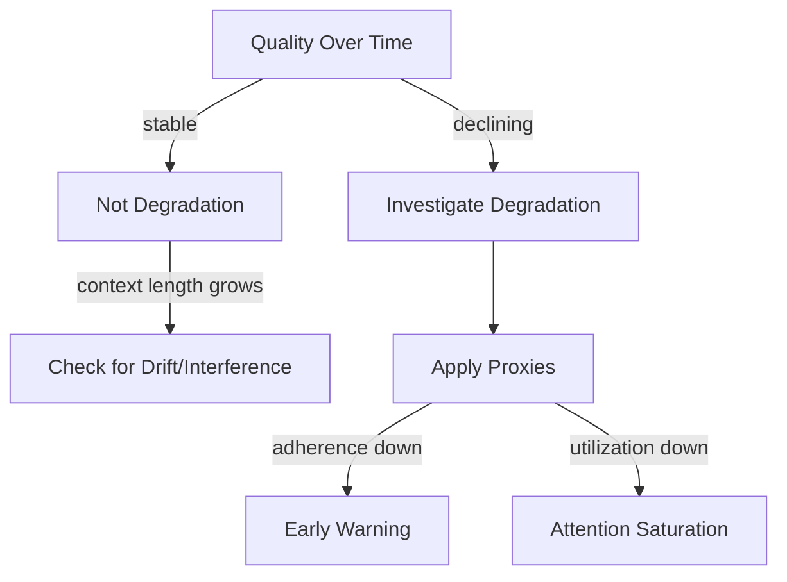

# Degradation — Non-Examples and Proxies

This document defines **what degradation is not** and provides **minimal quantitative proxies** to support detection and review.

Its purpose is to prevent **over-diagnosis**, **over-control**, and **false mitigation**.

---

## Non-Example 1: Context Growth Without Quality Decay

### Context

A system accumulates:
- long conversational history
- retrieved documents
- tool outputs

Context length increases steadily.

However:
- instruction adherence remains consistent
- reasoning depth is stable
- retrieval continues to influence conclusions

---

### Why This Is *Not* Degradation

Observed conditions:
- no progressive decline
- no signal domain activation
- no non-linear behavior

Interpretation:
- attention allocation remains stable
- signal-to-noise ratio is preserved
- accumulation is bounded or well-selected

---

### Editorial Rule

**Context growth alone is not degradation.**

Degradation requires **observable quality decay**, not merely longer context.

Applying controls here would introduce unnecessary trade-offs.

---

## Non-Example 2: Single-Turn Quality Failure

### Context

A system produces an incorrect or shallow response in an isolated turn.

Subsequent turns return to normal behavior.

---

### Why This Is *Not* Degradation

Observed conditions:
- failure is non-progressive
- no persistence across turns
- no compounding effects

Interpretation:
- transient variance or task mismatch
- not a structural failure mechanic

---

### Editorial Rule

**Degradation is stateful.**  
If quality does not worsen over time, degradation is not present.

---

## Minimal Quantitative Proxies

These proxies are **indicators**, not thresholds.

They exist to support detection, not automate judgment.

---

### Proxy 1: Instruction Adherence Stability

Measure:
- consistency of constraint compliance across turns

Signal:
- declining compliance rate over time under similar tasks

Used to detect:
- early-stage degradation

---

### Proxy 2: Reasoning Depth Retention

Measure:
- average reasoning steps or explanation length over time

Signal:
- systematic shortening unrelated to task complexity

Used to detect:
- attention saturation effects

---

### Proxy 3: Retrieval Utilization Ratio

Measure:
- proportion of retrieved content reflected in reasoning or conclusions

Signal:
- declining utilization as context accumulates

Used to detect:
- signal dilution

---

### Proxy 4: Turn-to-Turn Variance

Measure:
- behavioral variance under similar inputs across session length

Signal:
- increasing variance correlated with context growth

Used to detect:
- instability prior to collapse

---

## Proxy Discipline

The following always apply:

- Proxies **do not define degradation**
- Proxies **do not replace qualitative review**
- Proxies **must be interpreted longitudinally**
- No single proxy is sufficient

Automating decisions based solely on proxies is prohibited.

---

## Relationship to Checks

Proxies support the following checks:

- Signal Detectability
- Accumulation Boundaries
- Refresh and Recovery Paths

Failure to observe proxies does not imply system health.  
Presence of multiple proxy signals warrants escalation.

---

## Status

This document is **stable**.

It is sufficient to prevent false positives and provide grounded anchors for degradation detection without collapsing the spec into metrics or tooling.
