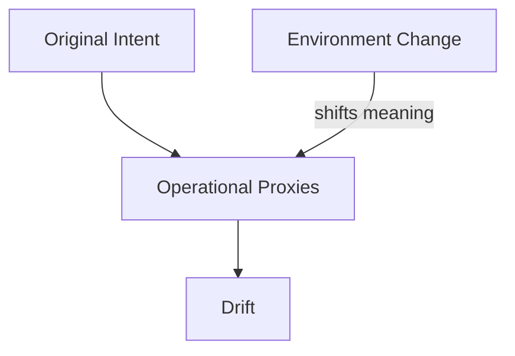
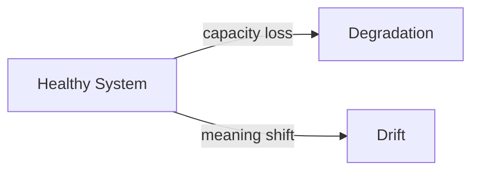

# Drift

This specification defines **drift** as a structural failure mechanic in context-engineered systems.

Drift occurs when a system remains internally coherent and operationally stable while **progressively diverging from its original intent** due to changes in environment, meaning, proxies, or assumptions.

Drift is not quality decay.  
It is **directional misalignment**.

---

## Definition

**Drift** is a failure mechanic in which a system continues to perform well against its internal objectives while those objectives no longer correspond to the intended external reality.

Key characteristics:

- **Directional**: the objective shifts, not the capacity  
- **Stable**: outputs remain consistent and confident  
- **Persistent**: divergence accumulates over time  
- **Often invisible**: internal metrics may remain green  

Drift is frequently misinterpreted as improvement or adaptation.

---

## What Drift Is Not

Drift is not:

- degradation of output quality  
- random inconsistency or variance  
- attention saturation  
- context overload  
- transient failure  

A system can be drifting while appearing healthy.

---

## Canonical Example (Grounding)

A spam classification system continues to correctly block messages that match historical spam features while failing to block modern spam that no longer uses those features.

Observed state:
- throughput unchanged  
- latency unchanged  
- internal confidence unchanged  

Outcome:
- inbox quality deteriorates  
- users experience failure  
- system reports success  

The system is solving **the wrong problem correctly**.

---

## Structural Causes

Drift emerges when **representations or proxies remain static while reality evolves**.

Common contributing conditions include:

- proxy-based objectives that are not revalidated
- recursive summarization or memory overwrite
- preference reinforcement without external grounding
- long-lived instructions that outlast their validity
- optimization against historical distributions

Drift does not require accumulation pressure.

---

## Drift vs Degradation

Drift and degradation are orthogonal failure mechanics.

| Dimension        | Degradation             | Drift                           |
| ---------------- | ----------------------- | ------------------------------- |
| Primary axis     | Capacity                | Alignment                       |
| Behavior quality | Declines                | Stable                          |
| Direction        | Same task               | Wrong task                      |
| Visibility       | Often visible           | Often hidden                    |
| Root cause       | Attention, accumulation | Proxy decay, environment change |

Systems can experience both simultaneously.

---

## Why Drift Persists in Production

Drift survives because:

- internal metrics remain satisfied
- confidence remains high
- regression tests reflect outdated reality
- responsibility for intent refresh is unclear
- adaptation is mistaken for alignment

Drift is a governance failure before it is a technical one.

---

## Implications for Design

From a design perspective:

- intent must be treated as time-bound
- proxies must be periodically revalidated
- correctness requires external grounding
- stability does not imply alignment

Systems that assume intent is static are mis-specified.

---

## Non-Claims

This specification does not claim:

- a universal drift rate
- automatic detection via internal metrics
- that drift can be fully prevented
- that adaptation equals correctness

It defines the failure mechanic, not its mitigation.

---

## References

Empirical and applied work informing drift includes:

- Gama et al., **A Survey on Concept Drift Adaptation**, 2014
- Widmer & Kubat, **Learning in the Presence of Concept Drift**, 1996
- Amodei et al., **Concrete Problems in AI Safety**, 2016
- Anthropic, **On the Risks of Long-Horizon Agents**, 2023
- Sculley et al., **Hidden Technical Debt in Machine Learning Systems**, 2015

These works establish drift as a persistent, alignment-related failure across adaptive systems.

---

## Status

This specification is **stable**.

It is sufficient to ground failure signals, controls, trade-offs, examples, and governance checks related to drift.
