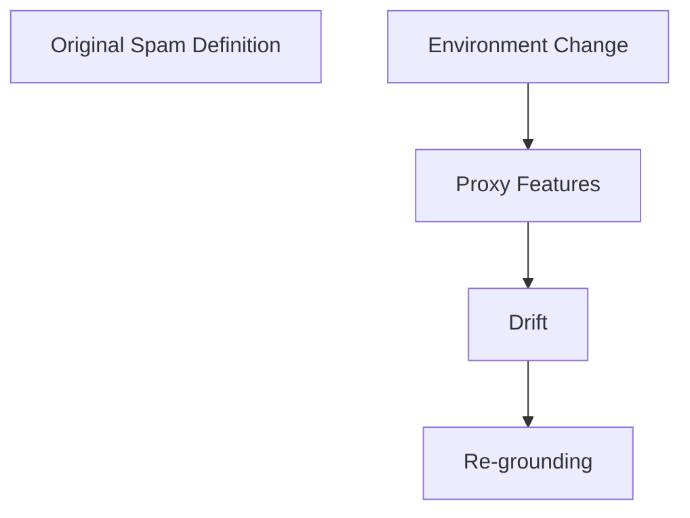
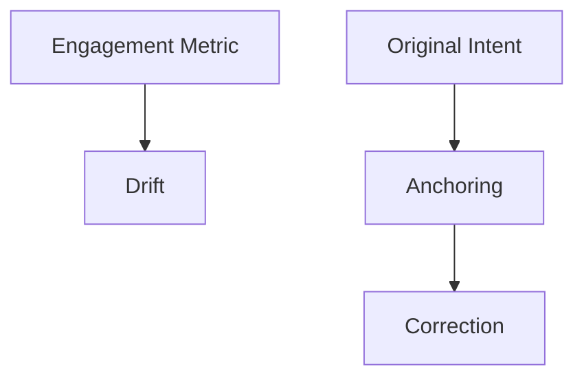
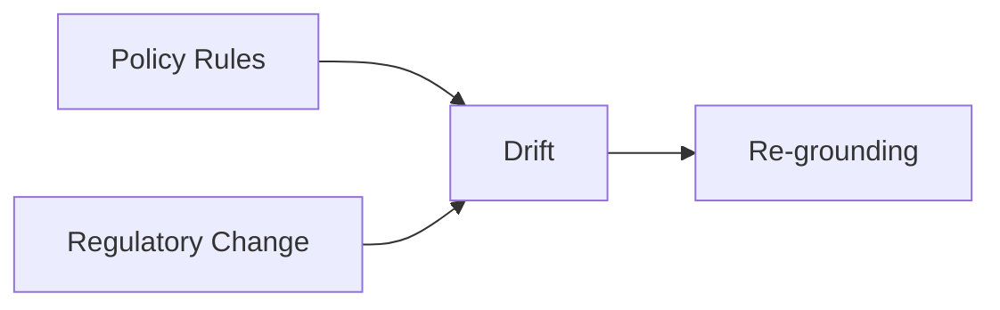

# Drift — Examples

This document provides **bounded, execution-focused examples** that demonstrate how drift manifests in real systems and how it is governed.

These examples show **stable systems becoming wrong**, not unstable systems failing.

---

## Example 1: Spam Classification System (Concept Drift)

### Context

An email filtering system classifies incoming messages as *spam* or *legitimate*.

The system:
- processes messages reliably
- maintains stable throughput and confidence
- uses historically effective features and heuristics

---

### Observed Failure Signals

From `01-failure-signals.md`:
- **Stable Outputs With Changed Meaning**
- **Feature or Heuristic Obsolescence**
- **Outcome–Intent Divergence**

Users report increasing spam in inboxes despite “successful” classifications.

---

### Control Application

Controls applied:
- **Validation**: compare classification outcomes against updated user complaints
- **Human Review**: reassess what constitutes spam under current conditions
- **Re-grounding**: update intent and feature assumptions



---

### Trade-Offs Introduced

From `02-trade-offs.md`:

- temporary instability during re-grounding
- increased review and retraining cost
- disruption of historical comparability

---

### Outcome

- alignment with user expectations restored
- system confidence recalibrated
- operational stability preserved after adjustment

---

### Human Governance Point

- explicit approval of updated spam definition
- documented intent revision

---

## Example 2: Recommendation System Preference Drift

### Context

A content recommendation system optimizes for user engagement based on historical interaction data.

The system:

- steadily improves engagement metrics
- adapts recommendations confidently
- shows no internal performance issues

---

### Observed Failure Signals

From `01-failure-signals.md`:

- **Proxy Substitution**
- **Reinforced Misalignment**
- **Temporal Success Illusion**

Users report reduced satisfaction despite higher engagement scores.

---

### Control Application

Controls applied:

- **Anchoring**: restate original intent (user value vs engagement)
- **Validation**: audit recommendations against satisfaction outcomes
- **Human Review**: adjudicate metric–outcome conflict



---

### Trade-Offs Introduced

From `02-trade-offs.md`:

- reduced short-term engagement
- slower adaptation cycles
- increased governance overhead

---

### Outcome

- recommendations align with declared user value
- metrics adjusted to reflect intent
- autonomy reduced intentionally

---

### Human Governance Point

- approval of revised success metrics
- authority to override automated optimization

---

## Example 3: Policy Enforcement System With Stale Assumptions

### Context

A compliance system enforces organizational policies encoded as rules and guidance.

The system:

- applies rules consistently
- reports high compliance rates
- does not detect internal errors

External regulations change.

---

### Observed Failure Signals

From `01-failure-signals.md`:

- **Distribution Shift Insensitivity**
- **Outcome–Intent Divergence**

Audits reveal non-compliance despite internal success signals.

---

### Control Application

Controls applied:

- **Re-grounding**: update policy interpretation
- **Validation**: cross-check outputs against current regulations
- **Human Review**: authorize rule changes



---

### Trade-Offs Introduced

From `02-trade-offs.md`:

- operational disruption during updates
- loss of continuity in reporting
- increased review load

---

### Outcome

- policy alignment restored
- system remains stable post-update

---

### Example 4: Simplified Drift Detection (Pseudo-code for Validation)

**Context**
A summarization agent produces daily reports from news feeds. Over time, the stylistic preferences or key phrase extraction might subtly shift from the initial, desired intent.

**Failure**
- Summaries become less useful or deviate from brand voice without explicit error flags.
- Internal metrics (e.g., summary length, keyword frequency) remain stable, but user satisfaction decreases.

**Change (Conceptual Pseudo-code for Drift Detection)**

```python
import hashlib

def calculate_semantic_hash(text: str) -> str:
    """
    Hypothetical function to create a "semantic hash" of text.
    In a real system, this might involve embedding, dimensionality reduction,
    and then hashing the reduced vector, or comparing against a centroid.
    For this example, it's a proxy for semantic fingerprinting.
    """
    # Placeholder: In reality, use an LLM embedding + clustering, or other content-aware hashing
    return hashlib.sha256(text.encode('utf-8')).hexdigest()[:10] # Simplified for example

def detect_drift(
    new_summary_features: dict,  # e.g., {'semantic_hash': 'abc123...', 'sentiment': 0.1}
    baseline_summary_features: dict, # e.g., {'semantic_hash': 'xyz789...', 'sentiment': 0.9}
    threshold: float = 0.2
) -> bool:
    """
    Detects if a new summary has semantically drifted too far from a baseline.
    """
    # Example: Compare semantic hashes (highly simplified)
    if new_summary_features['semantic_hash'] != baseline_summary_features['semantic_hash']:
        # In a real scenario, compare embeddings or other extracted features
        print("Semantic hash mismatch - potential drift detected!")
        # More sophisticated comparison for actual semantic drift
        # e.g., cosine_distance(new_embed, baseline_embed) > threshold
        return True

    # Example: Compare sentiment (simple numerical comparison)
    sentiment_diff = abs(new_summary_features.get('sentiment', 0) - baseline_summary_features.get('sentiment', 0))
    if sentiment_diff > threshold:
        print(f"Sentiment drift detected! Diff: {sentiment_diff}")
        return True

    return False

# --- Usage Example ---
# Baseline from initial good summaries
baseline_features = {
    'semantic_hash': calculate_semantic_hash("Expected summary style and content."),
    'sentiment': 0.8
}

# Features from a new summary
current_summary_text = "Today's news is quite bland and uninteresting, a stark contrast to yesterday's exciting events."
current_features = {
    'semantic_hash': calculate_semantic_hash(current_summary_text),
    'sentiment': 0.1 # This would be extracted via an LLM or sentiment analysis tool
}

is_drifted = detect_drift(current_features, baseline_features, threshold=0.3)
if is_drifted:
    print("Drift detected. Flag for human review or re-grounding.")
else:
    print("No significant drift detected.")

```

**Outcome**
- Provides an explicit, automated check to flag potential semantic or stylistic changes.
- Allows early detection of drift before it impacts user satisfaction significantly.
- Triggers a human review or re-grounding control when drift is detected, preventing prolonged misalignment.

### Human Governance Point

- regulatory interpretation sign-off
- accountability assignment

------

## Example Invariants

Across all examples:

- internal performance remains stable
- failure is detected externally
- correction requires intent-level decisions
- humans authorize alignment changes

Examples that do not meet these invariants are not drift.

---

## Status

This document is **stable**.

Examples provided here are sufficient to demonstrate drift as a distinct, alignment-driven failure mechanic.
