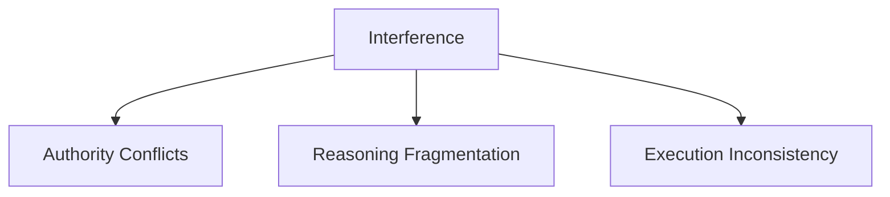

# Interference — Failure Signals

This document enumerates **observable failure signals** that indicate interference is occurring.

Interference signals arise from **simultaneous competition** between context elements.  
They are typically **immediate, inconsistent, and sensitive to ordering or concurrency**.

---

## Signal Domains

Interference manifests across authority, reasoning coherence, and execution consistency.

Signals often fluctuate across runs or turns.

---

## Authority Conflict Signals

### Selective Obedience

Observed behaviors:

- system follows some constraints while ignoring others
- compliance varies depending on prompt ordering
- safety or policy rules apply inconsistently

Interpretation:

- multiple instructions compete for authority
- no clear arbitration or priority

This is a **primary interference signal**.

---

### Instruction Shadowing

Observed behaviors:

- earlier instructions overridden by later content
- verbose user input dilutes system constraints
- retrieved text reframes or negates instructions

Interpretation:

- authority is positional or accidental
- constraints lack isolation or salience

---

## Reasoning Fragmentation Signals

### Contradictory Reasoning Paths

Observed behaviors:

- outputs contain internally conflicting statements
- conclusions negate intermediate steps
- reasoning oscillates between alternatives

Interpretation:

- competing context elements influence different parts of reasoning
- no single dominant frame

---

### Context Switching Mid-Response

Observed behaviors:

- tone, assumptions, or goals change within a single answer
- multiple roles appear simultaneously
- response reads as stitched together

Interpretation:

- concurrent signals fragment attention
- role or scope boundaries are violated

---

## Execution Inconsistency Signals

### Order Sensitivity

Observed behaviors:

- reordering the same context changes outcomes
- identical inputs produce different results when injected concurrently
- minor prompt layout changes cause major behavior shifts

Interpretation:

- arbitration relies on incidental position
- interference is unresolved

---

### Non-Deterministic Tool Use

Observed behaviors:

- tools invoked inconsistently under similar conditions
- different tools selected without rationale
- tool outputs partially applied or ignored

Interpretation:

- tool definitions and reasoning steps compete for attention
- execution authority is ambiguous

---

## Multi-Agent Specific Signals

### Cross-Agent Contamination

Observed behaviors:

- one agent’s context influences another unintentionally
- agent roles blur or collapse
- shared memory causes unexpected behavior

Interpretation:

- lack of isolation between agents
- shared context without boundaries

---

### Arbitration Failure

Observed behaviors:

- agents issue conflicting actions
- orchestrator does not resolve conflicts
- system oscillates between agent outputs

Interpretation:

- coordination logic is missing or insufficient
- interference propagates across agents

---

## Distinguishing Interference from Other Failures

| Failure      | Key Difference                      |
| ------------ | ----------------------------------- |
| Degradation  | Progressive decay over time         |
| Drift        | Stable behavior, wrong objective    |
| Interference | Immediate conflict from concurrency |

Misdiagnosis leads to ineffective mitigation.

---

## Detection Guidance

Interference is detected through:

- reordering experiments
- isolation tests
- single-source vs multi-source comparisons
- role-specific audits

Time-based analysis alone is insufficient.

---

## When to Escalate

Escalation is required when:

- authority conflicts recur
- behavior changes with ordering
- multi-agent outputs conflict
- fixes rely on accidental prompt layout

Interference left unresolved produces brittle systems.

---

## References

Evidence for interference-related signals includes:

- Shanahan et al., **Role-Playing and Multi-Agent Failure Modes**, 2023
- Anthropic, **On the Risks of Multi-Agent Systems**, 2023
- Liu et al., **Lost in the Middle: How Language Models Use Long Contexts**, 2023
- Sculley et al., **Hidden Technical Debt in Machine Learning Systems**, 2015

These works document coordination failure, authority conflict, and attention competition in complex systems.

---

## Status

This document is **stable**.

Signals listed here are sufficient to detect interference independent of degradation or drift.
