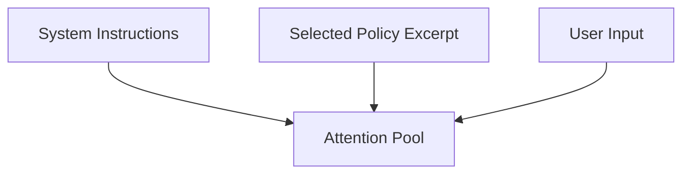
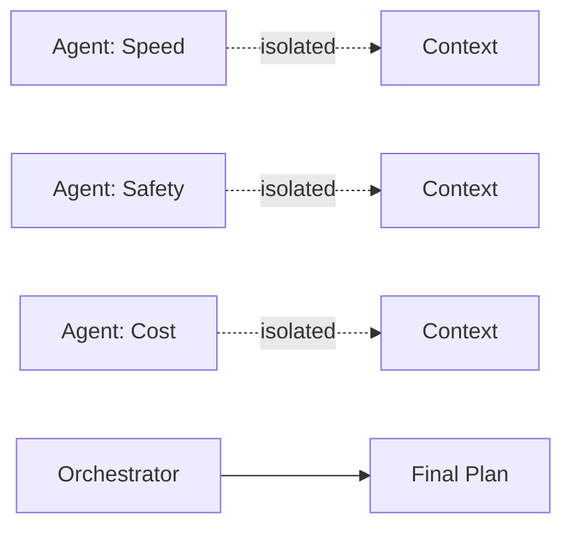
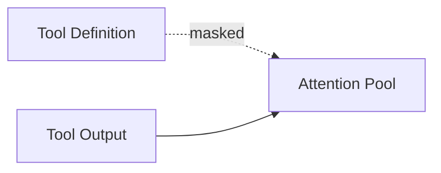
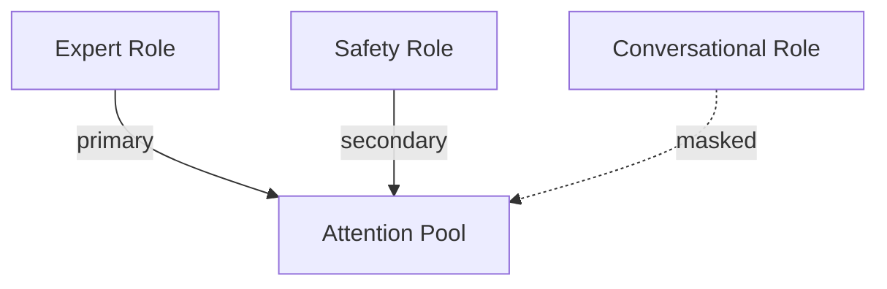

# Interference — Examples

This document provides **bounded, execution-focused examples** that demonstrate how interference manifests in real systems and how it is addressed through explicit coordination and authority controls.

These examples show **otherwise correct systems failing due to conflict**, not due to lack of capability or misalignment.

---

## Example 1: Conflicting System Instructions and Retrieved Policy

### Context

A system includes:
- system-level safety instructions
- retrieved organizational policy text
- user instructions requesting an action

The retrieved policy contains guidance that partially contradicts the system instructions.

---

### Observed Failure Signals

From `01-failure-signals.md`:
- **Selective Obedience**
- **Instruction Shadowing**
- **Order Sensitivity**

Reordering the policy text changes whether safety constraints are followed.

---

### Control Application

Controls applied:
- **Selection**: include only the relevant policy excerpt
- **Ordering**: system instructions placed above retrieved text
- **Masking**: suppress policy sections outside task scope

---

### Trade-Offs Introduced

From `02-trade-offs.md`:

- loss of broader policy context
- increased reliance on excerpt accuracy
- positional bias in authority

---

### Outcome

- instruction compliance stabilizes
- conflict becomes explicit and bounded

---

### Human Governance Point

- review of excerpt selection criteria
- escalation if policy interpretation is ambiguous

---

## Example 2: Multi-Agent Planning Collision

### Context

Multiple agents generate plans simultaneously:

- one optimizes speed
- one optimizes safety
- one optimizes cost

All agents write into a shared planning context.

---

### Observed Failure Signals

From `01-failure-signals.md`:

- **Cross-Agent Contamination**
- **Arbitration Failure**
- **Contradictory Reasoning Paths**

Plans oscillate or contain incompatible steps.

---

### Control Application

Controls applied:

- **Isolation**: separate agent contexts
- **Selection**: only one agent may write per turn
- **Ordering**: orchestrator output takes priority

---

### Trade-Offs Introduced

From `02-trade-offs.md`:

- reduced parallelism
- increased orchestration complexity
- slower convergence

---

### Outcome

- plans become coherent
- trade-offs are decided explicitly

---

### Human Governance Point

- approval of arbitration rules
- authority to override orchestrator decisions

---

## Example 3: Tool Definition and Tool Output Conflict

### Context

An agent has:

- tool definitions describing expected behavior
- tool outputs containing unexpected or contradictory data
- reasoning instructions referencing both

---

### Observed Failure Signals

From `01-failure-signals.md`:

- **Non-Deterministic Tool Use**
- **Contradictory Reasoning Paths**

The agent alternates between trusting the tool description and the tool output.

---

### Control Application

Controls applied:

- **Masking**: hide tool descriptions after invocation
- **Ordering**: place tool output immediately before reasoning
- **Selection**: restrict to the most recent tool call

---

### Trade-Offs Introduced

From `02-trade-offs.md`:

- reduced transparency into tool assumptions
- reliance on tool correctness

---

### Outcome

- tool outputs consistently influence reasoning
- conflict is localized

---

### Human Governance Point

- review tool reliability
- escalation if tool outputs are inconsistent

---

## Example 4: Role Collapse in Instruction-Tuned Assistant

### Context

A single assistant is instructed to:

- answer as an expert
- follow safety policies
- adopt a friendly conversational tone

Instructions are injected concurrently without role boundaries.

---

### Observed Failure Signals

From `01-failure-signals.md`:

- **Context Switching Mid-Response**
- **Selective Obedience**

The assistant alternates between roles within one answer.

---

### Control Application

Controls applied:

- **Ordering**: role hierarchy defined explicitly
- **Masking**: restrict role-specific instructions to phases
- **Selection**: reduce simultaneous role prompts

---

### Trade-Offs Introduced

From `02-trade-offs.md`:

- reduced expressive flexibility
- more rigid response structure

---

### Outcome

- role behavior stabilizes
- authority is explicit

---

### Human Governance Point

- approval of role hierarchy
- review of role boundaries

---

## Example Invariants

Across all examples:

- individual components are valid in isolation
- failure emerges from interaction
- resolution requires explicit arbitration
- human authority is involved

Examples that violate these invariants are not interference.

---

## Status

This document is **stable**.

Examples provided here are sufficient to demonstrate interference as a coordination failure mechanic.
