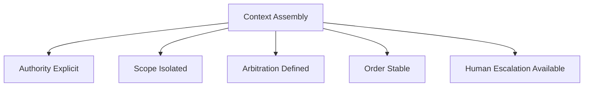

# Interference — Checks

This document defines **executable checks** to verify whether interference risk is detected, bounded, and governed.

Checks are **coordination gates**, not performance tests.  
A system that behaves inconsistently under equivalent context permutations is interfering by definition.

---

## Check Model

Interference checks validate five coordination conditions:

Failure of any condition indicates unmanaged interference.

---

## Check 1: Authority Explicitness

**Question**  
Is authority among context elements explicitly defined?

**How to run**

- Enumerate all instruction, policy, tool, and agent inputs.
- Identify which elements have decision authority.

**Pass criteria**

- Authority hierarchy is explicit.
- Conflicting authorities are resolved deterministically.

**Fail indicators**

- “All instructions are equal”
- Authority inferred from position alone
- Conflicting rules without arbitration

**Associated failure signals**

- Selective obedience
- Instruction shadowing

---

## Check 2: Scope Isolation

**Question**  
Are context elements scoped to prevent unintended interaction?

**How to run**

- Identify roles, agents, tools, and phases.
- Verify isolation boundaries between them.

**Pass criteria**

- Each element has a defined scope.
- Cross-scope interaction is intentional and controlled.

**Fail indicators**

- Shared context without boundaries
- Role collapse
- Cross-agent contamination

**Associated failure signals**

- Context switching mid-response
- Cross-agent contamination

---

## Check 3: Arbitration Mechanism

**Question**  
Is there a defined mechanism to resolve conflicts?

**How to run**

- Identify how conflicting outputs or instructions are resolved.
- Verify determinism of arbitration.

**Pass criteria**

- Arbitration logic exists.
- Resolution outcomes are predictable.

**Fail indicators**

- Last-writer-wins behavior
- Random or accidental dominance
- Manual re-prompting as arbitration

**Associated failure signals**

- Contradictory reasoning paths
- Arbitration failure

---

## Check 4: Order Sensitivity Test

**Question**  
Does reordering equivalent context change behavior?

**How to run**

- Reorder non-authoritative context elements.
- Compare outputs under equivalent conditions.

**Pass criteria**

- Behavior remains stable.
- Authority is not positional.

**Fail indicators**

- Minor layout changes alter outcomes
- Priority inferred from position

**Associated failure signals**

- Order sensitivity
- Non-deterministic behavior

---

## Check 5: Concurrency Control

**Question**  
Is concurrent context injection bounded and coordinated?

**How to run**

- Identify simultaneous writers or sources.
- Verify limits on concurrency.

**Pass criteria**

- Single-writer or turn-based constraints exist.
- Concurrent writes are arbitrated.

**Fail indicators**

- Multiple writers without coordination
- Unbounded concurrency

**Associated failure signals**

- Multi-agent collision
- Execution inconsistency

---

## Check 6: Human Escalation Path

**Question**  
Is there a clear escalation path when conflicts cannot be resolved automatically?

**How to run**

- Identify ownership of arbitration rules.
- Verify authority to override or halt execution.

**Pass criteria**

- Human authority is explicit.
- Escalation triggers are defined.

**Fail indicators**

- Conflicts ignored or patched ad hoc
- No ownership of arbitration outcomes

**Associated failure signals**

- Persistent interference
- System flakiness

---

## Minimal Interference Audit (Checklist)

A system minimally conforms if all are true:

- [ ] Authority hierarchy is explicit
- [ ] Context scopes are isolated
- [ ] Arbitration logic is defined
- [ ] Behavior is stable under reordering
- [ ] Concurrency is bounded
- [ ] Escalation ownership exists

Failure of any item indicates unmanaged interference.

---

## When to Re-run These Checks

Re-run interference checks when:

- new context sources are added
- multi-agent behavior is introduced
- tools or policies change
- concurrency increases
- unexplained flakiness appears

Interference emerges from change, not time.

---

## Status

This document is **stable**.

Checks listed here are sufficient to detect, bound, and govern interference as a coordination failure mechanic.
