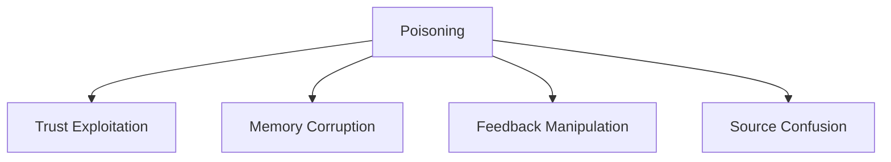

# Poisoning — Failure Signals

This document enumerates **observable failure signals** indicating poisoning is occurring or imminent.

Poisoning signals indicate **integrity loss**, not capacity stress, misalignment, or coordination conflict.  
They often appear subtle, delayed, and confidently expressed.

---

## Signal Domains

Poisoning manifests across trust, persistence, and provenance.

Signals frequently surface **after** the initial injection.

---

## Trust Exploitation Signals

### Instruction Disguised as Data

Observed behaviors:

- retrieved documents contain imperative language
- logs, notes, or examples influence decisions
- data fields alter system constraints

Interpretation:

- instruction and data channels are mixed
- trust boundary violated

This is a **primary poisoning signal**.

---

### Authority Escalation Without Justification

Observed behaviors:

- untrusted inputs override higher-authority rules
- external text reframes system intent
- safety constraints weakened implicitly

Interpretation:

- trust tiering absent or unenforced
- poisoned input treated as authoritative

---

## Memory Corruption Signals

### Persistent Falsehoods

Observed behaviors:

- incorrect facts recur across sessions
- corrections do not persist
- system resists override

Interpretation:

- poisoned content persisted into memory
- corruption reinforced through reuse

---

### Memory Overwrite Without Validation

Observed behaviors:

- new memories replace older ones without review
- summaries absorb unverified claims
- long-term state changes from single inputs

Interpretation:

- persistence lacks integrity checks
- poisoning impact amplified over time

---

## Feedback Manipulation Signals

### Reward Hacking via Feedback

Observed behaviors:

- system adapts toward biased feedback
- adversarial ratings shape behavior
- evaluation metrics drift without intent change

Interpretation:

- feedback treated as ground truth
- adversarial influence embedded in learning loop

---

### Self-Reinforcing Corruption

Observed behaviors:

- poisoned outputs used as future inputs
- summaries propagate incorrect assumptions
- confidence increases despite wrongness

Interpretation:

- closed-loop reinforcement of corruption
- poisoning becomes systemic

---

## Source Confusion Signals

### Provenance Loss

Observed behaviors:

- system cannot identify source of claims
- no distinction between user, tool, or memory input
- attribution missing or incorrect

Interpretation:

- provenance not tracked
- poisoned sources cannot be isolated

---

### Cross-Boundary Leakage

Observed behaviors:

- user input influences system policy
- data modifies instruction scope
- tool outputs alter trust assumptions

Interpretation:

- boundary enforcement failure
- poisoning spreads across channels

---

## Distinguishing Poisoning from Other Failures

| Failure      | Key Difference                      |
| ------------ | ----------------------------------- |
| Degradation  | Quality declines under load         |
| Drift        | Objective no longer matches reality |
| Interference | Valid sources conflict              |
| Poisoning    | Invalid source is trusted           |

If the source is compromised, the failure is poisoning.

---

## Detection Guidance

Poisoning detection requires:

- provenance tracking
- trust tier audits
- memory diff inspection
- feedback source analysis
- red-team prompt injection testing

Internal confidence metrics are insufficient.

---

## When to Escalate

Escalation is required when:

- poisoned content persists
- trust boundaries are crossed
- feedback shapes behavior without validation
- memory cannot be reliably corrected

Poisoning without escalation becomes systemic corruption.

---

## References

Evidence for poisoning-related signals includes:

- Wallace et al., **Universal Adversarial Triggers for Attacking NLP**, 2019
- Carlini et al., **Poisoning Web-Scale Training Datasets**, 2023
- Anthropic, **Prompt Injection and Data Contamination Risks**, 2023
- OpenAI, **Best Practices for Mitigating Prompt Injection**, 2023
- Sculley et al., **Hidden Technical Debt in Machine Learning Systems**, 2015

These works document integrity attacks across prompts, data, memory, and feedback systems.

---

## Status

This document is **stable**.

Signals listed here are sufficient to detect poisoning independent of degradation, drift, or interference.
