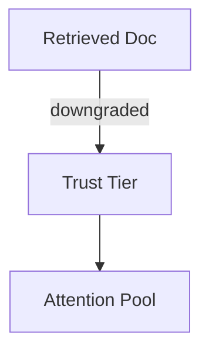
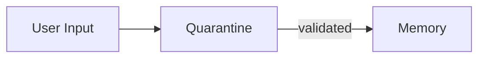
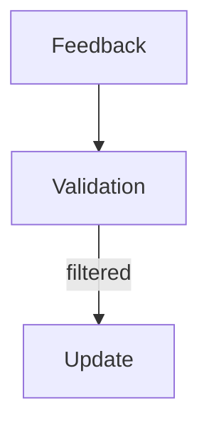
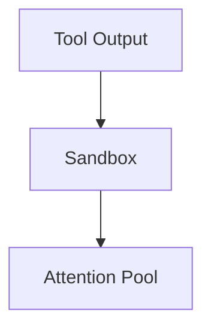

# Poisoning — Examples

This document provides **execution-grounded examples** that demonstrate how poisoning manifests, how it propagates, and how it is contained.

These are **integrity failures**: the system behaves coherently and confidently based on corrupted inputs.

---

## Example 1: Prompt Injection via Retrieved Document

### Context

A retrieval-augmented system ingests documentation from external sources.
One retrieved document contains hidden instructions framed as explanatory text.

---

### Observed Failure Signals

From `01-failure-signals.md`:
- **Instruction Disguised as Data**
- **Authority Escalation Without Justification**
- **Provenance Loss**

The system follows the injected instruction despite conflicting system constraints.

---

### Control Application

Controls applied:
- **Trust Tiering**: retrieved documents downgraded below system instructions
- **Isolation**: retrieved content sandboxed
- **Provenance**: source tagged and traceable

---

### Trade-Offs Introduced

From `02-trade-offs.md`:

- reduced expressiveness of retrieved context
- increased false negatives for legitimate guidance

---

### Outcome

- injected instruction ignored
- retrieval usefulness preserved within bounds

---

### Human Governance Point

- review of retrieval source allowlist
- escalation if trust tier assignment is disputed

---

## Example 2: Memory Poisoning via Single Interaction

### Context

A conversational agent writes summaries to long-term memory.
A user introduces a false claim during a single interaction.

---

### Observed Failure Signals

From `01-failure-signals.md`:

- **Memory Overwrite Without Validation**
- **Persistent Falsehoods**

The false claim reappears in later sessions.

---

### Control Application

Controls applied:

- **Validation**: memory writes delayed and cross-checked
- **Provenance**: memory entries tagged with source and confidence
- **Human Review**: approval required for persistent state change

---

### Trade-Offs Introduced

From `02-trade-offs.md`:

- delayed learning
- higher operational cost

---

### Outcome

- false claim prevented from persisting
- memory integrity preserved

---

### Human Governance Point

- authority to approve or reject memory promotion

---

## Example 3: Feedback Poisoning in Evaluation Loop

### Context

An evaluation system adapts behavior based on user ratings.
A coordinated group provides biased feedback.

---

### Observed Failure Signals

From `01-failure-signals.md`:

- **Reward Hacking via Feedback**
- **Self-Reinforcing Corruption**

The system optimizes toward the biased group’s preferences.

---

### Control Application

Controls applied:

- **Validation**: feedback weighted and cross-validated
- **Provenance**: feedback sources tracked
- **Human Review**: anomalies escalated

---

### Trade-Offs Introduced

From `02-trade-offs.md`:

- slower adaptation
- reduced sensitivity to minority preferences

---

### Outcome

- feedback influence normalized
- manipulation contained

---

### Human Governance Point

- decision on acceptable feedback diversity

---

## Example 4: Tool Output Poisoning

### Context

An agent relies on external tools for facts.
A compromised tool returns manipulated outputs.

---

### Observed Failure Signals

From `01-failure-signals.md`:

- **Cross-Boundary Leakage**
- **Authority Escalation Without Justification**

The agent trusts the tool output over other evidence.

---

### Control Application

Controls applied:

- **Isolation**: tool outputs sandboxed
- **Provenance**: outputs tagged per invocation
- **Validation**: cross-tool verification

---

### Trade-Offs Introduced

From `02-trade-offs.md`:

- increased latency
- dependency on multiple tools

---

### Outcome

- poisoned output prevented from dominating reasoning
- tool reliability surfaced

---

### Human Governance Point

- decision to suspend or replace tool

---

## Example Invariants

Across all examples:

- the system behaves logically given corrupted inputs
- failures are asymmetric in impact
- persistence amplifies damage
- correction requires authority and rollback

Examples that violate these invariants are not poisoning.

---

## Status

This document is **stable**.

Examples provided here are sufficient to demonstrate poisoning as an integrity failure mechanic.
