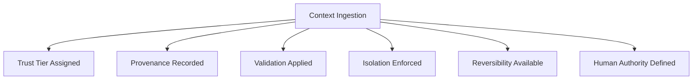

# Poisoning — Checks

This document defines **executable integrity checks** used to detect, bound, and remediate poisoning.

Checks are **trust and integrity gates**, not quality or performance tests.  
A system that behaves coherently while incorporating corrupted inputs is poisoned by definition.

---

## Check Model

Poisoning checks validate six integrity conditions:

Failure of any condition indicates unmanaged poisoning risk.

---

## Check 1: Trust Tier Assignment

**Question**  
Is every input assigned an explicit trust tier before influencing behavior?

**How to run**

- Enumerate all inputs: system, user, retrieval, tool, memory, feedback.
- Verify each has an explicit, enforced trust level.

**Pass criteria**

- Trust tiers are explicit and hierarchical.
- Lower tiers cannot override higher tiers.

**Fail indicators**

- Implicit trust assumptions
- Data able to modify instructions
- Equal treatment of all inputs

**Associated failure signals**

- Instruction disguised as data
- Authority escalation without justification

---

## Check 2: Provenance Preservation

**Question**  
Is the source and lineage of every persistent or influential input recorded?

**How to run**

- Inspect memory entries, summaries, and state transitions.
- Verify source attribution and timestamps exist.

**Pass criteria**

- Provenance is immutable and queryable.
- Corrupted sources can be isolated retroactively.

**Fail indicators**

- Missing attribution
- Inability to trace influence
- Mixed or overwritten sources

**Associated failure signals**

- Provenance loss
- Persistent falsehoods

---

## Check 3: Validation Before Persistence

**Question**  
Are inputs validated before being allowed to persist or reinforce behavior?

**How to run**

- Trace persistence paths (memory writes, summaries, learning loops).
- Verify validation gates exist before state changes.

**Pass criteria**

- Validation is required for persistence.
- Unverified inputs are quarantined.

**Fail indicators**

- Immediate persistence
- Single-input state changes
- No quarantine mechanism

**Associated failure signals**

- Memory overwrite without validation
- Self-reinforcing corruption

---

## Check 4: Isolation of Untrusted Inputs

**Question**  
Are untrusted inputs isolated to prevent systemic spread?

**How to run**

- Identify isolation boundaries for low-trust inputs.
- Verify sandboxing or scoped visibility.

**Pass criteria**

- Untrusted inputs cannot affect global state.
- Blast radius is bounded.

**Fail indicators**

- Cross-boundary leakage
- Shared state without isolation

**Associated failure signals**

- Cross-boundary leakage
- Systemic corruption

---

## Check 5: Reversibility and Rollback

**Question**  
Can the system revert poisoned state deterministically?

**How to run**

- Attempt to remove or invalidate a known-bad input.
- Observe whether downstream state can be corrected.

**Pass criteria**

- Rollback procedures exist.
- Reversal does not require full system reset.

**Fail indicators**

- Irreversible state changes
- Poisoned memories cannot be purged

**Associated failure signals**

- Persistent falsehoods
- Long-lived corruption

---

## Check 6: Human Authority and Escalation

**Question**  
Is there clear human authority to override trust, invalidate state, and halt propagation?

**How to run**

- Identify ownership of trust tiers and validation rules.
- Verify escalation paths are actionable.

**Pass criteria**

- Authority is explicit.
- Decisions are enforceable, not advisory.

**Fail indicators**

- Review without power
- Findings without action
- Ambiguous ownership

**Associated failure signals**

- Persistent poisoning
- Silent integrity loss

---

## Minimal Poisoning Audit (Checklist)

A system minimally conforms if all are true:

- [ ] All inputs have explicit trust tiers
- [ ] Provenance is preserved end-to-end
- [ ] Validation gates persistence
- [ ] Untrusted inputs are isolated
- [ ] Rollback paths exist
- [ ] Human authority is explicit

Failure of any item indicates poisoning risk.

---

## When to Re-run These Checks

Re-run poisoning checks when:

- new input channels are introduced
- memory or learning is added
- feedback loops are enabled
- tools or data sources change
- unexplained behavior shifts occur

Poisoning risk increases with openness.

---

## Status

This document is **stable**.

Checks listed here are sufficient to detect, contain, and remediate poisoning as an integrity failure mechanic.
