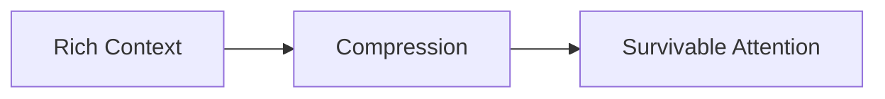

# Compression — Trade-Offs

This document enumerates the **structural trade-offs introduced by compression** as a control mechanism.

Compression does not make systems smarter.  
It **forces decisions about what can be lost**.

Every compression strategy encodes value judgments.

---

## Core Trade-Off

Compression trades **information richness** for **attention survivability**.

If nothing is lost, compression did not occur.

---

## Information Loss vs Stability

**What compression improves**

- resistance to attention saturation
- predictable behavior in long sessions
- constraint visibility under load

**What compression sacrifices**

- nuance
- minority signals
- latent context

Loss is not accidental. It is structural.

---

## Selective Compression Trade-Offs

**Advantages**

- preserves high-signal content verbatim
- auditable removal decisions
- low semantic distortion

**Costs**

- brittle if signal classification is wrong
- weak signals are easily dropped
- requires accurate upstream selection

Selective compression amplifies upstream mistakes.

---

## Abstractive Compression Trade-Offs

**Advantages**

- aggressive size reduction
- preserves intent-level meaning
- useful for long histories

**Costs**

- interpretation bias
- semantic drift
- loss of edge cases

Abstraction replaces data with judgment.

---

## Delta Compression Trade-Offs

**Advantages**

- prevents repetition
- stabilizes incremental workflows
- minimizes attention waste

**Costs**

- dependence on hidden prior state
- late readers lack context
- harder auditing

Delta compression increases coupling over time.

---

## Filtering Compression Trade-Offs

**Advantages**

- deterministic
- predictable
- easy to reason about

**Costs**

- rigid exclusion
- blind spots
- poor adaptability

Filtering trades intelligence for safety.

---

## Compression Depth Trade-Offs

**Shallow compression**

- preserves detail
- reduces risk of loss
- limited attention relief

**Deep compression**

- maximizes attention relief
- increases semantic distortion
- harder to reverse

Depth must match risk tolerance.

---

## Interaction with Other Controls

Compression amplifies or weakens other controls:

- **Without Selection** → arbitrary loss
- **Without Ordering** → priority inversion
- **Without Masking** → scope leakage
- **Without Validation** → poisoned summaries persist

Compression cannot stand alone.

---

## Governance Trade-Offs

As compression increases:

- responsibility shifts to designers
- errors become systemic
- audit burden rises

Compression decisions are governance decisions.

---

## Compression Invariants

The following always hold:

- Compression always loses information.
- Smaller context is not automatically better.
- Aggressive compression magnifies misclassification.
- Compression errors are hard to detect post-hoc.

Any design denying these is incomplete.

---

## Trade-Off Visibility Requirement

Compression trade-offs must be explicit.

Acceptable mechanisms:

- declared compression mode
- documented loss criteria
- validation checkpoints
- refresh cadence

Implicit compression creates invisible failures.

---

## Status

This document is **stable**.

Trade-offs listed here are sufficient to reason about compression decisions as a control mechanism.
