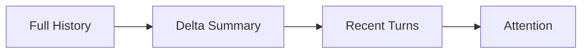
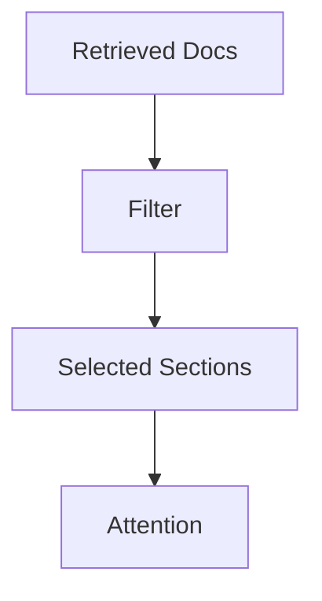
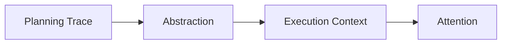
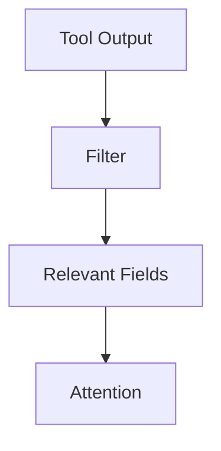
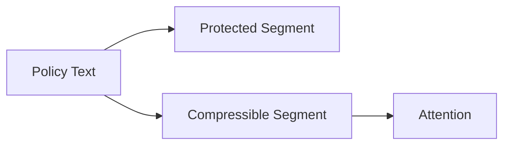

# Compression — Examples

This document provides **execution-grounded examples** showing how compression enforces attention constraints, where it fails, and how different compression modes change system behavior.

These examples focus on **context transformation**, not output quality alone.

---

## Example 1: Long-Running Conversation History

### Context

A conversational agent retains full message history across a long session.  
Over time, the context window approaches capacity.

---

### Failure (Without Compression)

Observed behavior:
- early constraints are ignored
- later messages dominate decisions
- responses become inconsistent

Root cause:
- attention saturation
- no reduction of historical context

Downstream failures:
- degradation
- interference

---

### Compression Applied

**Mode**: Delta compression  
**Target**: Message history

- retain last N turns verbatim
- summarize earlier turns into deltas
- remove repeated acknowledgements



---

### Outcome

- constraints remain visible
- long sessions stabilize
- attention pressure reduced predictably

---

## Example 2: Retrieval-Augmented Generation (RAG)

### Context

A RAG system retrieves multiple documents per query.  
Documents are long and partially overlapping.

---

### Failure (Without Compression)

Observed behavior:

- duplicated facts dominate attention
- weak constraints buried
- retrieval volume degrades quality

Root cause:

- redundancy
- no deduplication or abstraction

Downstream failures:

- degradation

---

### Compression Applied

**Mode**: Selective + Filtering  
**Target**: Retrieved documents

- remove duplicate passages
- keep only sections matching query intent
- discard background context



---

### Outcome

- higher relevance density
- stable performance under high recall
- reduced noise

---

## Example 3: Planning Trace Compression

### Context

An agent produces a detailed planning trace with alternatives, assumptions, and dead ends.  
Only the final plan is needed for execution.

---

### Failure (Without Compression)

Observed behavior:

- execution hesitates
- discarded alternatives reappear
- output appears indecisive

Root cause:

- planning signal treated as execution signal

Downstream failures:

- interference

---

### Compression Applied

**Mode**: Abstractive  
**Target**: Planning trace

- summarize plan rationale
- remove alternatives
- retain final decision and constraints



---

### Outcome

- decisive execution
- clean phase separation
- reduced interference

---

## Example 4: Tool Output Compression

### Context

A tool returns verbose logs and metadata.  
Only the result and error conditions are relevant.

---

### Failure (Without Compression)

Observed behavior:

- logs overwhelm context
- error signals buried
- model misinterprets tool success

Root cause:

- unfiltered tool output
- noise dominance

Downstream failures:

- degradation

---

### Compression Applied

**Mode**: Filtering  
**Target**: Tool output

- remove logs
- keep result, status, and errors
- tag provenance



---

### Outcome

- clearer tool interpretation
- stable downstream reasoning
- predictable attention usage

---

## Example 5: Over-Compression Failure

### Context

A safety-critical system compresses policy text aggressively to save space.

---

### Failure (Over-Compression)

Observed behavior:

- key safety constraints disappear
- outputs violate policy
- corrections fail intermittently

Root cause:

- critical signal removed
- compression depth exceeded tolerance

Downstream failures:

- interference
- policy breach

---

### Corrective Action

- reduce compression depth
- elevate constraints as non-compressible
- add validation check



---

### Outcome

    - constraints preserved
    - compression remains effective
    - safety restored

---

### Example 6: Generic Text Compression via Summarization (Pseudo-code)

**Context**
A long document (e.g., a meeting transcript, a detailed report, or an extensive chat history) needs to be included in an agent's context, but its full length exceeds the attention budget. The goal is to reduce its size while retaining the most critical information.

**Failure**
- Long texts consume too many tokens, displacing other important context elements.
- The model spends too much attention on verbose details instead of core facts.
- Context window limits are hit, leading to truncation and loss of critical information.

**Change (Conceptual Pseudo-code for Compression)**

```python
from typing import List, Dict, Any

class LLMService:
    """Mock LLM service for summarization."""
    def summarize(self, text: str, max_length: int = 200, style: str = "concise") -> str:
        # In a real scenario, this would call an actual LLM API.
        # This mock simply truncates or returns a placeholder summary.
        if len(text) > max_length * 2: # Arbitrary threshold for "long" text
            return f"[SUMMARY_CONCISE_{style}]: " + text[:max_length] + "..."
        return text

def apply_compression(
    text_to_compress: str,
    compression_mode: str, # e.g., "summarize_concise", "extract_keywords", "truncate_end"
    max_tokens: int,
    llm_service: LLMService # Dependency for summarization
) -> str:
    """
    Applies a specified compression mode to a given text.
    """
    # Estimate current tokens (simplified)
    current_tokens = len(text_to_compress.split())

    if current_tokens <= max_tokens:
        return text_to_compress # No compression needed

    if compression_mode == "summarize_concise":
        # Target length for summary based on max_tokens budget
        # This is a heuristic; actual token counting for target length is complex
        target_summary_tokens = int(max_tokens * 0.8) # Leave some buffer
        print(f"DEBUG: Summarizing text (current tokens: {current_tokens}) to target {target_summary_tokens} tokens.")
        return llm_service.summarize(text_to_compress, max_length=target_summary_tokens, style="concise")
    elif compression_mode == "extract_keywords":
        # In a real system, this would use an LLM or keyword extraction algorithm
        print(f"DEBUG: Extracting keywords (current tokens: {current_tokens}) to fit budget.")
        return llm_service.summarize(text_to_compress, max_length=max_tokens, style="keywords")
    elif compression_mode == "truncate_end":
        # Simple truncation: keep from the beginning
        print(f"DEBUG: Truncating text (current tokens: {current_tokens}) to fit budget.")
        words = text_to_compress.split()
        return " ".join(words[:max_tokens]) # Truncate to max_tokens words
    else:
        print(f"WARNING: Unknown compression mode: {compression_mode}. No compression applied.")
        return text_to_compress

# --- Usage Example ---
mock_llm = LLMService()

long_chat_history = (
    "User: I need help with my order #12345. It was placed on June 1st and hasn't shipped. " * 50 +
    "Agent: I see your order. Let me check the status. " * 50 +
    "User: I'm really frustrated. I need this by Friday. " * 50 +
    "Agent: I understand your frustration. I'm escalating this. " * 50
) # Simulate a very long chat history

max_context_budget = 500 # tokens

# Apply concise summarization
compressed_history_summary = apply_compression(
    long_chat_history,
    "summarize_concise",
    max_context_budget,
    mock_llm
)
print("\n--- Compressed History (Summarized) ---")
print(compressed_history_summary)

# Apply truncation
compressed_history_truncated = apply_compression(
    long_chat_history,
    "truncate_end",
    max_context_budget,
    mock_llm
)
print("\n--- Compressed History (Truncated) ---")
print(compressed_history_truncated)

# No compression needed
short_text = "This is a short message."
compressed_short_text = apply_compression(
    short_text,
    "summarize_concise",
    max_context_budget,
    mock_llm
)
print("\n--- Short Text (No Compression) ---")
print(compressed_short_text)
```

**Outcome**
- Provides a programmatic way to reduce the token count of verbose context elements.
- Illustrates different compression strategies (summarization, truncation) and their conceptual application.
- Helps manage the attention budget by ensuring context elements fit within defined limits.
- Highlights that compression involves trade-offs, where details might be lost for the sake of brevity.

---

## Example Invariants
Across all examples:

- compression stabilizes long contexts
- failures emerge when signal is misclassified
- abstraction introduces interpretation risk
- disabling compression is a useful diagnostic

If removing compression improves behavior, compression is misapplied.

---

## Status

This document is **stable**.

Examples provided here are sufficient to demonstrate compression as a control mechanism enforcing attention constraints.
