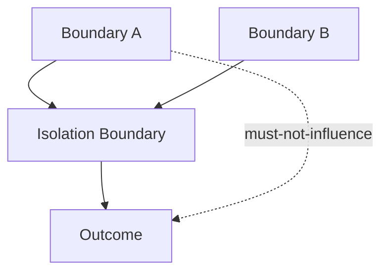

# Isolation — Checks

This document defines **enforceable checks** to verify that isolation boundaries are hard, non-bypassable, and effective.

Isolation checks do not ask whether context is *visible*.  
They ask whether **influence is impossible across boundaries**.

A system may appear correct while failing isolation checks silently.

---

## Check Model

Isolation checks verify **non-interaction guarantees**.

If any influence path exists across `I`, isolation has failed.

---

## Check 1: Non-Bypassable Boundary

**Question**  
Can this boundary be bypassed without changing system code or architecture?

**How to run**

- Attempt to pass context across the boundary using prompts, tools, or memory.
- Observe influence.

**Pass criteria**

- Influence is impossible without modifying the boundary itself.
- Prompt-level changes cannot bypass isolation.

**Fail indicators**

- Prompt tricks alter behavior across domains
- Context “leaks” via shared buffers

**Associated failures**

- Interference
- Poisoning

---

## Check 2: Independent Context Assemblies

**Question**  
Do isolated domains assemble context independently?

**How to run**

- Inspect context assembly for each domain.
- Check for shared artifacts.

**Pass criteria**

- No shared summaries, memory, or intermediate artifacts.
- Assemblies are independent by construction.

**Fail indicators**

- Shared “global context”
- Reused summaries across domains

**Associated failures**

- Interference

---

## Check 3: Authority Boundary Enforcement

**Question**  
Can low-authority context influence high-authority decisions?

**How to run**

- Introduce adversarial or speculative input into low-authority domain.
- Observe protected logic.

**Pass criteria**

- Protected decisions unaffected.
- No signal leakage.

**Fail indicators**

- User input affects system policy
- Untrusted data shapes routing or evaluation

**Associated failures**

- Poisoning

---

## Check 4: Failure Containment

**Question**  
Do failures stay contained within their domain?

**How to run**

- Induce errors or malformed input in one domain.
- Observe other domains.

**Pass criteria**

- Other domains remain stable.
- No cascading behavior change.

**Fail indicators**

- System-wide instability
- Cross-domain degradation

**Associated failures**

- Degradation

---

## Check 5: Temporal Isolation

**Question**  
Can past sessions or phases influence current execution?

**How to run**

- Reuse historical artifacts intentionally.
- Observe current behavior.

**Pass criteria**

- Past context cannot influence unless explicitly reintroduced.
- Session boundaries enforced.

**Fail indicators**

- “Ghost context” persists
- Old decisions resurface unexpectedly

**Associated failures**

- Drift
- Interference

---

## Check 6: Masking vs Isolation Boundary

**Question**  
Is isolation used where masking would be insufficient?

**How to run**

- Disable masking temporarily.
- Observe whether influence appears.

**Pass criteria**

- Isolation holds even without masking.
- Masking is optional decoration.

**Fail indicators**

- Masking failure causes leakage
- Isolation depends on visibility rules

**Associated failures**

- Interference

---

## Check 7: Validation Integration

**Question**  
Does isolation enforce validation boundaries?

**How to run**

- Attempt to reuse invalid or expired artifacts across domains.
- Observe influence.

**Pass criteria**

- Invalid artifacts blocked at boundary.
- Validation failures do not leak.

**Fail indicators**

- Rejected artifacts influence isolated domains
- Validation bypassed via isolation gaps

**Associated failures**

- Poisoning
- Drift

---

## Minimal Isolation Audit (Checklist)

A system minimally conforms if all are true:

- [ ] Boundaries are non-bypassable
- [ ] Context assemblies are independent
- [ ] Authority boundaries enforced
- [ ] Failures contained
- [ ] Temporal separation enforced
- [ ] Masking not required for safety
- [ ] Validation enforced at boundaries

Failure of any item indicates isolation failure.

---

## When to Re-run These Checks

Re-run isolation checks when:

- introducing parallel tasks or agents
- adding untrusted inputs
- experimenting with new prompts or tools
- sharing memory across components

Isolation failures represent **governance and safety risk**, not just quality loss.

---

## Status

This document is **stable**.

Checks listed here are sufficient to verify isolation as a control mechanism enforcing hard boundaries and non-interaction guarantees.
