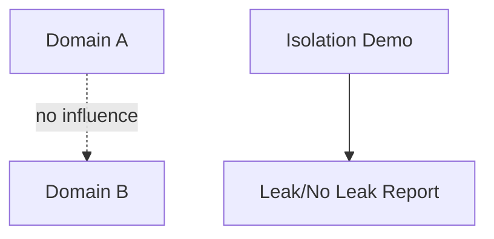

# Isolation Scripts

Demo scripts for testing isolation boundaries and leak checks. Keep them minimal; isolation design lives in the spec and skills.

```mermaid
flowchart TD
    DomainA[Domain A] -. no influence .-> DomainB[Domain B]
    Script[Isolation Demo] --> Result[Leak/No Leak Report]
```
