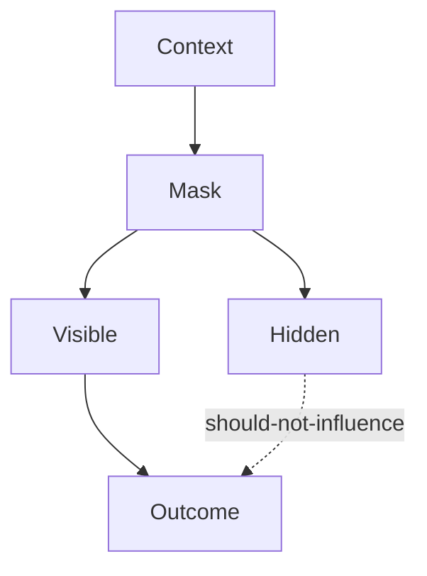

# Masking — Failure Signals

This document enumerates **observable signals** indicating that masking is absent, misapplied, or bypassed.

Masking failures are **visibility failures**.  
They occur when context is visible where it should not be, even if that context is correct.

---

## Failure Model

Masking fails when **context crosses scope or boundary lines** and exerts influence outside its permitted domain.

If hidden context influences outcomes, masking has failed.

---

## Role Leakage Signals

### Policy Bleed-Through

Observed behaviors:

- execution output mirrors policy language
- tone becomes legalistic or rigid
- explanations reference internal rules

Interpretation:

- policy context not masked from execution role

Primary downstream failures:

- interference

---

### Evaluation Contamination

Observed behaviors:

- generation optimizes for metrics prematurely
- reasoning appears self-scoring
- outputs anticipate evaluation criteria

Interpretation:

- evaluation context visible during generation

Primary downstream failures:

- interference

---

## Phase Leakage Signals

### Planning Context Leakage

Observed behaviors:

- alternatives reappear in final output
- indecision during execution
- hedging language persists

Interpretation:

- planning context not masked during execution

Primary downstream failures:

- interference

---

### Execution Artifact Leakage

Observed behaviors:

- implementation details affect evaluation
- evaluator reacts to process rather than result

Interpretation:

- execution artifacts visible during evaluation

Primary downstream failures:

- interference

---

## Scope Leakage Signals

### Task Cross-Contamination

Observed behaviors:

- constraints from one task affect another
- parallel objectives interfere
- outputs mix unrelated requirements

Interpretation:

- task scope not masked

Primary downstream failures:

- interference

---

### Global Constraint Misapplication

Observed behaviors:

- local rules enforced globally
- task-specific policies over-applied

Interpretation:

- scope boundaries ignored during masking

Primary downstream failures:

- interference

---

## Authority Leakage Signals

### Low-Authority Influence

Observed behaviors:

- untrusted input affects decisions
- speculative content shapes outputs

Interpretation:

- authority boundaries not enforced via masking

Primary downstream failures:

- poisoning
- interference

---

### High-Authority Exposure

Observed behaviors:

- system-level instructions visible to users
- sensitive logic leaked

Interpretation:

- masking failed to protect high-authority context

Primary downstream failures:

- governance breach

---

## Masking–Selection Confusion

### Masking Used Instead of Selection

Observed behaviors:

- irrelevant context present but hidden inconsistently
- masking compensates for poor admission control

Interpretation:

- selection failure upstream
- masking misused as filter

Primary downstream failures:

- degradation

---

## Distinguishing Masking Failure from Other Failures

| Observation                   | Masking Failure? |
| ----------------------------- | ---------------- |
| Wrong answer                  | Possibly         |
| Correct info in wrong place   | Yes              |
| Context should not be visible | Yes              |
| Too much context              | No (Selection)   |
| Meaning distorted             | No (Compression) |

Masking failures concern **where context acts**, not what it contains.

---

## Detection Guidance

Masking failures are detected by:

- isolating roles and phases explicitly
- inspecting visibility maps
- testing behavior with forced masking
- checking cross-task influence

If hiding context changes behavior dramatically, masking was required.

---

## When to Escalate

Escalation is required when:

- policy language leaks into execution
- evaluation criteria bias generation
- authority boundaries are crossed
- parallel tasks interfere

Masking failures undermine system separation guarantees.

---

## Status

This document is **stable**.

Signals listed here are sufficient to detect masking failures before they propagate into interference or poisoning.
