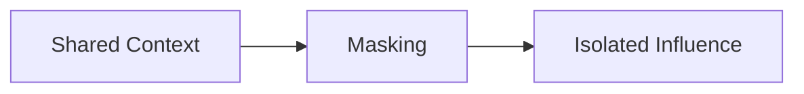

# Masking — Trade-Offs

This document enumerates the **structural trade-offs introduced by masking** as a control mechanism.

Masking does not simplify systems.  
It **forces explicit separation of influence**.

Every mask increases clarity while adding coordination cost.

---

## Core Trade-Off

Masking trades **shared visibility** for **controlled influence**.

If context is visible everywhere, masking is absent.

---

## Isolation vs Coordination

**Strong masking**

- clear role and phase separation
- reduced interference
- predictable behavior

**Costs**

- higher orchestration complexity
- increased handoff points
- coordination overhead

---

**Weak masking**

- simpler pipelines
- easier debugging

**Costs**

- context leakage
- interference
- blurred responsibility

Masking chooses which complexity to accept.

---

## Transparency vs Safety

**Aggressive masking**

- hides sensitive logic
- protects authority boundaries

**Costs**

- reduced debuggability
- harder system introspection

---

**Minimal masking**

- high transparency
- easier inspection

**Costs**

- safety exposure
- authority erosion

Masking encodes trust assumptions.

---

## Flexibility vs Predictability

**Dynamic masking**

- adapts to task and phase
- responsive to context shifts

**Costs**

- more failure modes
- harder to reason about

---

**Static masking**

- predictable behavior
- easier verification

**Costs**

- rigidity
- over-isolation in edge cases

---

## Debuggability Trade-Off

Masking hides context by design.

**Benefits**

- reduced cognitive load
- clearer contracts

**Costs**

- failures harder to trace
- invisible influence paths

Systems using masking must invest in observability.

---

## Over-Masking Risk

Observed when:

- critical context is hidden
- downstream components lack information
- behavior becomes brittle

Over-masking converts relevance failures into absence failures.

---

## Under-Masking Risk

Observed when:

- context leaks across roles
- phase boundaries collapse
- authority boundaries erode

Under-masking leads directly to interference.

---

## Interaction with Other Controls

Masking amplifies or constrains other controls:

- **Selection**: determines what is eligible to be masked
- **Compression**: masked context may still need reduction
- **Routing**: directs masked context to correct components
- **Validation**: masked persistent artifacts still require governance

Masking without composition creates blind spots.

---

## Governance Trade-Offs

As masking increases:

- authority lines harden
- accountability improves
- debugging cost rises

Masking is a governance decision, not an optimization.

---

## Masking Invariants

The following always hold:

- Masking never removes context, only influence.
- Masking increases system complexity.
- Over-masking hides failure causes.
- Under-masking guarantees interference.

Any system denying these is incomplete.

---

## Trade-Off Visibility Requirement

Masking trade-offs must be explicit.

Acceptable mechanisms:

- declared visibility maps
- role-to-context matrices
- phase-specific masks
- authority gates

Implicit masking creates invisible failure modes.

---

## Status

This document is **stable**.

Trade-offs listed here are sufficient to reason about masking decisions as a control mechanism.
