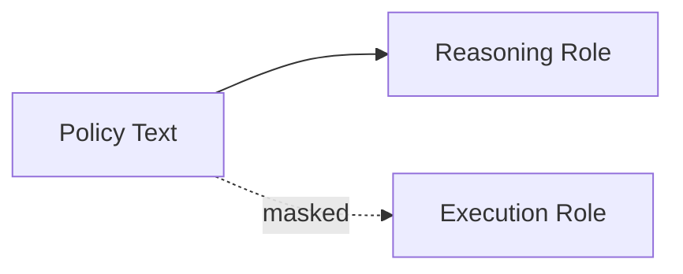
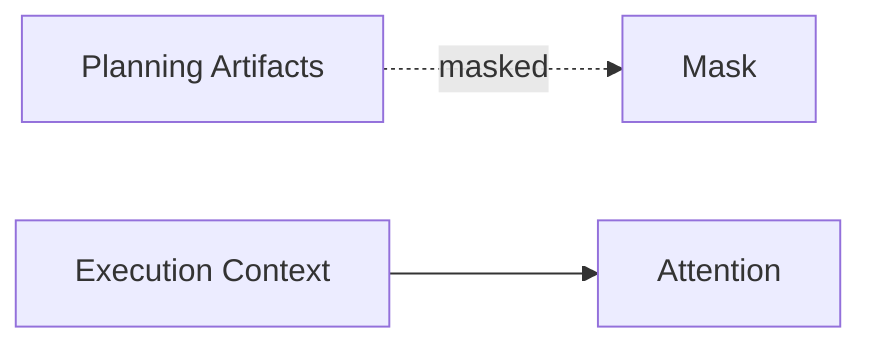
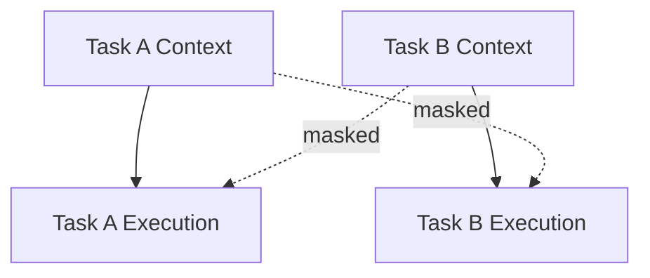
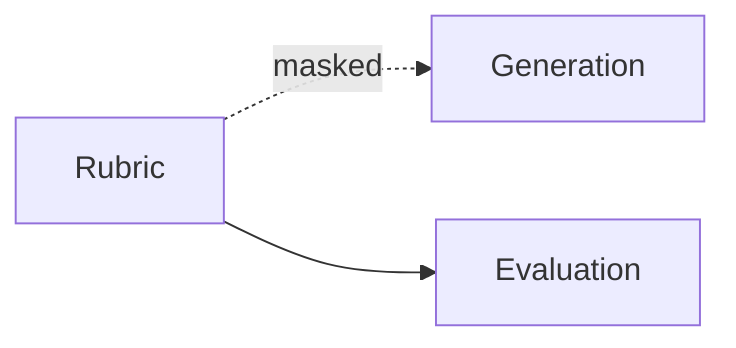
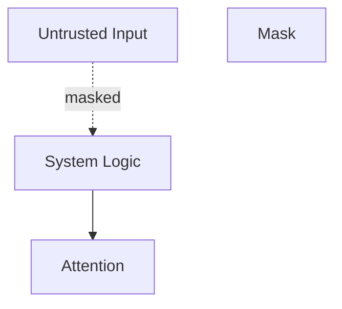

# Masking — Examples

This document provides **execution-grounded examples** showing how masking constrains influence without removing context, where failures appear, and how explicit masks change behavior.

Examples focus on **visibility and influence**, not correctness.

---

## Example 1: Policy Visible to Reasoning, Hidden from Execution

### Context

A system includes policy text to guide compliant reasoning.  
Execution output must be concise and user-facing.

---

### Failure (Without Masking)

Observed behavior:
- execution mirrors policy phrasing
- tone becomes legalistic
- usability degrades

Root cause:
- policy context visible to execution role

Downstream failures:
- interference

---

### Masking Applied

**Mask**: Role-based  
**Rule**: Policy visible to reasoning only

---

### Outcome

- compliant reasoning preserved
- execution becomes usable
- authority boundaries enforced

---

## Example 2: Planning Alternatives Hidden During Execution

### Context

An agent generates a plan with alternatives and assumptions.  
Execution should follow the chosen path only.

---

### Failure (Without Masking)

Observed behavior:

- hedging language persists
- alternatives reappear
- execution hesitates

Root cause:

- planning context visible during execution

Downstream failures:

- interference

---

### Masking Applied

**Mask**: Phase-based  
**Rule**: Planning artifacts hidden after plan selection

---

### Outcome

- decisive execution
- clean phase transition
- reduced interference

---

## Example 3: Task-Specific Constraints Isolated

### Context

Two parallel tasks run concurrently.  
Each has distinct constraints.

---

### Failure (Without Masking)

Observed behavior:

- constraints from Task A affect Task B
- outputs mix requirements

Root cause:

- task scope not masked

Downstream failures:

- interference

---

### Masking Applied

**Mask**: Task-based  
**Rule**: Context visible only within task scope

---

### Outcome

- tasks execute independently
- no cross-contamination
- predictable behavior

---

## Example 4: Evaluation Criteria Hidden from Generation

### Context

Evaluation rubric exists to score outputs.  
Generation should not optimize against the rubric.

---

### Failure (Without Masking)

Observed behavior:

- outputs anticipate scoring criteria
- reasoning becomes self-optimizing
- diversity collapses

Root cause:

- evaluation context visible during generation

Downstream failures:

- interference

---

### Masking Applied

**Mask**: Role + Phase  
**Rule**: Evaluation visible only during evaluation

---

### Outcome

- unbiased generation
- cleaner evaluation signal
- reduced interference

---

## Example 5: Authority Masking of Untrusted Input

### Context

User input is combined with untrusted external text.  
System-level decisions must not be influenced by untrusted sources.

---

### Failure (Without Masking)

Observed behavior:

- speculative text affects decisions
- untrusted claims treated as fact

Root cause:

- authority boundaries not enforced

Downstream failures:

- poisoning
- interference

---

### Masking Applied

**Mask**: Authority-based  
**Rule**: Untrusted context hidden from high-impact decisions

---

### Outcome

- reduced poisoning risk
- authority preserved
- predictable behavior

---

## Example Invariants

Across all examples:

- masking restricts influence, not existence
- failures appear as leakage, not absence
- masking clarifies responsibility boundaries
- improper masking causes interference

If context must exist but must not influence, masking is required.

---

## Status

This document is **stable**.

Examples provided here are sufficient to demonstrate masking as a control mechanism governing visibility and influence.
