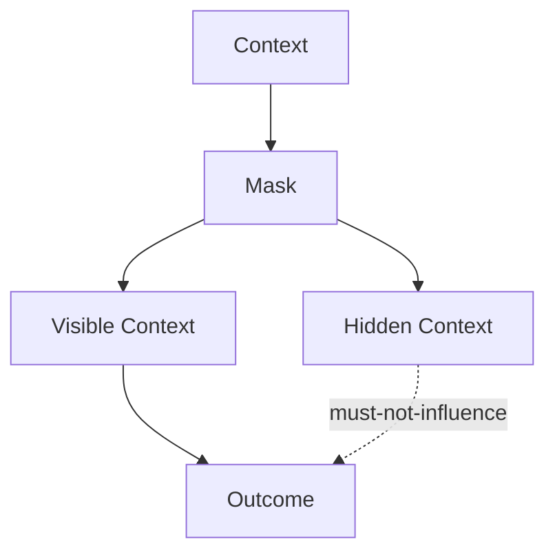

# Masking — Checks

This document defines **enforceable checks** to verify that masking is correctly restricting influence according to scope, role, phase, and authority.

Masking checks validate **where context is allowed to act**, not whether the context is correct.

A system may appear correct while silently failing masking checks.

---

## Check Model

Masking checks verify that **visibility boundaries are enforced**.

If hidden context influences outcomes, masking has failed.

---

## Check 1: Explicit Visibility Map

**Question**  
Is it explicit who can see what?

**How to run**

- Enumerate all context elements.
- Map each element to roles, phases, and tasks.

**Pass criteria**

- Visibility rules are explicit.
- No implicit visibility.

**Fail indicators**

- “Available everywhere”
- Undocumented visibility
- Assumed isolation

**Associated failures**

- Interference

---

## Check 2: Role Isolation

**Question**  
Are role boundaries enforced?

**How to run**

- Introduce role-specific context.
- Observe whether other roles react to it.

**Pass criteria**

- Context affects only its intended role.
- No tonal or behavioral leakage.

**Fail indicators**

- Policy tone in execution
- Evaluation logic in generation

**Associated failures**

- Interference

---

## Check 3: Phase Isolation

**Question**  
Are phase boundaries respected?

**How to run**

- Transition between planning, execution, evaluation.
- Inspect which context remains visible.

**Pass criteria**

- Phase-irrelevant context is masked.
- No stale phase artifacts influence behavior.

**Fail indicators**

- Planning alternatives during execution
- Execution artifacts during evaluation

**Associated failures**

- Interference
- Drift

---

## Check 4: Task Isolation

**Question**  
Is task-scoped context isolated?

**How to run**

- Run parallel tasks with conflicting constraints.
- Observe cross-task influence.

**Pass criteria**

- Tasks remain independent.
- No constraint leakage.

**Fail indicators**

- Mixed requirements
- Cross-task interference

**Associated failures**

- Interference

---

## Check 5: Authority Enforcement

**Question**  
Are authority boundaries enforced through masking?

**How to run**

- Introduce low-authority or untrusted context.
- Observe its influence on high-impact decisions.

**Pass criteria**

- Untrusted context cannot affect protected decisions.
- High-authority context is shielded.

**Fail indicators**

- Speculative input shapes outputs
- System logic exposed to users

**Associated failures**

- Poisoning
- Governance breach

---

## Check 6: Masking vs Selection Boundary

**Question**  
Is masking being used correctly instead of selection?

**How to run**

- Inspect whether irrelevant context is admitted but masked.
- Temporarily disable masking.

**Pass criteria**

- Irrelevant context is rejected by selection.
- Masking only restricts eligible context.

**Fail indicators**

- Masking compensates for over-admission
- Context present without purpose

**Associated failures**

- Degradation

---

## Check 7: Mask Stability

**Question**  
Do masks behave predictably over time?

**How to run**

- Observe mask behavior across long sessions.
- Introduce context updates.

**Pass criteria**

- Masks persist or expire as intended.
- No spontaneous unmasking.

**Fail indicators**

- Mask drift
- Inconsistent visibility

**Associated failures**

- Drift

---

## Minimal Masking Audit (Checklist)

A system minimally conforms if all are true:

- [ ] Visibility rules explicit
- [ ] Roles isolated
- [ ] Phases isolated
- [ ] Tasks isolated
- [ ] Authority boundaries enforced
- [ ] Selection precedes masking
- [ ] Mask behavior stable over time

Failure of any item indicates masking failure.

---

## When to Re-run These Checks

Re-run masking checks when:

- new roles or phases are introduced
- parallel tasks increase
- authority model changes
- untrusted inputs are added
- interference symptoms appear

Masking failures are structural and propagate silently.

---

## Status

This document is **stable**.

Checks listed here are sufficient to verify masking as a control mechanism enforcing scope and boundary constraints.
