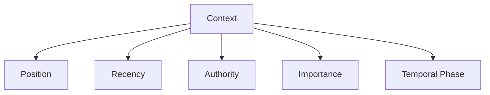

# Ordering

This specification defines **ordering** as a control mechanism that **establishes precedence among admitted context elements**.

Ordering does not decide *what* is admitted.  
Ordering decides *which admitted context gets attention first*.

Selection gates eligibility.  
Ordering governs competition.

---

## Definition

**Ordering** is the explicit arrangement of admitted context to influence attention allocation, precedence, and override behavior.

Ordering answers the question:

> *If multiple signals compete, which one wins?*

Without ordering, dominance defaults to position, recency, or verbosity.

---

## Primitive Justification

Ordering exists because:

- attention is finite and sequential
- models exhibit position and recency bias
- competing signals must be prioritized

Ordering enforces:
- **Attention** by structuring consumption
- **Signal vs Noise** by elevating priority signals

Without ordering, correct signal may exist but lose.

---

## What Ordering Is Not

Ordering is **not**:

- selection
- masking
- compression
- semantic rewriting

If content is removed, selection occurred.  
If content is hidden, masking occurred.  
If content is shortened, compression occurred.

Ordering only changes **precedence**.

---

## Ordering Targets

Ordering may apply to:

- system vs user instructions
- constraints vs background
- retrieved documents
- memory entries
- tool outputs
- intermediate artifacts

Ordering must declare **what is being ordered and why**.

---

## Ordering Axes

Ordering can be applied along multiple axes.

Implicit axes create invisible precedence.

---

## Common Ordering Strategies

### Authority-First Ordering

- system and policy precede user input
- constraints precede background

Risk:

- rigidity
- reduced adaptability

---

### Constraint-First Ordering

- safety and invariants appear earliest
- overrides later content

Risk:

- over-constraint
- reduced exploration

---

### Phase-First Ordering

- phase-relevant context elevated
- expired phase context demoted

Risk:

- orchestration complexity

---

### Recency-First Ordering

- latest context dominates

Risk:

- legacy constraints weakened
- drift

---

## Ordering Failure Signals

Ordering failure is present when:

- constraints exist but are ignored
- outputs change when context order changes
- later context overrides invariants
- verbosity dominates importance

Ordering failures are often misdiagnosed as selection or compression issues.

---

## Trade-Offs

Ordering introduces unavoidable trade-offs:

- **Pros**

  - predictable precedence
  - clearer override semantics
  - reduced position bias

- **Cons**

  - rigid influence hierarchy
  - increased orchestration effort
  - potential suppression of late-breaking signal

Ordering chooses which biases are acceptable.

---

## Interaction with Other Controls

Ordering must compose with:

- **Selection**: only admitted items are ordered
- **Compression**: compressed artifacts still require precedence
- **Masking**: ordered content must respect visibility
- **Validation**: persistent ordered artifacts require re-checks

Ordering without composition creates false confidence.

---

## Non-Claims

This specification does not claim:

- that ordering guarantees correctness
- that first position always wins
- that ordering removes bias
- that ordering replaces governance

Ordering shapes influence, not truth.

---

## Status

This specification is **stable**.

It provides sufficient grounding to define ordering failure signals, trade-offs, examples, and enforcement checks.
