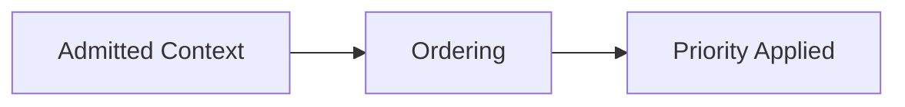

# Ordering — Trade-Offs

This document enumerates the **structural trade-offs introduced by ordering** as a control mechanism.

Ordering does not eliminate bias.  
It **chooses which bias is acceptable**.

Every precedence rule privileges one signal at the expense of another.

---

## Core Trade-Off

Ordering trades **flexibility** for **deterministic precedence**.

If precedence is not explicit, it will be inferred implicitly.

---

## Authority vs Adaptability

**Authority-first ordering**

- system and policy constraints dominate
- predictable enforcement

**Costs**

- reduced responsiveness to new information
- harder overrides

---

**Context-equal ordering**

- flexible adaptation
- user input can redirect behavior

**Costs**

- authority erosion
- inconsistent constraint application

Ordering encodes power relationships.

---

## Constraint Dominance vs Exploration

**Constraint-first ordering**

- invariants consistently enforced
- safety preserved

**Costs**

- limited exploration
- suppressed alternatives

---

**Exploration-friendly ordering**

- alternatives visible
- adaptive reasoning

**Costs**

- constraint dilution
- safety risk

Ordering defines what cannot be violated.

---

## Recency vs Stability

**Recency-first ordering**

- adapts quickly to updates
- responsive to interaction

**Costs**

- legacy constraint erosion
- drift

---

**Stability-first ordering**

- consistent behavior
- predictable outputs

**Costs**

- slower adaptation
- resistance to change

Ordering encodes temporal values.

---

## Phase-Centric Ordering Trade-Offs

**Phase-aware ordering**

- clear execution semantics
- reduced interference

**Costs**

- orchestration complexity
- more state transitions

---

**Phase-agnostic ordering**

- simpler pipelines
- fewer failure points

**Costs**

- cross-phase contamination
- blurred responsibility

---

## Ordering Depth Trade-Offs

**Shallow ordering**

- few precedence layers
- easier reasoning

**Costs**

- coarse control
- unresolved conflicts

---

**Deep ordering**

- fine-grained precedence
- explicit override rules

**Costs**

- brittle hierarchies
- harder maintenance

---

## Interaction with Other Controls

Ordering amplifies or constrains other controls:

- **Selection**: defines what enters competition
- **Compression**: ordered artifacts still compete
- **Masking**: ordered content must respect visibility
- **Validation**: persistent precedence must be rechecked

Ordering without composition creates false confidence.

---

## Governance Trade-Offs

As ordering becomes stricter:

- responsibility becomes explicit
- override paths narrow
- errors become systemic

Implicit ordering hides responsibility inside the model.

---

## Ordering Invariants

The following always hold:

- Ordering always privileges some signals.
- Unordered context defaults to positional bias.
- Reordering changes influence.
- Ordering errors are hard to detect post-hoc.

Any system denying these is incomplete.

---

## Trade-Off Visibility Requirement

Ordering trade-offs must be explicit.

Acceptable mechanisms:

- declared precedence rules
- authority hierarchies
- phase-based priority tables
- override semantics

Implicit ordering is silent failure.

---

## Status

This document is **stable**.

Trade-offs listed here are sufficient to reason about ordering decisions as a control mechanism.
