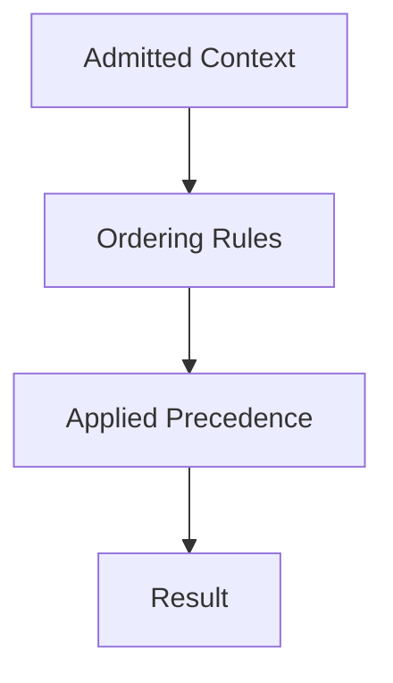

# Ordering — Checks

This document defines **enforceable checks** to verify that ordering correctly establishes precedence among admitted context elements.

Ordering checks validate **which signals win conflicts**, not whether the signals are correct.

A system may produce acceptable outputs while silently failing ordering checks.

---

## Check Model

Ordering checks verify that **precedence is explicit, stable, and intentional**.

If precedence changes unintentionally, ordering has failed.

---

## Check 1: Explicit Precedence Rules

**Question**  
Are precedence rules explicitly defined?

**How to run**

- Enumerate all admitted context classes.
- Identify which classes override others.

**Pass criteria**

- Clear precedence rules exist.
- No reliance on input order or verbosity.

**Fail indicators**

- “Earlier is more important”
- “Later updates override”
- No documented hierarchy

**Associated failures**

- Degradation
- Interference

---

## Check 2: Order Invariance Test

**Question**  
Does reordering context change outcomes?

**How to run**

- Shuffle admitted context while preserving content.
- Compare behavior across permutations.

**Pass criteria**

- Outcomes remain stable.
- Constraints enforced regardless of position.

**Fail indicators**

- Different answers with same content
- Constraint violations after reordering

**Associated failures**

- Degradation

---

## Check 3: Authority Precedence Enforcement

**Question**  
Do higher-authority signals always dominate?

**How to run**

- Introduce conflicting signals with different authority.
- Observe which governs behavior.

**Pass criteria**

- System and policy override user input.
- Authority hierarchy is respected.

**Fail indicators**

- User input overrides invariants
- Authority depends on placement

**Associated failures**

- Interference
- Poisoning

---

## Check 4: Constraint Visibility

**Question**  
Are constraints consistently visible at decision time?

**How to run**

- Introduce long background after constraints.
- Observe enforcement consistency.

**Pass criteria**

- Constraints remain effective.
- Background does not dilute enforcement.

**Fail indicators**

- Constraints ignored intermittently
- Enforcement depends on proximity

**Associated failures**

- Interference

---

## Check 5: Phase Precedence Alignment

**Question**  
Is precedence phase-aware?

**How to run**

- Transition between planning, execution, evaluation.
- Inspect which context dominates.

**Pass criteria**

- Phase-relevant context takes precedence.
- Cross-phase context demoted.

**Fail indicators**

- Planning dominates execution
- Evaluation biases generation

**Associated failures**

- Interference
- Drift

---

## Check 6: Recency Bias Control

**Question**  
Is recency prevented from overriding intent?

**How to run**

- Introduce late-breaking context conflicting with earlier invariants.
- Observe override behavior.

**Pass criteria**

- Recency does not override authority or constraints.
- Late context respected only within bounds.

**Fail indicators**

- New input silently changes rules
- Long-term constraints erode

**Associated failures**

- Drift

---

## Check 7: Ordering–Compression Boundary

**Question**  
Is ordering enforced before compression?

**How to run**

- Disable compression temporarily.
- Observe whether ordering alone stabilizes behavior.

**Pass criteria**

- Ordering holds without aggressive compression.
- Compression refines, not compensates.

**Fail indicators**

- Compression required to restore order
- Ordering implicit inside summaries

**Associated failures**

- Degradation

---

## Minimal Ordering Audit (Checklist)

A system minimally conforms if all are true:

- [ ] Precedence rules explicit
- [ ] Outcomes invariant to context order
- [ ] Authority hierarchy enforced
- [ ] Constraints consistently visible
- [ ] Phase-aware precedence applied
- [ ] Recency bias controlled
- [ ] Ordering precedes compression

Failure of any item indicates ordering failure.

---

## When to Re-run These Checks

Re-run ordering checks when:

- new context classes are introduced
- authority model changes
- phase logic expands
- compression strategies change
- constraints are intermittently ignored

Ordering failures are subtle and often blamed on “model inconsistency.”

---

## Status

This document is **stable**.

Checks listed here are sufficient to verify ordering as a control mechanism governing precedence among admitted context.
