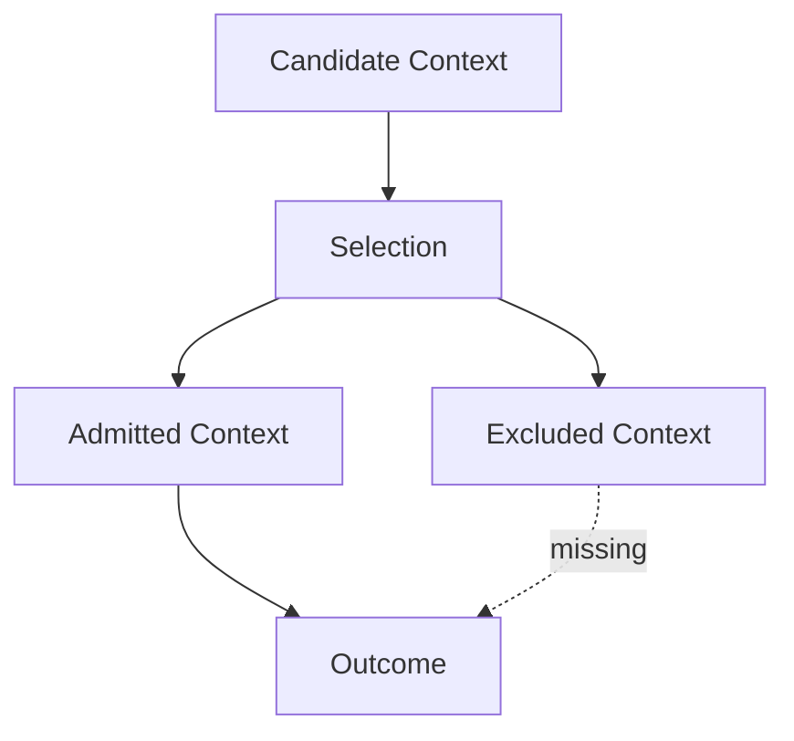

# Selection — Failure Signals

This document enumerates **observable signals** indicating that selection is absent, misapplied, or bypassed.

Selection failures occur **before attention is spent**.  
They are often misdiagnosed as compression or model failures.

---

## Failure Model

Selection fails when **irrelevant or ineligible context is admitted**, or when **relevant context is excluded**.

If outcomes improve when admission criteria change, selection has failed.

---

## Over-Admission Signals

### Irrelevant Context Consumption

Observed behaviors:

- background information dominates reasoning
- tangential documents affect decisions
- verbosity correlates with influence

Interpretation:

- selection criteria too permissive
- relevance inferred implicitly

Primary downstream failures:

- degradation
- interference

---

### Scope-Violating Admission

Observed behaviors:

- task-specific constraints appear globally
- role-specific instructions leak
- policy text shapes execution tone

Interpretation:

- selection ignores scope boundaries

Primary downstream failures:

- interference

---

### Phase-Insensitive Admission

Observed behaviors:

- planning alternatives affect execution
- evaluation criteria bias generation
- stale goals remain influential

Interpretation:

- selection not re-evaluated across phases

Primary downstream failures:

- interference
- drift

---

## Under-Admission Signals

### Critical Signal Exclusion

Observed behaviors:

- safety constraints disappear
- outputs violate explicit requirements
- corrections fail to apply

Interpretation:

- selection criteria too strict
- weak but critical signal excluded

Primary downstream failures:

- interference
- policy breach

---

### Edge-Case Blindness

Observed behaviors:

- system fails on rare but known cases
- qualifiers and caveats ignored
- behavior appears overconfident

Interpretation:

- selection optimized for majority cases
- weak signal suppressed

Primary downstream failures:

- degradation

---

## Authority Misclassification Signals

### Low-Authority Content Influences Decisions

Observed behaviors:

- untrusted inputs shape outputs
- speculative content treated as fact

Interpretation:

- selection ignores authority boundaries

Primary downstream failures:

- interference
- poisoning

---

### High-Authority Content Excluded

Observed behaviors:

- system instructions ignored
- constraints inconsistently applied

Interpretation:

- selection criteria misaligned with authority hierarchy

Primary downstream failures:

- degradation
- interference

---

## Temporal Selection Signals

### Stale Context Admission

Observed behaviors:

- obsolete constraints persist
- outdated assumptions dominate decisions

Interpretation:

- selection ignores lifetimes
- freshness not evaluated

Primary downstream failures:

- drift

---

### Fresh Signal Suppression

Observed behaviors:

- updates fail to affect behavior
- new constraints ignored

Interpretation:

- selection favors legacy context

Primary downstream failures:

- drift

---

## Selection–Compression Confusion

### Compression Masking Selection Failure

Observed behaviors:

- aggressive compression required to stabilize behavior
- disabling compression improves outcomes

Interpretation:

- selection failed upstream
- compression compensating for over-admission

Primary downstream failures:

- degradation

---

## Distinguishing Selection Failure from Other Failures

| Observation                        | Selection Failure? |
| ---------------------------------- | ------------------ |
| Too much context                   | Possibly           |
| Wrong context admitted             | Yes                |
| Correct context ignored            | Yes                |
| Performance improves after pruning | Yes                |
| Summaries distort meaning          | No (Compression)   |

Selection failures concern **eligibility**, not transformation.

---

## Detection Guidance

Selection failures are detected by:

- tightening admission criteria experimentally
- enforcing scope-aware gates
- comparing outcomes with different selection thresholds
- auditing why each context element was admitted

If context must be compressed heavily to behave, selection is weak.

---

## When to Escalate

Escalation is required when:

- irrelevant content repeatedly dominates
- safety constraints disappear
- scope violations persist
- behavior improves when inputs are rejected

Selection failures propagate silently into downstream controls.

---

## Status

This document is **stable**.

Signals listed here are sufficient to detect selection failures before they manifest as systemic degradation, interference, or drift.
