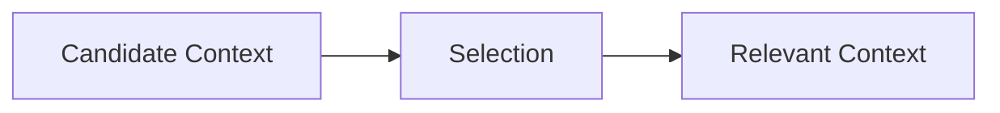

# Selection — Trade-Offs

This document enumerates the **structural trade-offs introduced by selection** as a control mechanism.

Selection does not improve reasoning quality directly.  
It **constrains what is allowed to matter**.

Every admission decision excludes alternatives.

---

## Core Trade-Off

Selection trades **coverage** for **relevance certainty**.

If nothing is excluded, selection has not occurred.

---

## Precision vs Recall

**High-precision selection**

- admits only strong, high-confidence signal
- reduces noise aggressively

**Costs**

- weak but critical signals excluded
- brittle behavior under novelty

---

**High-recall selection**

- admits broad context
- tolerant of ambiguity

**Costs**

- attention dilution
- increased reliance on downstream controls

Selection must choose which failure mode is acceptable.

---

## Weak Signal Trade-Off

Weak signals are:

- short
- conditional
- rare
- safety-relevant

**Admitting weak signals**

- improves correctness and safety
- increases noise surface

**Excluding weak signals**

- simplifies reasoning
- risks catastrophic omission

There is no neutral position.

---

## Authority vs Flexibility

**Authority-weighted selection**

- prioritizes system and policy constraints
- stabilizes behavior

**Costs**

- reduced adaptability
- harder user overrides

---

**Context-equal selection**

- treats inputs uniformly
- maximizes flexibility

**Costs**

- authority erosion
- unpredictable influence

Selection assigns power.

---

## Phase Sensitivity Trade-Off

**Phase-aware selection**

- re-evaluates relevance per phase
- reduces interference

**Costs**

- orchestration complexity
- increased failure surface

---

**Phase-agnostic selection**

- simpler pipelines
- fewer moving parts

**Costs**

- cross-phase contamination
- drift

---

## Freshness vs Stability

**Favoring fresh context**

- adapts quickly
- responds to updates

**Costs**

- instability
- loss of long-term constraints

---

**Favoring legacy context**

- stabilizes behavior
- predictable outputs

**Costs**

- drift
- resistance to change

Selection encodes temporal values.

---

## Selection Threshold Trade-Offs

**Strict thresholds**

- fewer admitted elements
- clearer intent

**Costs**

- false negatives
- fragile under uncertainty

---

**Loose thresholds**

- more admitted elements
- resilient to misclassification

**Costs**

- noise accumulation
- downstream burden

---

## Interaction with Other Controls

Selection amplifies other controls:

- **Before Compression** → determines what can be reduced
- **Before Ordering** → determines what competes for priority
- **Before Masking** → determines what must be scoped
- **Before Validation** → determines what persists

Poor selection shifts cost downstream.

---

## Governance Trade-Offs

As selection tightens:

- responsibility shifts to designers
- mistakes become explicit
- accountability increases

Loose selection hides responsibility inside the model.

---

## Selection Invariants

The following always hold:

- Selection always excludes something.
- Exclusion is irreversible at runtime.
- Weak signals are expensive to preserve.
- Selection errors surface late.

Any system denying these is incomplete.

---

## Trade-Off Visibility Requirement

Selection trade-offs must be explicit.

Acceptable mechanisms:

- declared admission criteria
- authority weighting rules
- phase-based gates
- freshness thresholds

Implicit selection is silent failure.

---

## Status

This document is **stable**.

Trade-offs listed here are sufficient to reason about selection decisions as a control mechanism.
