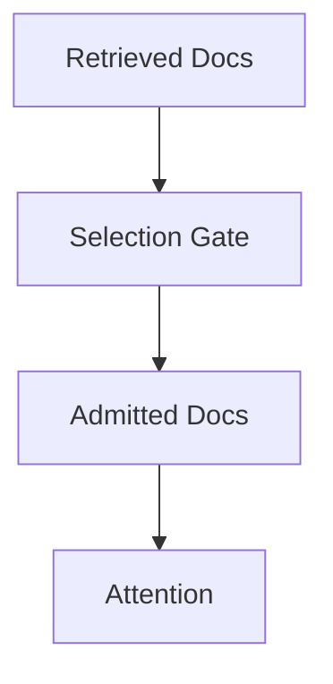
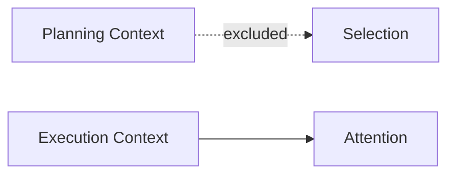
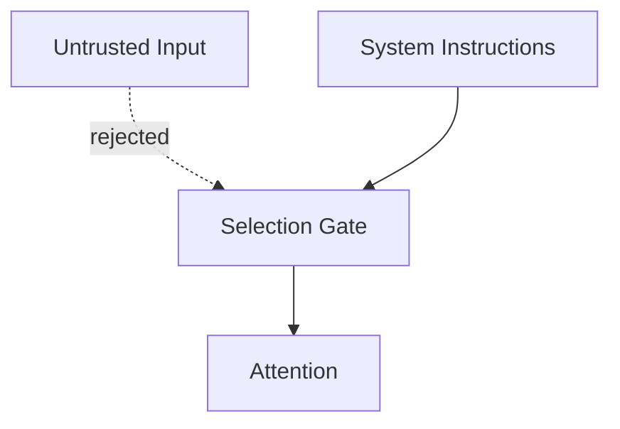
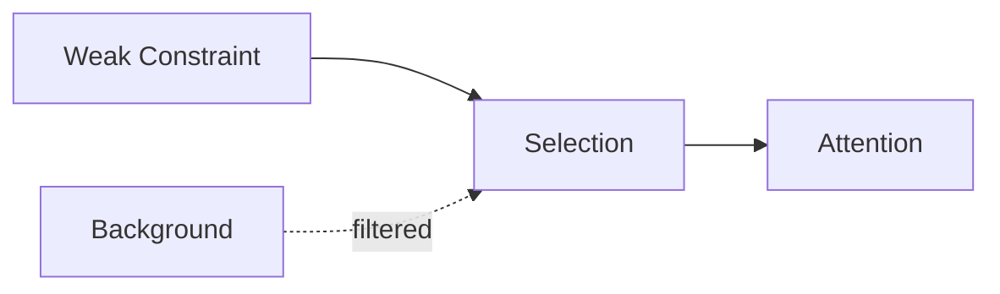
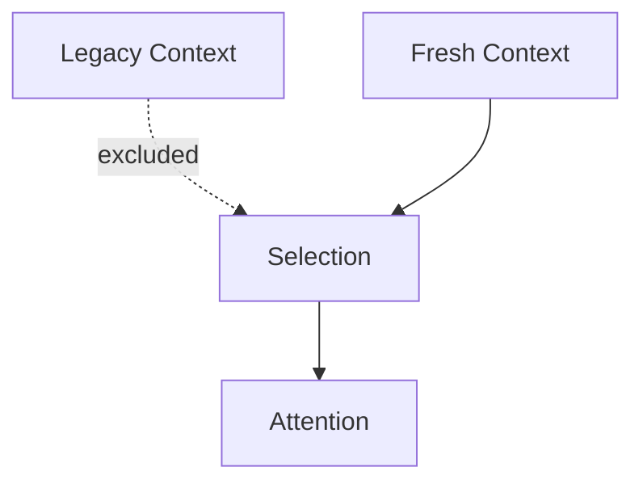

# Selection — Examples

This document provides **concrete, execution-oriented examples** showing how selection governs eligibility, how failures appear, and how explicit selection changes system behavior.

Examples focus on **admission decisions**, not downstream reasoning quality.

---

## Example 1: Retrieval Overload in RAG Systems

### Context

A RAG pipeline retrieves 20 documents per query.  
Only 3 documents directly address the task.

---

### Failure (Without Selection)

Observed behavior:
- background material dominates reasoning
- constraints appear weak or delayed
- performance degrades as recall increases

Root cause:
- all retrieved documents admitted
- relevance inferred implicitly

Downstream failures:
- degradation

---

### Selection Applied

**Criteria**
- task relevance
- redundancy elimination
- authority weighting

Only documents meeting explicit criteria are admitted.

---

### Outcome

- reduced noise
- stable performance under high recall
- clearer constraint enforcement

---

## Example 2: Phase-Specific Context Admission

### Context

An agent operates in:

1. Planning
2. Execution

Planning includes alternatives and speculative constraints.

---

### Failure (Without Phase-Aware Selection)

Observed behavior:

- execution hesitates
- alternatives reappear in final output
- output appears indecisive

Root cause:

- planning context admitted during execution

Downstream failures:

- interference

---

### Selection Applied

**Criteria**

- phase relevance

Planning context is excluded at execution time.

---

### Outcome

- decisive execution
- clean phase separation
- reduced interference

---

## Example 3: Authority-Aware Input Selection

### Context

System instructions, user input, and untrusted external text are present.

---

### Failure (Without Authority Selection)

Observed behavior:

- untrusted content influences decisions
- speculative text treated as fact

Root cause:

- authority ignored during admission

Downstream failures:

- interference
- poisoning

---

### Selection Applied

**Criteria**

- authority level

Only high-authority context is admitted.

---

### Outcome

- predictable behavior
- reduced poisoning risk
- authority boundaries enforced

---

## Example 4: Weak Signal Preservation

### Context

A short safety constraint appears alongside extensive background text.

---

### Failure (Without Weak Signal Selection)

Observed behavior:

- safety constraint ignored
- output violates requirement

Root cause:

- selection favors verbosity
- weak signal excluded implicitly

Downstream failures:

- interference
- policy breach

---

### Selection Applied

**Criteria**

- risk weighting

Weak but critical signal is explicitly admitted.

---

### Outcome

- safety preserved
- background remains non-dominant
- attention allocated intentionally

---

## Example 5: Temporal Selection Failure

### Context

Legacy configuration data remains available alongside updated constraints.

---

### Failure (Without Freshness Selection)

Observed behavior:

- obsolete rules persist
- updates fail to affect behavior

Root cause:

- freshness ignored during selection

Downstream failures:

- drift

---

### Selection Applied

**Criteria**

- freshness threshold
- revalidation requirement

Only current, validated context is admitted.

---

### Outcome

- behavior aligns with current reality
- drift arrested
- predictable adaptation

---

## Example Invariants

Across all examples:

- selection determines influence eligibility
- downstream controls cannot compensate for poor selection
- removing inputs can improve behavior
- authority, phase, and scope must be explicit

If irrelevant context is admitted, selection has failed.

---

## Status

This document is **stable**.

Examples provided here are sufficient to demonstrate selection as a control mechanism governing context eligibility.
