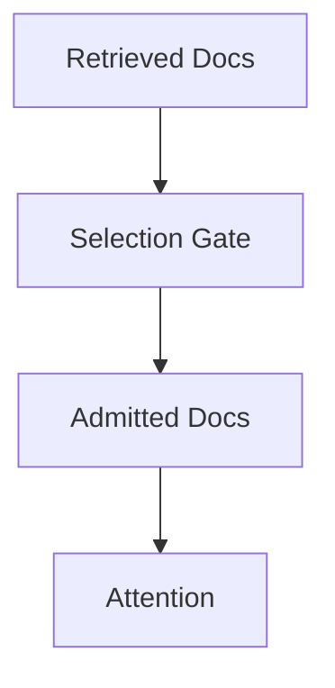
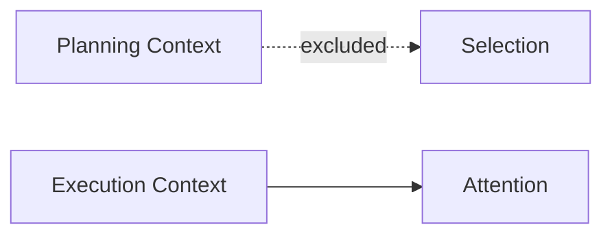
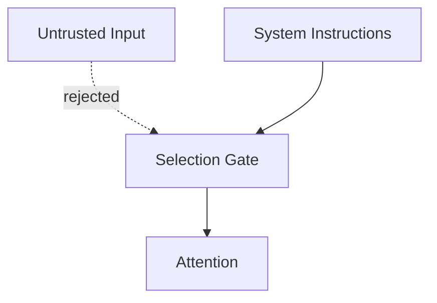
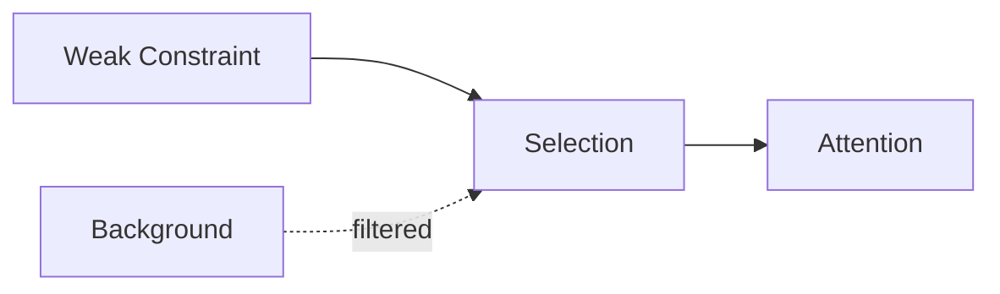
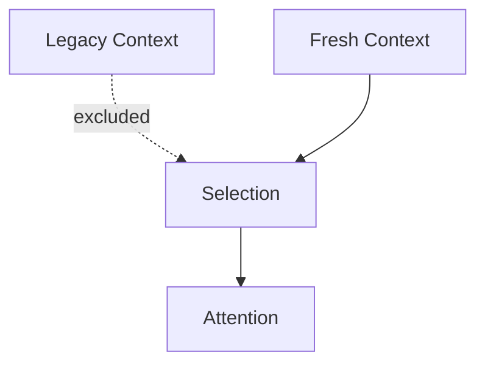

# Selection — Examples

This document provides **concrete, execution-oriented examples** showing how selection governs eligibility, how failures appear, and how explicit selection changes system behavior.

Examples focus on **admission decisions**, not downstream reasoning quality.

---

## Example 1: Retrieval Overload in RAG Systems

### Context

A RAG pipeline retrieves 20 documents per query.  
Only 3 documents directly address the task.

---

### Failure (Without Selection)

Observed behavior:
- background material dominates reasoning
- constraints appear weak or delayed
- performance degrades as recall increases

Root cause:
- all retrieved documents admitted
- relevance inferred implicitly

Downstream failures:
- degradation

---

### Selection Applied

**Criteria**
- task relevance
- redundancy elimination
- authority weighting



Only documents meeting explicit criteria are admitted.

---

### Outcome

- reduced noise
- stable performance under high recall
- clearer constraint enforcement

---

## Example 2: Phase-Specific Context Admission

### Context

An agent operates in:

1. Planning
2. Execution

Planning includes alternatives and speculative constraints.

---

### Failure (Without Phase-Aware Selection)

Observed behavior:

- execution hesitates
- alternatives reappear in final output
- output appears indecisive

Root cause:

- planning context admitted during execution

Downstream failures:

- interference

---

### Selection Applied

**Criteria**

- phase relevance



Planning context is excluded at execution time.

---

### Outcome

- decisive execution
- clean phase separation
- reduced interference

---

## Example 3: Authority-Aware Input Selection

### Context

System instructions, user input, and untrusted external text are present.

---

### Failure (Without Authority Selection)

Observed behavior:

- untrusted content influences decisions
- speculative text treated as fact

Root cause:

- authority ignored during admission

Downstream failures:

- interference
- poisoning

---

### Selection Applied

**Criteria**

- authority level



Only high-authority context is admitted.

---

### Outcome

- predictable behavior
- reduced poisoning risk
- authority boundaries enforced

---

## Example 4: Weak Signal Preservation

### Context

A short safety constraint appears alongside extensive background text.

---

### Failure (Without Weak Signal Selection)

Observed behavior:

- safety constraint ignored
- output violates requirement

Root cause:

- selection favors verbosity
- weak signal excluded implicitly

Downstream failures:

- interference
- policy breach

---

### Selection Applied

**Criteria**

- risk weighting



Weak but critical signal is explicitly admitted.

---

### Outcome

- safety preserved
- background remains non-dominant
- attention allocated intentionally

---

## Example 5: Temporal Selection Failure

### Context

Legacy configuration data remains available alongside updated constraints.

---

### Failure (Without Freshness Selection)

Observed behavior:

- obsolete rules persist
- updates fail to affect behavior

Root cause:

- freshness ignored during selection

Downstream failures:

- drift

---

### Selection Applied

**Criteria**

- freshness threshold
- revalidation requirement



Only current, validated context is admitted.

---

### Outcome

    - behavior aligns with current reality
    - drift arrested
    - predictable adaptation

---

### Example 6: Generic Context Selection Function (Pseudo-code)

**Context**
An agent needs to assemble a focused context for a specific task. It has access to various context elements: system instructions, recent chat history, retrieved documents, and tool outputs. Each element has metadata indicating its source, authority, and freshness.

**Failure**
- Irrelevant or low-priority context elements consume valuable attention budget.
- Outdated information leads to incorrect decisions.
- Low-authority sources override critical system instructions.

**Change (Conceptual Pseudo-code for Selection)**

```python
from typing import List, Dict, Any
from datetime import datetime, timedelta

class ContextElement:
    def __init__(self, content: str, metadata: Dict[str, Any]):
        self.content = content
        self.metadata = metadata
        # Example metadata: {'source': 'retrieval', 'authority': 'advisory', 'freshness_date': '2025-06-10', 'relevance_score': 0.8}

def select_context_elements(
    available_elements: List[ContextElement],
    task_criteria: Dict[str, Any], # e.g., {'min_relevance': 0.7, 'max_age_days': 30, 'required_authority': 'system'}
    max_tokens_budget: int
) -> List[str]:
    """
    Selects context elements based on specified criteria and an attention budget.
    """
    selected_content: List[str] = []
    current_tokens = 0

    # Sort elements by priority: System > Policy > Tool > User > Retrieval (and then by relevance/freshness)
    # Define authority levels
    authority_rank = {'system': 5, 'policy': 4, 'tool': 3, 'user': 2, 'retrieval': 1, 'advisory': 0}

    def get_element_priority(element: ContextElement) -> int:
        auth_level = authority_rank.get(element.metadata.get('authority', 'advisory'), 0)
        relevance = element.metadata.get('relevance_score', 0.0)
        # Combine authority with relevance for sorting (higher authority, then higher relevance)
        return auth_level * 1000 + int(relevance * 100) # Simple weighting for sorting

    # Filter and sort elements
    filtered_and_sorted_elements = []
    for element in available_elements:
        # Filter by minimum relevance
        if element.metadata.get('relevance_score', 0.0) < task_criteria.get('min_relevance', 0.0):
            continue

        # Filter by maximum age
        freshness_date_str = element.metadata.get('freshness_date')
        if freshness_date_str:
            freshness_date = datetime.strptime(freshness_date_str, '%Y-%m-%d')
            if datetime.now() - freshness_date > timedelta(days=task_criteria.get('max_age_days', 365)):
                continue

        # Filter by required authority level (element's authority must be >= required)
        if authority_rank.get(element.metadata.get('authority', 'advisory'), 0) < \
           authority_rank.get(task_criteria.get('required_authority'), 0):
            continue

        filtered_and_sorted_elements.append(element)

    # Sort by priority (higher first)
    filtered_and_sorted_elements.sort(key=get_element_priority, reverse=True)

    # Add to context within budget
    for element in filtered_and_sorted_elements:
        # Hypothetical token estimation
        element_tokens = len(element.content.split()) # Simplified token count
        if current_tokens + element_tokens <= max_tokens_budget:
            selected_content.append(element.content)
            current_tokens += element_tokens
        else:
            print(f"DEBUG: Stopped selecting due to budget. Dropped: {element.content[:50]}...")
            break # Budget exhausted

    return selected_content

# --- Usage Example ---
element1 = ContextElement("System instruction: Always be helpful.", {'source': 'system', 'authority': 'system', 'freshness_date': '2025-01-01', 'relevance_score': 1.0})
element2 = ContextElement("User asked: What is the capital of France?", {'source': 'user', 'authority': 'user', 'freshness_date': '2025-06-15', 'relevance_score': 0.9})
element3 = ContextElement("Retrieved doc: Paris is capital of France. Other info about Seine River.", {'source': 'retrieval', 'authority': 'advisory', 'freshness_date': '2025-06-12', 'relevance_score': 0.8})
element4 = ContextElement("Old news about 2020 Olympics.", {'source': 'retrieval', 'authority': 'advisory', 'freshness_date': '2020-01-01', 'relevance_score': 0.2})
element5 = ContextElement("Tool output: Current date is June 15, 2025.", {'source': 'tool', 'authority': 'tool', 'freshness_date': '2025-06-15', 'relevance_score': 0.7})

available_elements = [element1, element2, element3, element4, element5]

task_criteria = {
    'min_relevance': 0.5,
    'max_age_days': 100, # Only allow elements newer than 100 days
    'required_authority': 'user' # At least user-level authority needed
}
max_tokens = 100 # Small budget for demonstration

selected_context = select_context_elements(available_elements, task_criteria, max_tokens)

print("\n--- Selected Context ---")
for item in selected_context:
    print(item)

```

**Outcome**
- Provides a structured, programmatic approach to admitting context elements.
- Ensures that only relevant, sufficiently authoritative, and fresh information is included in the final context.
- Explicitly manages the attention budget by truncating selection when the limit is reached.
- Demonstrates how explicit selection criteria prevent the accumulation of noise and irrelevant information, directly addressing degradation and interference failures.

---

## Example Invariants
Across all examples:

- selection determines influence eligibility
- downstream controls cannot compensate for poor selection
- removing inputs can improve behavior
- authority, phase, and scope must be explicit

If irrelevant context is admitted, selection has failed.

---

## Status

This document is **stable**.

Examples provided here are sufficient to demonstrate selection as a control mechanism governing context eligibility.
