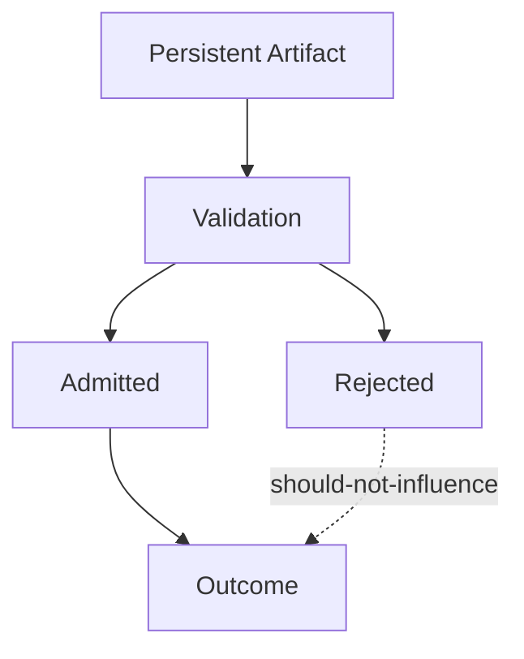

# Validation — Failure Signals

This document enumerates **observable signals** indicating that validation is absent, incomplete, or bypassed.

Validation failures are **persistence failures**.  
They occur when context continues to influence behavior **after it should have expired, been rejected, or been rechecked**.

---

## Failure Model

Validation fails when **ineligible artifacts retain influence**.

If rejected artifacts still influence outcomes, validation has failed.

---

## Lifetime Failure Signals

### Stale Influence Persistence

Observed behaviors:

- old summaries guide new sessions
- previous assumptions override updated instructions
- behavior reflects earlier state despite explicit change

Interpretation:

- lifetime checks missing or ignored
- expiration not enforced

Primary downstream failures:

- drift

---

### Freshness Blindness

Observed behaviors:

- updated constraints fail to take effect
- system appears “stuck” in prior configuration

Interpretation:

- freshness thresholds undefined
- stale artifacts treated as valid

Primary downstream failures:

- drift

---

## Provenance Failure Signals

### Untrusted Artifact Reuse

Observed behaviors:

- tool output reused without rechecking
- external text reappears as fact
- speculative content becomes authoritative

Interpretation:

- provenance not recorded or not enforced
- validation bypassed for reuse

Primary downstream failures:

- poisoning

---

### Source Ambiguity

Observed behaviors:

- system cannot explain where a rule came from
- conflicting artifacts coexist without resolution

Interpretation:

- provenance metadata missing
- UNKNOWN treated as valid

Primary downstream failures:

- poisoning
- interference

---

## Scope Failure Signals

### Out-of-Scope Persistence

Observed behaviors:

- task-specific constraints affect unrelated tasks
- role-specific rules appear globally

Interpretation:

- scope not revalidated on reuse
- validation skipped at context assembly

Primary downstream failures:

- interference

---

### Phase Leakage via Persistence

Observed behaviors:

- planning assumptions affect execution
- evaluation criteria influence generation

Interpretation:

- phase not part of validation
- expired phase artifacts treated as valid

Primary downstream failures:

- interference

---

## Authority Failure Signals

### Low-Authority Persistence

Observed behaviors:

- user suggestions harden into rules
- temporary overrides become permanent

Interpretation:

- authority not checked during validation
- promotions without revalidation

Primary downstream failures:

- poisoning
- interference

---

### High-Authority Erosion

Observed behaviors:

- system constraints weakened over time
- policy appears optional after long sessions

Interpretation:

- validation allows conflicts to merge
- higher authority not enforced

Primary downstream failures:

- drift

---

## Conflict Handling Failure Signals

### Silent Conflict Accumulation

Observed behaviors:

- mutually inconsistent artifacts coexist
- behavior oscillates across runs

Interpretation:

- conflict check missing
- CONFLICTING not rejected

Primary downstream failures:

- interference

---

### Conflict Resolution by Averaging

Observed behaviors:

- constraints appear diluted
- system “splits the difference”

Interpretation:

- validation allows merging instead of rejection
- governance failure

Primary downstream failures:

- interference

---

## Validation–Selection Confusion

### Selection Used Instead of Validation

Observed behaviors:

- artifacts admitted once and reused forever
- eligibility checked only at intake

Interpretation:

- validation absent on reuse
- lifetime governance missing

Primary downstream failures:

- drift

---

## Distinguishing Validation Failure from Other Failures

| Observation                   | Validation Failure? |
| ----------------------------- | ------------------- |
| Wrong output                  | Possibly            |
| Old behavior persists         | Yes                 |
| New constraints ignored       | Yes                 |
| Context removed fixes issue   | Possibly            |
| Context exists but misordered | No (Ordering)       |

Validation failures concern **continued eligibility**, not relevance or precedence.

---

## Detection Guidance

Validation failures are detected by:

- forcing revalidation on reuse
- expiring artifacts aggressively
- clearing memory and observing behavior change
- tracing provenance of influential context

If clearing persistent context “fixes” behavior, validation was missing.

---

## When to Escalate

Escalation is required when:

- behavior drifts without intent change
- untrusted content reappears
- scope violations persist across sessions
- conflicts accumulate silently

Validation failures compound over time and are rarely self-correcting.

---

## Status

This document is **stable**.

Signals listed here are sufficient to detect validation failures before they manifest as drift, poisoning, or systemic interference.
