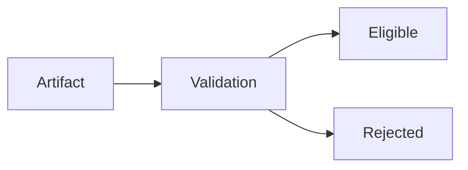

# Validation — Trade-Offs

Validation enforces eligibility for persistent or reused context.  
It trades **speed and convenience** for **integrity and governance**.

---

## Core Trade-Off

Validation raises the **cost of influence**.

Anything not validated is excluded, even if “probably fine.”

---

## Strict Validation

**Improves**
- prevents stale or untrusted artifacts from persisting
- surfaces conflicts early
- reduces drift and poisoning risk

**Costs**
- added latency and orchestration complexity
- higher false negatives (over-rejection)
- more human review load

---

## Permissive Validation

**Improves**
- faster throughput
- lower friction for iteration

**Costs**
- stale or adversarial artifacts persist
- hidden drift/poisoning
- reliance on luck instead of governance

---

## Metadata Burden

Validation requires provenance, scope, authority, lifetime.  
Collecting and maintaining metadata:
- **Improves** auditability and rollback
- **Costs** storage, tooling, operator discipline

Missing metadata forces rejection or unsafe defaults; choose explicitly.

---

## Conflict Handling

**Reject on conflict**
- preserves higher authority
- prevents dilution
- may block progress until resolved

**Merge/average on conflict**
- keeps systems running
- silently erodes authority and intent

Validation must choose; “merge” is a design decision, not a default.

---

## Refresh Cadence

**Frequent revalidation**
- catches drift/poisoning sooner
- increases cost and churn

**Infrequent revalidation**
- cheaper to run
- risks stale or invalid state

Cadence must be declared; implicit schedules drift.

---

## Automation vs. Human Review

**Automated validation**
- consistent, fast
- blind to subtle integrity risks

**Human-in-loop validation**
- better judgment on edge cases
- slower, higher cost, subjective variance

Balance automation with explicit escalation triggers.

---

## Invariants

- Validation always increases friction.
- Unknown/unstamped artifacts are either rejected or unsafe.
- Validation without metadata is impossible.
- Merging conflicts erodes authority and intent.

Any design claiming “no validation cost” is mis-specified.

---

## Status

This document is **stable**.  
Trade-offs must be explicit before declaring any validation regime acceptable.
