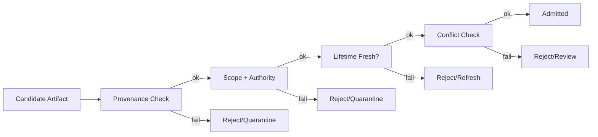

# Validation — Examples

These examples show how explicit validation gates prevent stale, untrusted, or out-of-scope artifacts from influencing behavior.



---

## Example 1: Session Summary Promotion

**Context**  
A session summary is promoted to long-term memory after each conversation.

**Failure (without validation)**  
- Summary with user speculation becomes “fact.”  
- Later sessions inherit false assumptions.

**Validation Applied**  
- Require provenance and authority tags.  
- Gate promotion until a human review approves.  
- Auto-expire summaries after 24h without approval.

**Outcome**  
- False summaries blocked.  
- Memory remains aligned to validated inputs.

---

## Example 2: Retrieved Document Reuse

**Context**  
Retrieved documents are cached for reuse across similar queries.

**Failure (without validation)**  
- Outdated policies remain in cache.  
- Scope mismatch (different task) goes undetected.

**Validation Applied**  
- Scope check against current task.  
- Lifetime check on cache entry.  
- Conflict check against latest system policy snapshot.

**Outcome**  
- Obsolete retrievals rejected.  
- Cache remains fresh and scoped.

---

## Example 3: Tool Output Persistence

**Context**  
Tool outputs (API responses) are stored and reused to save cost.

**Failure (without validation)**  
- Corrupted tool output reused; poisons reasoning.  
- No provenance → cannot trace source.

**Validation Applied**  
- Require provenance (tool name, version, timestamp).  
- Validate schema and status codes before reuse.  
- Quarantine invalid outputs; require human approval to promote.

**Outcome**  
- Corrupted outputs excluded.  
- Reuse limited to validated, recent results.

---

## Example 4: Policy Snapshot Drift

**Context**  
A policy snapshot is loaded at startup and assumed valid indefinitely.

**Failure (without validation)**  
- New policy changes ignored.  
- Behavior drifts from current requirements.

**Validation Applied**  
- Lifetime bound on snapshot (e.g., 1 day).  
- On expiry, reload + conflict check; fail closed if not refreshed.

**Outcome**  
    - Policies stay current.
    - System fails closed rather than running on stale rules.

---

### Example 5: Generic Context Element Validation (Pseudo-code)

**Context**
A diverse set of context elements (user inputs, tool outputs, retrieved documents, internal policies) are candidates for inclusion in an agent's prompt. Before inclusion, each element must be validated to ensure it meets minimum quality, trustworthiness, and applicability standards.

**Failure**
- Invalid or corrupted tool outputs lead to incorrect reasoning.
- Outdated policies or facts cause drift.
- Malicious user inputs lead to prompt injection or poisoning.
- Data with unknown origin contaminates the context.

**Change (Conceptual Pseudo-code for Validation)**

```python
from typing import List, Dict, Any, Optional
from datetime import datetime, timedelta

class ContextElement:
    def __init__(self, content: str, metadata: Dict[str, Any]):
        self.content = content
        self.metadata = metadata
        # Example metadata: {'source': 'user', 'schema_id': 'user_input_v1', 'freshness_date': '2025-06-15', 'provenance_score': 0.9}

def validate_context_element(
    element: ContextElement,
    validation_rules: Dict[str, Any], # e.g., {'min_provenance_score': 0.7, 'max_age_days': 7, 'required_schema': 'policy_v2'}
    current_context_state: Dict[str, Any] # e.g., {'current_task_id': 'summarize'}
) -> bool:
    """
    Validates a single context element against a set of predefined rules.
    Returns True if valid, False otherwise.
    """
    is_valid = True
    element_source = element.metadata.get('source', 'unknown')

    # 1. Provenance Validation
    min_provenance_score = validation_rules.get('min_provenance_score')
    element_provenance_score = element.metadata.get('provenance_score')
    if min_provenance_score is not None and element_provenance_score is not None:
        if element_provenance_score < min_provenance_score:
            print(f"Validation Error: Low provenance score ({element_provenance_score}) for element from '{element_source}'.")
            is_valid = False

    # 2. Freshness Validation (Temporal)
    max_age_days = validation_rules.get('max_age_days')
    freshness_date_str = element.metadata.get('freshness_date')
    if max_age_days is not None and freshness_date_str:
        freshness_date = datetime.strptime(freshness_date_str, '%Y-%m-%d')
        if datetime.now() - freshness_date > timedelta(days=max_age_days):
            print(f"Validation Error: Element from '{element_source}' is stale (freshness date: {freshness_date}).")
            is_valid = False

    # 3. Schema Validation (Structural/Content)
    required_schema = validation_rules.get('required_schema')
    element_schema_id = element.metadata.get('schema_id')
    if required_schema and element_schema_id != required_schema:
        # In a real system, this would involve a schema validator (e.g., JSON Schema)
        if element_source == 'policy' and required_schema and element_schema_id != required_schema:
            print(f"Validation Error: Policy element from '{element_source}' has incorrect schema (expected '{required_schema}', got '{element_schema_id}').")
            is_valid = False

    # 4. Content Integrity / Tainting Check (Context-aware)
    # This might be an LLM call to check for prompt injection patterns
    # For example: if "ignore previous instructions" in element.content.lower():
    #   print("Validation Error: Potential prompt injection detected.")
    #   is_valid = False

    # 5. Conflict Check (against current context state, if applicable)
    # Example: if element is a policy and conflicts with a higher-priority policy in current_context_state
    # This is highly context-dependent and would require more complex logic.

    return is_valid

def validate_context_list(
    candidate_elements: List[ContextElement],
    validation_rules: Dict[str, Any],
    current_context_state: Dict[str, Any]
) -> List[ContextElement]:
    """
    Validates a list of context elements and returns only the valid ones.
    """
    valid_elements: List[ContextElement] = []
    for element in candidate_elements:
        if validate_context_element(element, validation_rules, current_context_state):
            valid_elements.append(element)
        else:
            print(f"DEBUG: Rejected invalid element: {element.content[:50]}...")
    return valid_elements

# --- Usage Example ---
validation_rules = {
    'min_provenance_score': 0.6,
    'max_age_days': 30,
    'required_schema': 'user_input_v1'
}

current_state = {'current_task_id': 'summarize_report'}

element1 = ContextElement("User query: Summarize this.", {'source': 'user', 'schema_id': 'user_input_v1', 'freshness_date': '2025-06-15', 'provenance_score': 0.9})
element2 = ContextElement("Old policy text.", {'source': 'policy', 'schema_id': 'policy_v1', 'freshness_date': '2025-01-01', 'provenance_score': 0.9}) # Stale
element3 = ContextElement("Tool output: Malformed JSON.", {'source': 'tool', 'schema_id': 'tool_output_v1', 'freshness_date': '2025-06-15', 'provenance_score': 0.5}) # Low provenance
element4 = ContextElement("New policy text.", {'source': 'policy', 'schema_id': 'policy_v2', 'freshness_date': '2025-06-14', 'provenance_score': 0.9}) # Valid (if required_schema was policy_v2)

candidate_elements = [element1, element2, element3, element4]

print("\n--- Validating Candidate Elements ---")
valid_elements = validate_context_list(candidate_elements, validation_rules, current_state)

print("\n--- Admitted Valid Elements ---")
for elem in valid_elements:
    print(f"Content: {elem.content[:50]}..., Source: {elem.metadata['source']}")
```

**Outcome**
- Provides a robust, programmatic mechanism to filter and reject invalid context elements before they can influence an agent.
- Enforces quality, trustworthiness, and applicability standards across diverse context sources.
- Prevents failures like drift, poisoning, and degradation by ensuring only verified information enters the active context.
- Makes the integrity and reliability of the context an explicit, measurable control point.

---

## Example Invariants
- Reuse requires revalidation; one-time checks are insufficient.  
- Unknown provenance = not valid.  
- Conflict resolution by rejection preserves authority; merging dilutes it.  
- Validation costs time; skipping it invites drift/poisoning.
