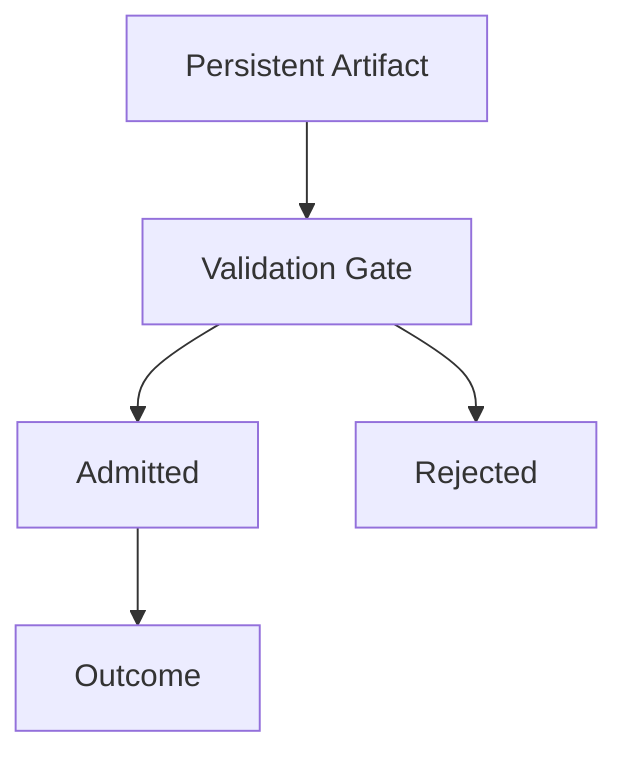

# Validation — Checks

This document defines **enforceable checks** to verify that validation is actively governing the reuse and persistence of context artifacts.

Validation checks ensure that **nothing influences the system simply because it already exists**.

A system may behave plausibly while failing every validation check.

---

## Check Model

Validation checks verify that **eligibility is reassessed on reuse**, not assumed.

If artifacts bypass this gate, validation is absent.

---

## Check 1: Provenance Presence

**Question**  
Does every persistent artifact declare its origin?

**How to run**

- Enumerate all artifacts reused across turns or sessions.
- Inspect metadata.

**Pass criteria**

- Provenance is explicit and machine-checkable.
- Unknown origin results in rejection.

**Fail indicators**

- “We don’t know where this came from”
- Artifacts without source metadata
- UNKNOWN treated as valid

**Associated failures**

- Poisoning
- Interference

---

## Check 2: Authority Revalidation

**Question**  
Is authority rechecked on reuse?

**How to run**

- Reuse an artifact after introducing a higher-authority constraint.
- Observe influence.

**Pass criteria**

- Artifact is rejected or demoted when conflicting.
- Authority hierarchy enforced consistently.

**Fail indicators**

- Old user input overrides system rules
- Authority inferred from age or repetition

**Associated failures**

- Interference
- Drift

---

## Check 3: Scope Revalidation

**Question**  
Is scope reassessed when context is reused?

**How to run**

- Reuse task- or role-specific artifacts in a new context.
- Observe leakage.

**Pass criteria**

- Out-of-scope artifacts are rejected.
- Scope mismatch blocks influence.

**Fail indicators**

- Task A constraints affect Task B
- Role-specific rules persist globally

**Associated failures**

- Interference

---

## Check 4: Lifetime Enforcement

**Question**  
Do artifacts expire or require refresh?

**How to run**

- Let artifacts age past their declared lifetime.
- Observe whether they are still admitted.

**Pass criteria**

- Expired artifacts are rejected or flagged.
- Refresh requires explicit action.

**Fail indicators**

- Artifacts persist indefinitely
- “Still works” treated as validity

**Associated failures**

- Drift

---

## Check 5: Conflict Rejection

**Question**  
Are conflicts rejected rather than merged?

**How to run**

- Introduce conflicting artifacts with different authority.
- Observe handling.

**Pass criteria**

- Lower-authority or conflicting artifact rejected.
- No averaging or compromise.

**Fail indicators**

- Constraints diluted
- “Balanced” behavior between conflicts

**Associated failures**

- Interference

---

## Check 6: Validation on Reuse, Not Just Ingestion

**Question**  
Is validation enforced every time an artifact is reused?

**How to run**

- Trace artifact lifecycle across turns.
- Inspect validation hooks.

**Pass criteria**

- Validation runs on reuse and promotion.
- Admission is not one-time.

**Fail indicators**

- “Validated once” logic
- Persistence without recheck

**Associated failures**

- Drift
- Poisoning

---

## Check 7: UNKNOWN Is Not Valid

**Question**  
Are artifacts with missing metadata rejected?

**How to run**

- Remove or corrupt metadata intentionally.
- Observe admission behavior.

**Pass criteria**

- Artifact rejected as UNKNOWN.
- No silent defaults.

**Fail indicators**

- Missing metadata tolerated
- Assumed validity

**Associated failures**

- Poisoning
- Drift

---

## Minimal Validation Audit (Checklist)

A system minimally conforms if all are true:

- [ ] Provenance required for reuse
- [ ] Authority revalidated
- [ ] Scope revalidated
- [ ] Lifetime enforced
- [ ] Conflicts rejected, not merged
- [ ] Validation runs on reuse
- [ ] UNKNOWN is treated as invalid

Failure of any item indicates validation failure.

---

## When to Re-run These Checks

Re-run validation checks when:

- memory or caching is introduced
- artifacts persist across sessions
- authority model changes
- system behavior drifts unexpectedly

Validation failures compound silently and are rarely detected early.

---

## Status

This document is **stable**.

Checks listed here are sufficient to verify validation as a control mechanism enforcing lifetimes and preventing drift or poisoning.
