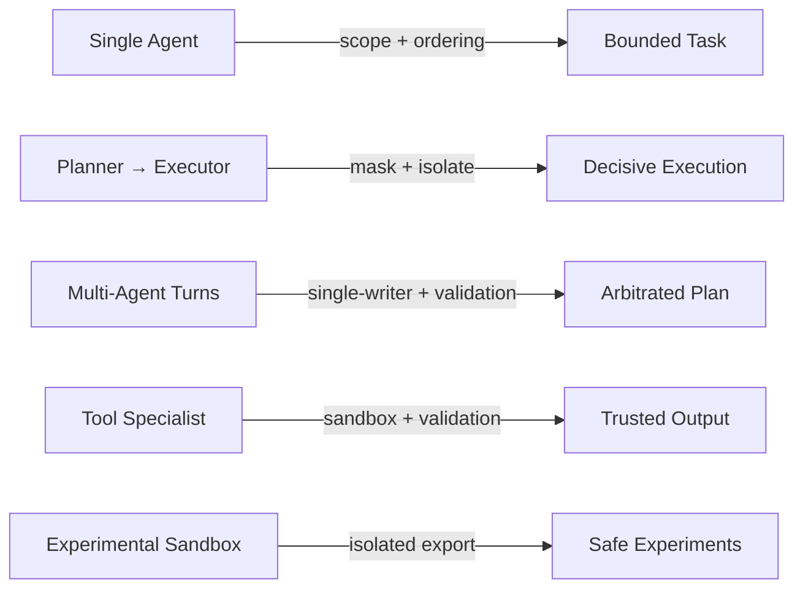

# Agents — Patterns

These patterns apply primitives and controls to single- and multi-agent orchestration.

They do **not** introduce new controls; they combine selection, ordering, masking, validation, and isolation to prevent interference and poisoning.

---

## Pattern: Single Agent with Hard Scope

- **Use when**: one agent handles a bounded task.
- **Controls**:
  - Scope: bind instructions to task/role; clear on completion.
  - Ordering: system/developer constraints precede user/tool content.
  - Masking: hide evaluation/rubric from generation.
- **Failure prevention**: avoids scope bleed and authority inversion.

---

## Pattern: Planner–Executor Split

- **Use when**: planning must not leak into execution.
- **Controls**:
  - Isolation: separate planning context; discard alternatives after selection.
  - Masking: only selected plan visible to executor.
  - Validation: selected plan checked against constraints before handoff.
- **Failure prevention**: prevents execution hedging and planning interference.

---

## Pattern: Multi-Agent Turn-Based Orchestration

- **Use when**: multiple roles collaborate (research, synthesis, critique).
- **Controls**:
  - Isolation: per-agent context stores; no shared implicit memory.
  - Ordering: orchestrator decides writer per turn; single-writer rule.
  - Selection: only typed handoff artifacts admitted to next agent.
  - Validation: handoff artifacts checked for scope/authority before use.
- **Failure prevention**: avoids cross-agent contamination and arbitration failure.

---

## Pattern: Tool-Specialist Agent

- **Use when**: an agent calls untrusted tools.
- **Controls**:
  - Isolation: sandbox tool outputs; no direct write to shared state.
  - Validation: schema + provenance checks on tool outputs before reasoning.
  - Masking: logs hidden; only results/errors visible.
- **Failure prevention**: contains poisoning from tool outputs; reduces attention overload from logs.

---

## Pattern: Experimental Agent Sandbox

- **Use when**: testing new behaviors alongside production.
- **Controls**:
  - Isolation: separate environment, caches, and memory.
  - Validation: export-only via reviewed reports; no direct influence on production.
  - Ordering: production agents always dominate shared surfaces.
- **Failure prevention**: prevents experimental drift/poisoning from reaching production.

---

## Pattern Selection Guidance

- Default to isolation when blast radius risk is high.
- Default to single-writer orchestration; arbitrate explicitly.
- Require typed, validated handoffs; reject free-form shared context.
- Escalate when agent arbitration fails or authority is unclear.

---

## Status

This document is **stable**. Patterns may be extended, but must not bypass primitives or controls.
